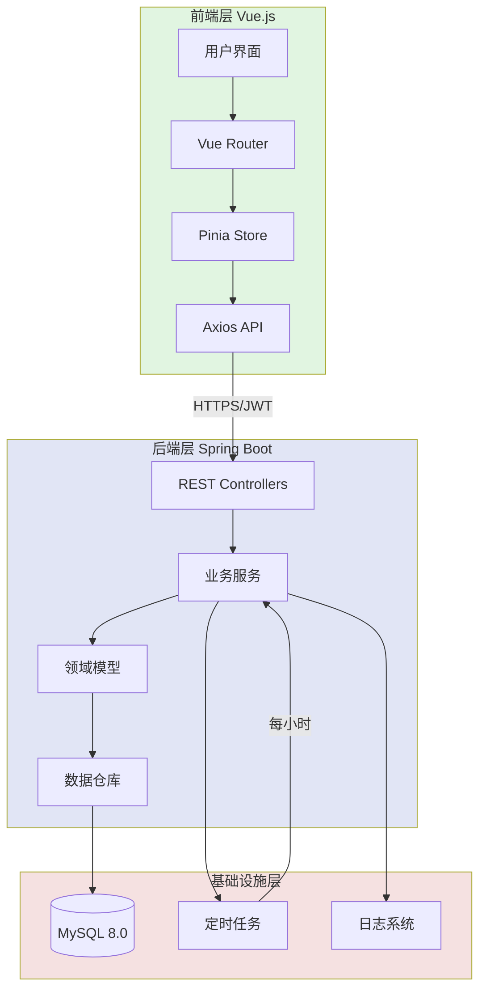
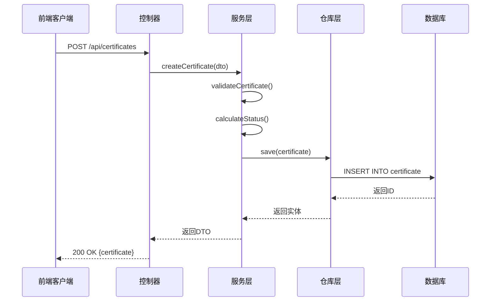
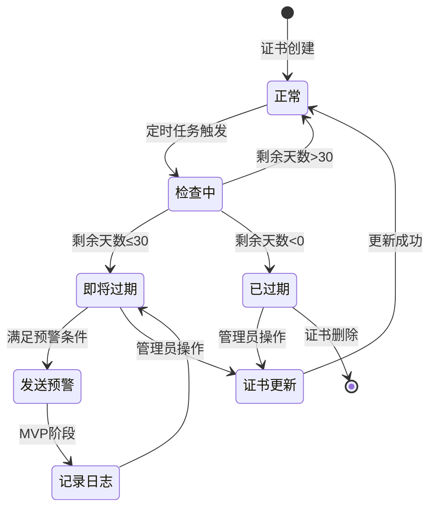

# 证书生命周期管理系统MVP实施计划

## 计划概述
- **计划ID**: 001
- **项目名称**: 证书生命周期管理系统MVP
- **计划类型**: 全栈开发实施计划
- **预计工期**: 4-6周
- **技术栈**: Spring Boot 2.7.x + Vue.js 3.x + MySQL 8.0
- **创建时间**: 2025-08-14
- **状态**: 执行中

## 目标与范围

### 核心目标
1. 建立证书管理的基础架构
2. 实现证书CRUD功能
3. 实现自动监控和预警功能
4. 提供统一的Web管理界面

### MVP范围
- ✅ 证书信息管理（增删改查）
- ✅ 证书状态自动监控（每小时检查）
- ✅ 预警通知（日志记录形式）
- ✅ 统一管理界面
- ❌ 高级功能（批量操作、导出等）- 后续迭代

## 系统架构图



## 实施阶段

### 第一阶段：基础架构搭建 (Week 1)

#### [ ] 1.1 项目初始化
```bash
# 后端项目结构
backend/
├── src/main/java/com/example/certificate/
│   ├── config/           # 配置类
│   ├── controller/       # REST控制器
│   ├── service/          # 业务服务
│   ├── domain/           # 领域模型
│   ├── infrastructure/   # 基础设施
│   └── CertificateManagementApplication.java
└── pom.xml

# 前端项目结构
frontend/
├── src/
│   ├── api/             # API接口
│   ├── components/      # 组件
│   ├── views/           # 页面
│   ├── stores/          # 状态管理
│   └── router/          # 路由
└── package.json
```

#### [ ] 1.2 数据库设计与初始化

```sql
-- 证书表
CREATE TABLE `certificate` (
    `id` BIGINT PRIMARY KEY AUTO_INCREMENT,
    `name` VARCHAR(100) NOT NULL COMMENT '证书名称',
    `domain` VARCHAR(255) NOT NULL COMMENT '域名',
    `issuer` VARCHAR(100) COMMENT '颁发机构',
    `issue_date` DATE COMMENT '颁发日期',
    `expiry_date` DATE NOT NULL COMMENT '到期日期',
    `certificate_type` VARCHAR(50) COMMENT '证书类型',
    `status` VARCHAR(20) COMMENT '状态: NORMAL/EXPIRING_SOON/EXPIRED',
    `created_at` TIMESTAMP DEFAULT CURRENT_TIMESTAMP,
    `updated_at` TIMESTAMP DEFAULT CURRENT_TIMESTAMP ON UPDATE CURRENT_TIMESTAMP,
    INDEX idx_expiry_date (expiry_date),
    INDEX idx_status (status)
) ENGINE=InnoDB DEFAULT CHARSET=utf8mb4;

-- 监控日志表
CREATE TABLE `monitoring_log` (
    `id` BIGINT PRIMARY KEY AUTO_INCREMENT,
    `certificate_id` BIGINT NOT NULL,
    `log_type` VARCHAR(50) COMMENT 'MONITORING/ALERT_EMAIL/ALERT_SMS',
    `log_time` TIMESTAMP DEFAULT CURRENT_TIMESTAMP,
    `message` TEXT,
    `days_until_expiry` INT,
    `created_at` TIMESTAMP DEFAULT CURRENT_TIMESTAMP,
    FOREIGN KEY (certificate_id) REFERENCES certificate(id),
    INDEX idx_certificate_id (certificate_id),
    INDEX idx_log_time (log_time)
) ENGINE=InnoDB DEFAULT CHARSET=utf8mb4;
```

#### [ ] 1.3 Maven依赖配置

```xml
<!-- pom.xml 核心依赖 -->
<dependencies>
    <!-- Spring Boot Starter -->
    <dependency>
        <groupId>org.springframework.boot</groupId>
        <artifactId>spring-boot-starter-web</artifactId>
        <version>2.7.18</version>
    </dependency>
    
    <!-- MyBatis Plus -->
    <dependency>
        <groupId>com.baomidou</groupId>
        <artifactId>mybatis-plus-boot-starter</artifactId>
        <version>3.5.3.1</version>
    </dependency>
    
    <!-- MySQL Driver -->
    <dependency>
        <groupId>mysql</groupId>
        <artifactId>mysql-connector-java</artifactId>
        <version>8.0.33</version>
    </dependency>
    
    <!-- Spring Security + JWT -->
    <dependency>
        <groupId>org.springframework.boot</groupId>
        <artifactId>spring-boot-starter-security</artifactId>
    </dependency>
    <dependency>
        <groupId>io.jsonwebtoken</groupId>
        <artifactId>jjwt</artifactId>
        <version>0.9.1</version>
    </dependency>
</dependencies>
```

#### [ ] 1.4 前端环境配置

```json
// package.json 核心依赖
{
  "dependencies": {
    "vue": "^3.4.0",
    "vue-router": "^4.2.5",
    "pinia": "^2.1.7",
    "axios": "^1.6.5",
    "element-plus": "^2.4.4",
    "dayjs": "^1.11.10"
  },
  "devDependencies": {
    "vite": "^4.5.1",
    "@vitejs/plugin-vue": "^4.5.2"
  }
}
```

### 第二阶段：核心功能开发 (Week 2-3)

#### [ ] 2.1 后端核心API开发



##### API接口清单

| 方法 | 路径 | 功能 | 请求体 | 响应 |
|------|------|------|--------|------|
| GET | /api/certificates | 获取证书列表 | - | PageResult<CertificateDto> |
| GET | /api/certificates/{id} | 获取证书详情 | - | CertificateDto |
| POST | /api/certificates | 创建证书 | CertificateCreateDto | CertificateDto |
| PUT | /api/certificates/{id} | 更新证书 | CertificateUpdateDto | CertificateDto |
| DELETE | /api/certificates/{id} | 删除证书 | - | void |
| GET | /api/monitoring-logs | 获取监控日志 | - | PageResult<MonitoringLogDto> |
| GET | /api/system/status | 获取系统状态 | - | SystemStatusDto |

#### [ ] 2.2 领域模型实现

```java
// Certificate.java - 核心领域模型
@Data
@TableName("certificate")
public class Certificate {
    @TableId(type = IdType.AUTO)
    private Long id;
    private String name;
    private String domain;
    private String issuer;
    private LocalDate issueDate;
    private LocalDate expiryDate;
    private String certificateType;
    private CertificateStatus status;
    private LocalDateTime createdAt;
    private LocalDateTime updatedAt;
    
    // 业务方法
    public void updateStatus() {
        LocalDate now = LocalDate.now();
        long daysUntilExpiry = ChronoUnit.DAYS.between(now, expiryDate);
        
        if (daysUntilExpiry < 0) {
            this.status = CertificateStatus.EXPIRED;
        } else if (daysUntilExpiry <= 30) {
            this.status = CertificateStatus.EXPIRING_SOON;
        } else {
            this.status = CertificateStatus.NORMAL;
        }
    }
}
```

#### [ ] 2.3 服务层实现

```java
// CertificateServiceImpl.java - 服务实现
@Service
@Transactional
public class CertificateServiceImpl implements CertificateService {
    
    private final CertificateRepository repository;
    private final MonitoringLogService logService;
    
    @Override
    public PageResult<CertificateDto> findAll(PageRequest pageRequest) {
        // 分页查询实现
        Page<Certificate> page = repository.selectPage(
            new Page<>(pageRequest.getPage(), pageRequest.getSize()),
            new QueryWrapper<Certificate>()
                .orderByAsc("expiry_date")
        );
        
        return PageResult.of(page, this::toDto);
    }
    
    @Override
    public CertificateDto create(CertificateCreateDto dto) {
        Certificate certificate = new Certificate();
        BeanUtils.copyProperties(dto, certificate);
        certificate.updateStatus();
        
        repository.insert(certificate);
        logService.logCertificateCreated(certificate);
        
        return toDto(certificate);
    }
    
    // 其他方法实现...
}
```

#### [ ] 2.4 定时任务实现

```java
// CertificateScheduler.java - 定时监控任务
@Component
@Slf4j
public class CertificateScheduler {
    
    private final CertificateService certificateService;
    private final AlertService alertService;
    
    @Scheduled(cron = "0 0 * * * ?") // 每小时执行
    public void checkCertificates() {
        log.info("开始执行证书监控任务");
        
        List<Certificate> certificates = certificateService.findAll();
        
        for (Certificate cert : certificates) {
            cert.updateStatus();
            certificateService.update(cert);
            
            // 检查是否需要发送预警
            long daysUntilExpiry = calculateDaysUntilExpiry(cert);
            if (shouldSendAlert(daysUntilExpiry)) {
                alertService.sendAlert(cert, daysUntilExpiry);
            }
        }
        
        log.info("证书监控任务执行完成，检查了{}个证书", certificates.size());
    }
    
    private boolean shouldSendAlert(long days) {
        return days == 30 || days == 15 || days == 7 || days == 1;
    }
}
```

### 第三阶段：前端界面开发 (Week 3-4)

#### [ ] 3.1 路由配置

```javascript
// router/index.js
const routes = [
  {
    path: '/',
    component: DefaultLayout,
    children: [
      {
        path: '',
        name: 'Dashboard',
        component: () => import('@/views/Dashboard.vue')
      },
      {
        path: 'certificates',
        name: 'CertificateList',
        component: () => import('@/views/certificate/List.vue')
      },
      {
        path: 'certificates/:id',
        name: 'CertificateDetail',
        component: () => import('@/views/certificate/Detail.vue')
      },
      {
        path: 'certificates/create',
        name: 'CertificateCreate',
        component: () => import('@/views/certificate/Form.vue')
      }
    ]
  }
]
```

#### [ ] 3.2 状态管理

```javascript
// stores/certificate.js
export const useCertificateStore = defineStore('certificate', {
  state: () => ({
    certificates: [],
    currentCertificate: null,
    loading: false,
    pagination: {
      page: 1,
      size: 20,
      total: 0
    }
  }),
  
  actions: {
    async fetchCertificates(params = {}) {
      this.loading = true
      try {
        const response = await api.get('/certificates', { params })
        this.certificates = response.data.content
        this.pagination.total = response.data.total
      } finally {
        this.loading = false
      }
    },
    
    async createCertificate(data) {
      const response = await api.post('/certificates', data)
      this.certificates.push(response.data)
      return response.data
    }
  },
  
  getters: {
    expiringCertificates: (state) => {
      return state.certificates.filter(c => c.status === 'EXPIRING_SOON')
    }
  }
})
```

#### [ ] 3.3 核心组件开发

```vue
<!-- components/CertificateList.vue -->
<template>
  <div class="certificate-list">
    <el-table :data="certificates" v-loading="loading">
      <el-table-column prop="name" label="证书名称" />
      <el-table-column prop="domain" label="域名" />
      <el-table-column prop="expiryDate" label="到期日期">
        <template #default="{ row }">
          <span :class="getStatusClass(row.status)">
            {{ formatDate(row.expiryDate) }}
          </span>
        </template>
      </el-table-column>
      <el-table-column prop="status" label="状态">
        <template #default="{ row }">
          <el-tag :type="getStatusType(row.status)">
            {{ getStatusText(row.status) }}
          </el-tag>
        </template>
      </el-table-column>
      <el-table-column label="操作" width="200">
        <template #default="{ row }">
          <el-button @click="viewDetail(row)" size="small">详情</el-button>
          <el-button @click="editCertificate(row)" size="small">编辑</el-button>
          <el-button @click="deleteCertificate(row)" size="small" type="danger">删除</el-button>
        </template>
      </el-table-column>
    </el-table>
    
    <el-pagination
      v-model:current-page="pagination.page"
      v-model:page-size="pagination.size"
      :total="pagination.total"
      @current-change="handlePageChange"
    />
  </div>
</template>

<script setup>
import { onMounted } from 'vue'
import { useCertificateStore } from '@/stores/certificate'
import { formatDate, getStatusClass, getStatusType, getStatusText } from '@/utils'

const store = useCertificateStore()
const { certificates, loading, pagination } = storeToRefs(store)

onMounted(() => {
  store.fetchCertificates()
})

const handlePageChange = (page) => {
  store.fetchCertificates({ page })
}
</script>
```

### 第四阶段：集成测试与部署 (Week 5)

#### [ ] 4.1 单元测试

```java
// CertificateServiceTest.java
@SpringBootTest
@AutoConfigureMockMvc
public class CertificateServiceTest {
    
    @Autowired
    private CertificateService service;
    
    @MockBean
    private CertificateRepository repository;
    
    @Test
    public void testCreateCertificate() {
        // Given
        CertificateCreateDto dto = new CertificateCreateDto();
        dto.setName("Test Certificate");
        dto.setDomain("example.com");
        dto.setExpiryDate(LocalDate.now().plusDays(30));
        
        // When
        CertificateDto result = service.create(dto);
        
        // Then
        assertNotNull(result);
        assertEquals("Test Certificate", result.getName());
        assertEquals(CertificateStatus.EXPIRING_SOON, result.getStatus());
    }
}
```

#### [ ] 4.2 集成测试

```javascript
// tests/e2e/certificate.spec.js
describe('Certificate Management', () => {
  it('should create a new certificate', () => {
    cy.visit('/certificates/create')
    cy.get('[data-testid="name-input"]').type('Test Certificate')
    cy.get('[data-testid="domain-input"]').type('example.com')
    cy.get('[data-testid="expiry-date"]').type('2025-12-31')
    cy.get('[data-testid="submit-button"]').click()
    
    cy.url().should('include', '/certificates')
    cy.contains('Test Certificate').should('be.visible')
  })
})
```

#### [ ] 4.3 部署配置

```yaml
# docker-compose.yml
version: '3.8'
services:
  mysql:
    image: mysql:8.0
    environment:
      MYSQL_ROOT_PASSWORD: root123
      MYSQL_DATABASE: certificate_db
    ports:
      - "3306:3306"
    volumes:
      - mysql_data:/var/lib/mysql
  
  backend:
    build: ./backend
    ports:
      - "8080:8080"
    environment:
      SPRING_DATASOURCE_URL: jdbc:mysql://mysql:3306/certificate_db
      SPRING_DATASOURCE_USERNAME: root
      SPRING_DATASOURCE_PASSWORD: root123
    depends_on:
      - mysql
  
  frontend:
    build: ./frontend
    ports:
      - "80:80"
    depends_on:
      - backend

volumes:
  mysql_data:
```

## 监控流程图



## 风险管理

### 技术风险
| 风险 | 影响 | 缓解措施 |
|------|------|----------|
| JDK 8 与新框架兼容性 | 中 | 严格测试，准备升级方案 |
| 大量证书并发检查性能 | 高 | 实现批量处理和缓存机制 |
| 数据库连接池配置 | 低 | 使用HikariCP默认配置 |

### 项目风险
| 风险 | 影响 | 缓解措施 |
|------|------|----------|
| 需求变更 | 中 | 坚持MVP范围，记录后续需求 |
| 团队技术栈熟悉度 | 低 | 提供技术培训和文档 |
| 部署环境差异 | 中 | 使用Docker确保环境一致性 |

## 验收标准

### 功能验收
- [ ] 证书CRUD功能正常
- [ ] 定时监控任务正常执行
- [ ] 预警日志正确记录
- [ ] 界面响应流畅

### 性能验收
- [ ] 支持100+证书管理
- [ ] 页面加载时间<2秒
- [ ] API响应时间<1秒

### 安全验收
- [ ] JWT认证正常工作
- [ ] HTTPS配置正确
- [ ] 无SQL注入漏洞

## 后续迭代计划

### Phase 2 (可选功能)
- 批量导入/导出功能
- 高级筛选和搜索
- 证书自动续期集成
- 多租户支持

### Phase 3 (企业级功能)
- 审计日志
- RBAC权限管理
- API限流
- 监控告警升级

## 项目交付物

### 代码交付
- [ ] 后端Spring Boot项目源码
- [ ] 前端Vue.js项目源码
- [ ] 数据库初始化脚本
- [ ] Docker配置文件

### 文档交付
- [ ] API接口文档
- [ ] 部署指南
- [ ] 操作手册
- [ ] 技术架构文档

### 测试交付
- [ ] 单元测试报告
- [ ] 集成测试报告
- [ ] 性能测试报告

## 总结

本实施计划基于MVP原则，聚焦核心功能，采用成熟技术栈，确保4-6周内可交付。关键成功因素：
1. 严格控制范围，避免过度设计
2. 使用成熟技术，降低风险
3. 充分测试，确保质量
4. 文档齐全，便于维护

---

**计划状态**: 待执行
**下一步行动**: 项目初始化和环境搭建
**负责人**: 开发团队
**最后更新**: 2025-08-14