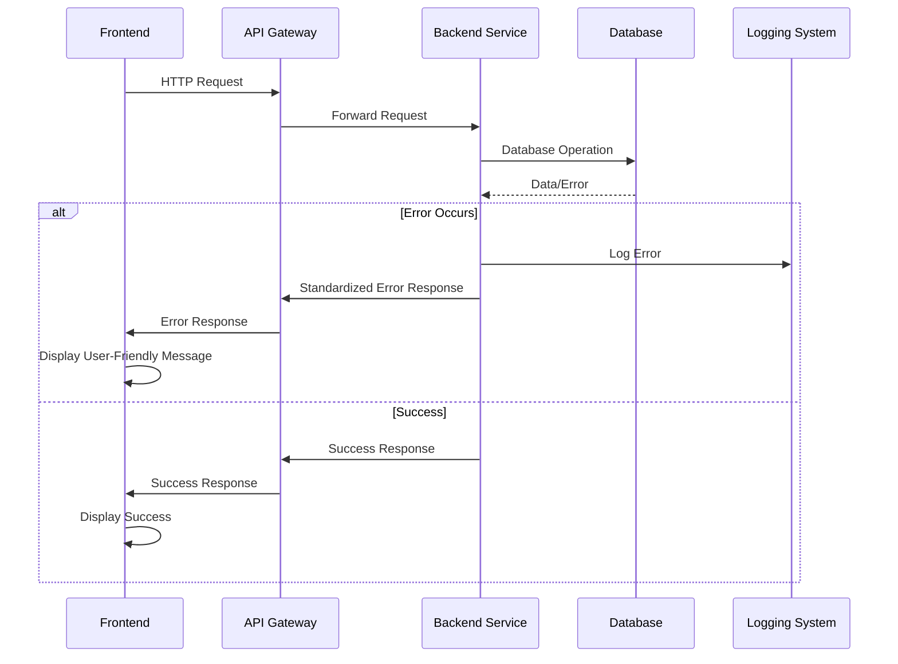

# Error Handling Strategy

## Error Flow



## Error Response Format

```typescript
interface ApiError {
  error: {
    code: string;
    message: string;
    details?: Record<string, any>;
    timestamp: string;
    requestId: string;
  };
}
```

## Frontend Error Handling

```typescript
// services/errorHandling.ts
export class ErrorHandler {
  private static instance: ErrorHandler;
  
  static getInstance(): ErrorHandler {
    if (!ErrorHandler.instance) {
      ErrorHandler.instance = new ErrorHandler();
    }
    return ErrorHandler.instance;
  }
  
  async handleApiError(error: any): Promise<void> {
    // 记录错误日志
    console.error('API Error:', error);
    
    // 解析错误信息
    let errorMessage = '操作失败，请稍后重试';
    let errorDetails = '';
    
    if (error.response) {
      // 服务器响应错误
      const { status, data } = error.response;
      
      switch (status) {
        case 400:
          errorMessage = '请求参数错误';
          errorDetails = data.error?.details || '请检查输入数据';
          break;
        case 401:
          errorMessage = '未授权访问';
          errorDetails = '请重新登录';
          // 跳转到登录页
          window.location.href = '/login';
          return;
        case 403:
          errorMessage = '权限不足';
          errorDetails = '您没有执行此操作的权限';
          break;
        case 404:
          errorMessage = '资源不存在';
          errorDetails = '请求的资源不存在或已被删除';
          break;
        case 500:
          errorMessage = '服务器内部错误';
          errorDetails = '服务器发生错误，请稍后重试';
          break;
        default:
          errorMessage = `请求失败 (${status})`;
          errorDetails = data.error?.message || '未知错误';
      }
    } else if (error.request) {
      // 请求发送失败
      errorMessage = '网络连接失败';
      errorDetails = '请检查网络连接';
    } else {
      // 其他错误
      errorMessage = '操作失败';
      errorDetails = error.message || '未知错误';
    }
    
    // 显示错误提示
    this.showErrorNotification(errorMessage, errorDetails);
  }
  
  private showErrorNotification(message: string, details: string): void {
    // 使用 UI 框架的通知组件显示错误
    // 例如使用 Element Plus 或 Ant Design 的通知组件
    console.error(`${message}: ${details}`);
    
    // 这里可以根据实际使用的 UI 框架实现通知显示
    // 例如：
    // ElNotification.error({
    //   title: message,
    //   message: details,
    //   duration: 5000
    // });
  }
  
  async handleCertificateError(error: any): Promise<void> {
    // 证书相关错误的特殊处理
    if (error.response?.data?.error?.code === 'CERTIFICATE_EXPIRED') {
      this.showErrorNotification('证书已过期', '该证书已过期，请更新证书信息');
    } else if (error.response?.data?.error?.code === 'CERTIFICATE_NOT_FOUND') {
      this.showErrorNotification('证书不存在', '请求的证书不存在或已被删除');
    } else {
      // 使用通用错误处理
      await this.handleApiError(error);
    }
  }
}

// 在 API 服务中使用错误处理
// services/certificateService.ts
export class CertificateService {
  private errorHandler = ErrorHandler.getInstance();
  
  async getCertificates(): Promise<Certificate[]> {
    try {
      const response = await api.get('/certificates');
      return response.data;
    } catch (error) {
      await this.errorHandler.handleCertificateError(error);
      throw error;
    }
  }
  
  async createCertificate(certificate: CertificateData): Promise<Certificate> {
    try {
      const response = await api.post('/certificates', certificate);
      return response.data;
    } catch (error) {
      await this.errorHandler.handleCertificateError(error);
      throw error;
    }
  }
}
```

## Backend Error Handling

```typescript
// middleware/errorHandler.ts
import { Request, Response, NextFunction } from 'express';
import { Logger } from '../utils/logger';

export class ApiError extends Error {
  public statusCode: number;
  public code: string;
  public details?: Record<string, any>;
  
  constructor(
    statusCode: number,
    code: string,
    message: string,
    details?: Record<string, any>
  ) {
    super(message);
    this.statusCode = statusCode;
    this.code = code;
    this.details = details;
    this.name = 'ApiError';
  }
}

export const errorHandler = (
  error: Error,
  req: Request,
  res: Response,
  next: NextFunction
): void => {
  const logger = Logger.getInstance();
  const requestId = req.headers['x-request-id'] as string || 'unknown';
  
  // 记录错误日志
  logger.error('Error occurred:', {
    error: error.message,
    stack: error.stack,
    requestId,
    url: req.url,
    method: req.method,
    userAgent: req.get('User-Agent'),
    ip: req.ip,
    timestamp: new Date().toISOString()
  });
  
  // 如果是自定义 API 错误
  if (error instanceof ApiError) {
    res.status(error.statusCode).json({
      error: {
        code: error.code,
        message: error.message,
        details: error.details,
        timestamp: new Date().toISOString(),
        requestId
      }
    });
    return;
  }
  
  // 处理其他类型的错误
  let statusCode = 500;
  let code = 'INTERNAL_SERVER_ERROR';
  let message = '服务器内部错误';
  let details: Record<string, any> | undefined;
  
  // 根据错误类型设置不同的响应
  if (error.name === 'ValidationError') {
    statusCode = 400;
    code = 'VALIDATION_ERROR';
    message = '数据验证失败';
    details = { fields: (error as any).errors };
  } else if (error.name === 'CastError') {
    statusCode = 400;
    code = 'INVALID_ID';
    message = '无效的ID格式';
  } else if ((error as any).code === 11000) {
    // MongoDB 重复键错误
    statusCode = 409;
    code = 'DUPLICATE_KEY';
    message = '数据已存在';
    details = { field: Object.keys((error as any).keyPattern)[0] };
  }
  
  res.status(statusCode).json({
    error: {
      code,
      message,
      details,
      timestamp: new Date().toISOString(),
      requestId
    }
  });
};

// 证书相关的错误类型
export class CertificateError extends ApiError {
  constructor(code: string, message: string, details?: Record<string, any>) {
    let statusCode = 400;
    
    switch (code) {
      case 'CERTIFICATE_NOT_FOUND':
        statusCode = 404;
        break;
      case 'CERTIFICATE_EXPIRED':
        statusCode = 400;
        break;
      case 'CERTIFICATE_VALIDATION_FAILED':
        statusCode = 400;
        break;
      default:
        statusCode = 500;
    }
    
    super(statusCode, code, message, details);
  }
}

// 在控制器中使用错误处理
// controllers/certificateController.ts
import { CertificateError } from '../middleware/errorHandler';

export class CertificateController {
  async getCertificate(req: Request, res: Response, next: NextFunction): Promise<void> {
    try {
      const { id } = req.params;
      
      const certificate = await Certificate.findById(id);
      if (!certificate) {
        throw new CertificateError('CERTIFICATE_NOT_FOUND', '证书不存在');
      }
      
      res.json(certificate);
    } catch (error) {
      next(error);
    }
  }
  
  async createCertificate(req: Request, res: Response, next: NextFunction): Promise<void> {
    try {
      const { name, domain, issuer, expiryDate, type } = req.body;
      
      // 验证证书数据
      if (!name || !domain || !issuer || !expiryDate || !type) {
        throw new CertificateError(
          'CERTIFICATE_VALIDATION_FAILED',
          '证书数据不完整',
          { missingFields: ['name', 'domain', 'issuer', 'expiryDate', 'type'].filter(field => !req.body[field]) }
        );
      }
      
      // 检查证书是否已过期
      if (new Date(expiryDate) < new Date()) {
        throw new CertificateError('CERTIFICATE_EXPIRED', '证书已过期');
      }
      
      // 创建证书
      const certificate = await Certificate.create({
        name,
        domain,
        issuer,
        expiryDate,
        type,
        status: this.calculateCertificateStatus(expiryDate)
      });
      
      res.status(201).json(certificate);
    } catch (error) {
      next(error);
    }
  }
  
  private calculateCertificateStatus(expiryDate: string): string {
    const now = new Date();
    const expiry = new Date(expiryDate);
    const diffDays = Math.ceil((expiry.getTime() - now.getTime()) / (1000 * 60 * 60 * 24));
    
    if (diffDays < 0) {
      return 'expired';
    } else if (diffDays <= 1) {
      return 'critical';
    } else if (diffDays <= 7) {
      return 'warning';
    } else if (diffDays <= 30) {
      return 'notice';
    } else {
      return 'valid';
    }
  }
}
```

## Rationale

1. **统一错误格式**：定义了统一的 API 错误响应格式，包含错误代码、消息、详细信息、时间戳和请求 ID。这种格式使得前端可以一致地处理各种错误，并且请求 ID 可以帮助在日志中追踪错误。

2. **前端错误处理策略**：前端错误处理采用了单例模式的错误处理器，集中处理所有 API 错误。对于不同类型的错误（网络错误、服务器错误、认证错误等）提供了不同的处理逻辑，特别是对证书相关错误进行了特殊处理。

3. **后端错误处理策略**：后端使用了自定义的 ApiError 类和错误处理中间件，确保所有错误都以统一格式返回。对于证书相关的错误，定义了专门的 CertificateError 类，提供更精确的错误类型和状态码。

4. **错误流程可视化**：使用 Mermaid 序列图展示了错误在系统中的流动路径，从前端到后端再到日志系统，帮助开发团队理解错误处理的全流程。

5. **证书状态计算**：在证书控制器中实现了证书状态的计算逻辑，根据证书的到期时间判断证书状态（有效、即将过期、已过期等），这是证书管理系统的核心功能。

6. **错误日志记录**：后端错误处理中间件会记录详细的错误信息，包括错误消息、堆栈、请求 ID、URL、方法、用户代理、IP 地址和时间戳，便于问题排查和分析。

7. **用户友好的错误消息**：前端错误处理会将技术性错误转换为用户友好的错误消息，避免将技术细节暴露给最终用户，提高用户体验。

8. **错误恢复机制**：对于某些特定错误（如认证错误），系统会自动执行恢复操作（如跳转到登录页），提高系统的健壮性。

这种错误处理策略确保了证书管理系统的稳定性和用户体验，特别是在处理证书相关错误时，能够提供准确的错误信息和适当的恢复机制。