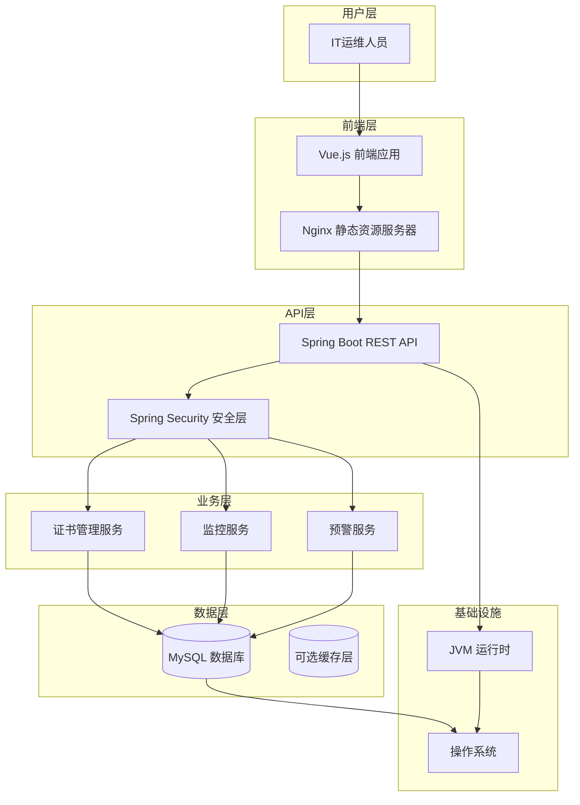
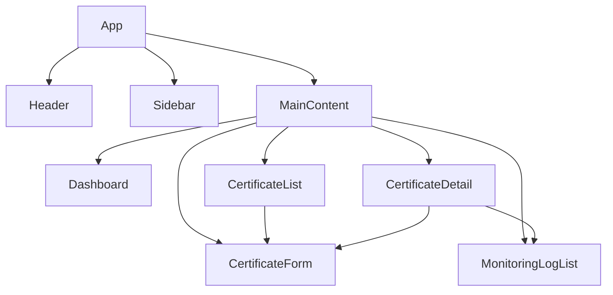
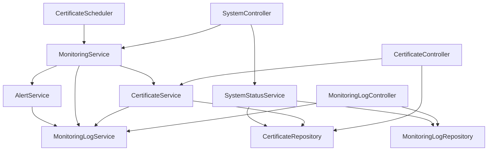

# 证书生命周期管理系统全栈架构文档

## 简介

本文档概述了证书生命周期管理系统的完整全栈架构，包括后端系统、前端实现及其集成。它作为 AI 驱动开发的单一真实来源，确保整个技术栈的一致性。

这种统一方法结合了传统上分离的后端和前端架构文档，简化了现代全栈应用程序的开发过程，因为这些关注点日益交织在一起。

### 启动模板或现有项目

**选择的模板：** 基于 Spring Boot + Vue 的标准企业应用模板

**理由：** 这个选择与 PRD 中概述的技术假设完全一致，该假设指定后端使用 Spring Boot，前端使用 Vue.js。此模板为企业级应用程序提供了坚实的基础，具有内置的安全性、可扩展性和可维护性支持。

**关键约束和考虑因素：**
- 后端将使用 JDK 8、Spring Boot 框架和 MyBatis Plus 作为 ORM
- 前端将使用 Vue.js 和 Vue Router 进行路由管理
- 将采用 Monorepo 结构进行统一的代码管理
- 领域驱动设计（DDD）原则将指导后端架构
- 该模板支持 MVP 要求，同时允许未来的可扩展性

### 变更日志

| 日期 | 版本 | 描述 | 作者 |
|------|------|------|------|
| 2025-08-11 | 1.0 | 初始全栈架构文档创建 | Winston（架构师） |

**详细理由说明：**
我选择了基于 Spring Boot + Vue 的标准企业应用模板，这完全符合 PRD 中技术假设部分的要求。这个选择有以下优势：

1. **技术一致性**：与 PRD 中指定的技术栈（JDK 8、Spring Boot、MyBatis Plus、Vue.js）完全匹配
2. **企业级特性**：Spring Boot 提供了内置的安全性、可扩展性和可维护性支持
3. **开发效率**：标准模板减少了初始配置工作，可以更快地进入实际功能开发
4. **团队熟悉度**：作为企业级标准技术栈，大多数开发团队都具备相关经验
5. **社区支持**：两个框架都有活跃的社区和丰富的文档资源
6. **MVP 适配**：这个模板非常适合 MVP 阶段的快速开发和部署
7. **未来扩展性**：虽然开始是单体架构，但为未来可能的微服务迁移预留了可能性

**需要用户关注的决策点：**
- 是否需要调整模板中的特定配置或依赖
- 是否有特定的安全要求需要额外配置
- 是否需要集成特定的企业级工具或服务

## 高层架构

### 技术摘要

证书生命周期管理系统采用基于 Spring Boot + Vue 的全栈架构，结合了企业级后端框架和现代化前端技术。系统使用领域驱动设计（DDD）原则组织后端代码，通过 REST API 实现前后端分离，采用 MySQL 作为主数据库，并实现了自动化的证书监控和预警功能。这种架构设计确保了系统的可扩展性、可维护性和安全性，同时满足了 MVP 阶段的快速开发需求和未来的业务增长。

### 平台和基础设施选择

**推荐平台：** 传统服务器架构（Spring Boot + Vue + MySQL）

**理由：**
- **技术成熟度**：Spring Boot 和 Vue.js 都是成熟的企业级技术，拥有丰富的生态系统和社区支持
- **团队熟悉度**：作为标准企业技术栈，大多数开发团队都具备相关经验，降低学习成本
- **MVP 适配性**：这种架构非常适合 MVP 阶段的快速开发和部署
- **成本效益**：相比云原生解决方案，初期投入更低，运维成本可控
- **数据安全**：自托管数据库提供了更好的数据控制权和安全性

**核心服务：**
- **应用服务器**：Spring Boot 内嵌 Tomcat
- **数据库**：MySQL 8.0
- **前端服务器**：Nginx（静态资源服务）
- **监控服务**：Spring Boot Actuator
- **日志服务**：Logback

**部署主机和区域：**
- **开发环境**：本地开发服务器
- **测试环境**：内部测试服务器
- **生产环境**：企业内部服务器或云主机（根据企业政策决定）

### 仓库结构

**结构：** Monorepo（单一代码仓库）

**Monorepo 工具：** Maven（后端）+ npm（前端）

**包组织策略：**
```
certificate-management-system/
├── backend/                 # Spring Boot 后端应用
│   ├── src/main/java/      # Java 源代码
│   ├── src/main/resources/ # 配置文件
│   └── src/test/java/      # 测试代码
├── frontend/               # Vue.js 前端应用
│   ├── src/               # Vue 源代码
│   ├── public/            # 静态资源
│   └── tests/             # 测试代码
├── shared/                # 共享代码和类型定义
│   ├── types/             # TypeScript 类型定义
│   └── utils/             # 共享工具函数
├── docs/                  # 项目文档
├── docker/                # Docker 配置
└── scripts/               # 构建和部署脚本
```

### 高层架构图



### 架构模式

- **领域驱动设计（DDD）**：采用 DDD 原则组织后端代码，将业务逻辑集中在领域层 - _理由_：确保业务逻辑的清晰性和可维护性，便于未来业务扩展

- **分层架构**：将系统分为表现层、应用层、领域层和基础设施层 - _理由_：实现关注点分离，提高代码的可测试性和可维护性

- **RESTful API**：使用 REST 风格设计 API 接口 - _理由_：标准化前后端通信，提高系统的互操作性

- **组件化前端**：使用 Vue 组件化开发前端界面 - _理由_：提高前端代码的复用性和可维护性

- **单仓库管理（Monorepo）**：前后端代码放在同一个仓库中管理 - _理由_：简化版本控制和依赖管理，便于团队协作

- **定时任务架构**：使用 Spring Scheduler 实现证书监控定时任务 - _理由_：轻量级实现，无需额外引入消息队列

- **安全优先设计**：在架构各层都考虑安全性 - _理由_：证书管理涉及敏感信息，安全性至关重要

## 技术栈

这是整个项目的最终技术选择。所有开发都必须使用这些确切版本，这是单一的真实来源。

### 技术栈表

| 类别 | 技术 | 版本 | 用途 | 理由 |
|------|------|------|------|------|
| 前端语言 | JavaScript | ES2020+ | 前端开发逻辑实现 | 现代 JavaScript 特性提供更好的开发体验和性能 |
| 前端框架 | Vue.js | 3.x | 构建响应式用户界面 | 轻量级、易学习、生态丰富，适合企业级应用 |
| 前端路由 | Vue Router | 4.x | 前端页面路由管理 | Vue.js 官方路由管理器，支持路由守卫和懒加载 |
| UI 组件库 | Element Plus | 2.x | 提供 UI 组件和设计系统 | 与 Vue.js 深度集成，提供丰富的企业级组件 |
| 状态管理 | Pinia | 2.x | 前端状态管理 | Vue 3 官方推荐，轻量且类型安全 |
| 后端语言 | Java | 8 | 后端业务逻辑实现 | 企业级标准，稳定可靠，生态系统成熟 |
| Java 开发工具包 | JDK (Oracle JDK 或 OpenJDK) | 8 | Java 运行环境 | 提供稳定的 Java 运行环境，与企业环境兼容性好 |
| 后端框架 | Spring Boot | 2.7.x | 构建 RESTful API 和后端服务 | 简化配置，快速开发，企业级特性丰富 |
| ORM 框架 | MyBatis Plus | 3.5.x | 数据访问层和对象关系映射 | 简化数据库操作，提供丰富的 CRUD 功能，与 Spring Boot 深度集成 |
| 定时任务框架 | Spring Scheduler | - | 证书监控定时任务 | Spring Boot 内置调度器，轻量级实现，无需额外依赖 |
| API 风格 | REST | - | 前后端通信接口 | 标准化、简单易用、工具支持丰富 |
| 数据库 | MySQL | 8.0 | 存储证书和系统数据 | 成熟可靠，性能优秀，与企业环境兼容性好 |
| 缓存 | - | - | 数据缓存（MVP 阶段暂不使用） | MVP 阶段简化架构，后续可根据性能需求添加 |
| 文件存储 | 本地文件系统 | - | 存储日志和临时文件 | MVP 阶段简化实现，后续可扩展为云存储 |
| 认证 | Spring Security + JWT | - | 用户认证和授权 | 企业级安全标准，无状态认证，易于扩展 |
| 安全通信 | HTTPS / SSL/TLS | - | 加密通信和数据传输安全 | 确保客户端和服务器之间的通信安全，防止数据窃听和篡改 |
| 前端测试 | Jest + Vue Test Utils | 最新 | 单元测试和组件测试 | Vue 生态系统标准测试工具，易于使用和维护 |
| 后端测试 | JUnit + Mockito | 5.x | 单元测试和集成测试 | Java 生态系统标准测试工具，与 Spring Boot 深度集成 |
| E2E 测试 | Selenium | 4.x | 端到端测试 | 成熟的浏览器自动化测试工具，支持多种浏览器 |
| 构建工具 | Maven | 3.8.x | 后端项目构建和依赖管理 | Java 生态系统标准，企业级依赖管理 |
| 打包工具 | Vite | 4.x | 前端资源打包和开发服务器 | 快速的构建和热重载，现代前端开发标准 |
| 基础设施即代码 | - | - | 基础设施管理（MVP 阶段暂不使用） | MVP 阶段简化部署，后续可添加 Docker 支持 |
| CI/CD | 基础脚本 | - | 持续集成和部署 | MVP 阶段使用简单脚本，后续可扩展为完整 CI/CD 流程 |
| 监控 | Spring Boot Actuator | - | 应用监控和健康检查 | Spring Boot 内置监控，提供基本的健康和指标信息 |
| 日志 | Logback | 1.3.x | 应用日志记录 | Spring Boot 默认日志框架，配置灵活，性能优秀 |
| CSS 框架 | Element Plus 内置样式 | 2.x | UI 样式和主题 | 与组件库深度集成，提供统一的设计系统 |

## 数据模型

定义将在前端和后端之间共享的核心数据模型/实体：

### Certificate（证书）

**目的：** 存储和管理证书的基本信息和状态

**关键属性：**
- id: Long - 证书唯一标识符
- name: String - 证书名称
- domain: String - 证书关联的域名
- issuer: String - 证书颁发机构
- issueDate: Date - 证书颁发日期
- expiryDate: Date - 证书到期日期
- certificateType: String - 证书类型（如 SSL/TLS、代码签名等）
- status: CertificateStatus - 证书状态（正常、即将过期、已过期）
- createdAt: Date - 记录创建时间
- updatedAt: Date - 记录更新时间

#### TypeScript 接口

```typescript
export interface Certificate {
  id: number;
  name: string;
  domain: string;
  issuer: string;
  issueDate: Date;
  expiryDate: Date;
  certificateType: string;
  status: CertificateStatus;
  createdAt: Date;
  updatedAt: Date;
}

export enum CertificateStatus {
  NORMAL = 'NORMAL',
  EXPIRING_SOON = 'EXPIRING_SOON',
  EXPIRED = 'EXPIRED'
}
```

#### 关系

- 与 MonitoringLog 一对多关系（一个证书可以有多个监控日志）

### MonitoringLog（监控日志）

**目的：** 记录证书监控和预警活动的日志

**关键属性：**
- id: Long - 日志唯一标识符
- certificateId: Long - 关联的证书ID
- logType: String - 日志类型（MONITORING、ALERT_EMAIL、ALERT_SMS）
- logTime: Date - 日志记录时间
- message: String - 日志消息内容
- daysUntilExpiry: Integer - 距离到期的天数
- createdAt: Date - 记录创建时间

#### TypeScript 接口

```typescript
export interface MonitoringLog {
  id: number;
  certificateId: number;
  logType: string;
  logTime: Date;
  message: string;
  daysUntilExpiry: number;
  createdAt: Date;
}

export enum LogType {
  MONITORING = 'MONITORING',
  ALERT_EMAIL = 'ALERT_EMAIL',
  ALERT_SMS = 'ALERT_SMS'
}
```

#### 关系

- 与 Certificate 多对一关系（多个监控日志属于一个证书）

## API 规范

定义系统的 REST API 接口，包括证书管理、监控和预警等功能。

### API 设计原则

- **RESTful 设计**：遵循 REST 架构风格，使用标准 HTTP 方法
- **统一响应格式**：所有 API 响应使用统一的 JSON 格式
- **状态码使用**：正确使用 HTTP 状态码表示请求结果
- **版本控制**：API 路径包含版本号（/api/v1/）
- **错误处理**：统一的错误响应格式，包含错误代码和消息
- **认证授权**：使用 JWT 进行 API 认证

### 统一响应格式

所有 API 响应使用以下统一格式：

```typescript
interface ApiResponse<T> {
  success: boolean;      // 请求是否成功
  code: number;          // 响应代码
  message: string;       // 响应消息
  data?: T;             // 响应数据（可选）
  timestamp: string;    // 响应时间戳
}
```

### 统一错误响应格式

```typescript
interface ApiError {
  success: boolean;      // 固定为 false
  code: number;          // 错误代码
  message: string;       // 错误消息
  error?: string;       // 详细错误信息（可选）
  timestamp: string;    // 响应时间戳
}
```

### 证书管理 API

#### 1. 获取证书列表

**端点：** `GET /api/v1/certificates`

**描述：** 获取证书列表，支持分页、排序和筛选

**请求参数：**
- `page` (number, 可选): 页码，默认为 1
- `size` (number, 可选): 每页大小，默认为 20
- `sort` (string, 可选): 排序字段，如 "expiryDate,desc"
- `status` (string, 可选): 筛选状态，如 "NORMAL"、"EXPIRING_SOON"、"EXPIRED"
- `search` (string, 可选): 搜索关键词，搜索证书名称和域名

**成功响应示例：**
```json
{
  "success": true,
  "code": 200,
  "message": "获取证书列表成功",
  "data": {
    "content": [
      {
        "id": 1,
        "name": "网站SSL证书",
        "domain": "example.com",
        "issuer": "Let's Encrypt",
        "issueDate": "2023-01-15T00:00:00Z",
        "expiryDate": "2024-01-15T00:00:00Z",
        "certificateType": "SSL/TLS",
        "status": "NORMAL",
        "createdAt": "2023-01-20T08:30:00Z",
        "updatedAt": "2023-01-20T08:30:00Z"
      }
    ],
    "pageable": {
      "sort": {
        "empty": false,
        "sorted": true,
        "unsorted": false
      },
      "offset": 0,
      "pageNumber": 0,
      "pageSize": 20,
      "paged": true,
      "unpaged": false
    },
    "last": true,
    "totalPages": 1,
    "totalElements": 1,
    "size": 20,
    "number": 0,
    "sort": {
      "empty": false,
      "sorted": true,
      "unsorted": false
    },
    "first": true,
    "numberOfElements": 1,
    "empty": false
  },
  "timestamp": "2023-06-15T10:30:00Z"
}
```

#### 2. 获取证书详情

**端点：** `GET /api/v1/certificates/{id}`

**描述：** 根据证书ID获取证书详情

**路径参数：**
- `id` (number): 证书ID

**成功响应示例：**
```json
{
  "success": true,
  "code": 200,
  "message": "获取证书详情成功",
  "data": {
    "id": 1,
    "name": "网站SSL证书",
    "domain": "example.com",
    "issuer": "Let's Encrypt",
    "issueDate": "2023-01-15T00:00:00Z",
    "expiryDate": "2024-01-15T00:00:00Z",
    "certificateType": "SSL/TLS",
    "status": "NORMAL",
    "createdAt": "2023-01-20T08:30:00Z",
    "updatedAt": "2023-01-20T08:30:00Z"
  },
  "timestamp": "2023-06-15T10:30:00Z"
}
```

#### 3. 创建证书

**端点：** `POST /api/v1/certificates`

**描述：** 创建新证书

**请求体：**
```json
{
  "name": "网站SSL证书",
  "domain": "example.com",
  "issuer": "Let's Encrypt",
  "issueDate": "2023-01-15T00:00:00Z",
  "expiryDate": "2024-01-15T00:00:00Z",
  "certificateType": "SSL/TLS"
}
```

**成功响应示例：**
```json
{
  "success": true,
  "code": 201,
  "message": "创建证书成功",
  "data": {
    "id": 1,
    "name": "网站SSL证书",
    "domain": "example.com",
    "issuer": "Let's Encrypt",
    "issueDate": "2023-01-15T00:00:00Z",
    "expiryDate": "2024-01-15T00:00:00Z",
    "certificateType": "SSL/TLS",
    "status": "NORMAL",
    "createdAt": "2023-06-15T10:30:00Z",
    "updatedAt": "2023-06-15T10:30:00Z"
  },
  "timestamp": "2023-06-15T10:30:00Z"
}
```

#### 4. 更新证书

**端点：** `PUT /api/v1/certificates/{id}`

**描述：** 更新证书信息

**路径参数：**
- `id` (number): 证书ID

**请求体：**
```json
{
  "name": "网站SSL证书（更新）",
  "domain": "example.com",
  "issuer": "Let's Encrypt",
  "issueDate": "2023-01-15T00:00:00Z",
  "expiryDate": "2024-06-15T00:00:00Z",
  "certificateType": "SSL/TLS"
}
```

**成功响应示例：**
```json
{
  "success": true,
  "code": 200,
  "message": "更新证书成功",
  "data": {
    "id": 1,
    "name": "网站SSL证书（更新）",
    "domain": "example.com",
    "issuer": "Let's Encrypt",
    "issueDate": "2023-01-15T00:00:00Z",
    "expiryDate": "2024-06-15T00:00:00Z",
    "certificateType": "SSL/TLS",
    "status": "NORMAL",
    "createdAt": "2023-01-20T08:30:00Z",
    "updatedAt": "2023-06-15T10:30:00Z"
  },
  "timestamp": "2023-06-15T10:30:00Z"
}
```

#### 5. 删除证书

**端点：** `DELETE /api/v1/certificates/{id}`

**描述：** 删除证书

**路径参数：**
- `id` (number): 证书ID

**成功响应示例：**
```json
{
  "success": true,
  "code": 200,
  "message": "删除证书成功",
  "timestamp": "2023-06-15T10:30:00Z"
}
```

### 监控日志 API

#### 1. 获取监控日志列表

**端点：** `GET /api/v1/monitoring-logs`

**描述：** 获取监控日志列表，支持分页、排序和筛选

**请求参数：**
- `page` (number, 可选): 页码，默认为 1
- `size` (number, 可选): 每页大小，默认为 20
- `sort` (string, 可选): 排序字段，如 "logTime,desc"
- `logType` (string, 可选): 筛选日志类型，如 "MONITORING"、"ALERT_EMAIL"、"ALERT_SMS"
- `certificateId` (number, 可选): 筛选证书ID
- `startDate` (string, 可选): 开始日期，格式为 "YYYY-MM-DD"
- `endDate` (string, 可选): 结束日期，格式为 "YYYY-MM-DD"

**成功响应示例：**
```json
{
  "success": true,
  "code": 200,
  "message": "获取监控日志列表成功",
  "data": {
    "content": [
      {
        "id": 1,
        "certificateId": 1,
        "logType": "MONITORING",
        "logTime": "2023-06-15T10:00:00Z",
        "message": "证书监控检查完成",
        "daysUntilExpiry": 30,
        "createdAt": "2023-06-15T10:00:00Z"
      },
      {
        "id": 2,
        "certificateId": 1,
        "logType": "ALERT_EMAIL",
        "logTime": "2023-06-15T10:00:00Z",
        "message": "发送证书过期预警邮件",
        "daysUntilExpiry": 30,
        "createdAt": "2023-06-15T10:00:00Z"
      }
    ],
    "pageable": {
      "sort": {
        "empty": false,
        "sorted": true,
        "unsorted": false
      },
      "offset": 0,
      "pageNumber": 0,
      "pageSize": 20,
      "paged": true,
      "unpaged": false
    },
    "last": true,
    "totalPages": 1,
    "totalElements": 2,
    "size": 20,
    "number": 0,
    "sort": {
      "empty": false,
      "sorted": true,
      "unsorted": false
    },
    "first": true,
    "numberOfElements": 2,
    "empty": false
  },
  "timestamp": "2023-06-15T10:30:00Z"
}
```

### 系统管理 API

#### 1. 手动触发证书监控

**端点：** `POST /api/v1/system/monitor-certificates`

**描述：** 手动触发证书监控检查

**成功响应示例：**
```json
{
  "success": true,
  "code": 200,
  "message": "证书监控检查已启动",
  "timestamp": "2023-06-15T10:30:00Z"
}
```

#### 2. 获取系统状态

**端点：** `GET /api/v1/system/status`

**描述：** 获取系统状态信息

**成功响应示例：**
```json
{
  "success": true,
  "code": 200,
  "message": "获取系统状态成功",
  "data": {
    "status": "RUNNING",
    "uptime": "2d 5h 30m",
    "certificateCount": 10,
    "normalCount": 8,
    "expiringSoonCount": 1,
    "expiredCount": 1,
    "lastMonitoringTime": "2023-06-15T10:00:00Z",
    "nextMonitoringTime": "2023-06-15T11:00:00Z"
  },
  "timestamp": "2023-06-15T10:30:00Z"
}
```

### 错误代码定义

| 代码 | 名称 | 描述 |
|------|------|------|
| 200 | OK | 请求成功 |
| 201 | Created | 资源创建成功 |
| 400 | Bad Request | 请求参数错误 |
| 401 | Unauthorized | 未授权访问 |
| 403 | Forbidden | 禁止访问 |
| 404 | Not Found | 资源不存在 |
| 500 | Internal Server Error | 服务器内部错误 |
| 10001 | Certificate Not Found | 证书不存在 |
| 10002 | Certificate Validation Failed | 证书验证失败 |
| 10003 | Certificate Already Exists | 证书已存在 |
| 10004 | Monitoring Failed | 监控失败 |
| 10005 | Alert Sending Failed | 预警发送失败 |

## 组件

定义前端和后端的核心组件，包括它们的职责和交互方式。

### 组件依赖关系和可重用性

#### 前端组件依赖关系图



#### 后端组件依赖关系图



### 前端组件

#### 1. App.vue（根组件）

**职责：** 应用程序的根组件，负责整体布局和路由配置

**关键特性：**
- 应用整体布局结构
- 路由配置和导航
- 全局状态管理
- 全局样式和主题

**子组件：**
- Header
- Sidebar
- MainContent

**依赖关系：**
- 无父组件依赖
- 依赖 Vue Router 进行路由管理
- 依赖 Pinia 进行全局状态管理

**可重用性：**
- 高度可重用，作为整个应用的入口点
- 提供通用的布局结构，可以适应不同的内容需求
- 通过插槽（slots）机制允许灵活的内容插入

#### 2. CertificateList.vue（证书列表组件）

**职责：** 显示证书列表，提供搜索、筛选和排序功能

**关键特性：**
- 证书列表展示
- 分页功能
- 搜索功能（按证书名称和域名）
- 筛选功能（按证书状态）
- 排序功能（按到期日期和状态）
- 批量操作（查看、编辑、删除）

**数据依赖：**
- Certificate[] - 证书列表数据
- 分页信息
- 筛选和排序参数

**API 调用：**
- GET /api/v1/certificates - 获取证书列表
- DELETE /api/v1/certificates/{id} - 删除证书

**依赖关系：**
- 父组件：MainContent
- 子组件：CertificateForm（用于创建新证书）
- 依赖 Element Plus 的表格组件
- 依赖 Pinia 存储中的证书状态

**可重用性：**
- 中等可重用性，专为证书列表设计
- 分页、搜索和筛选逻辑可以抽象为可重用的混入（mixin）或组合式函数
- 表格列配置可以通过 props 动态调整，适应不同的展示需求
- 操作按钮可以通过插槽自定义，增加灵活性

#### 3. CertificateDetail.vue（证书详情组件）

**职责：** 显示单个证书的详细信息，提供编辑和删除功能

**关键特性：**
- 证书详细信息展示
- 证书状态可视化
- 编辑证书信息
- 删除证书
- 相关监控日志查看

**数据依赖：**
- Certificate - 证书详细信息
- MonitoringLog[] - 相关监控日志

**API 调用：**
- GET /api/v1/certificates/{id} - 获取证书详情
- PUT /api/v1/certificates/{id} - 更新证书
- DELETE /api/v1/certificates/{id} - 删除证书
- GET /api/v1/monitoring-logs?certificateId={id} - 获取相关监控日志

**依赖关系：**
- 父组件：MainContent
- 子组件：CertificateForm（用于编辑证书）、MonitoringLogList（用于显示相关日志）
- 依赖 Vue Router 的路由参数获取证书ID
- 依赖 Element Plus 的表单和卡片组件

**可重用性：**
- 中等可重用性，专为证书详情设计
- 详情展示部分可以抽象为通用的详情展示组件
- 状态可视化组件可以独立出来，用于其他需要状态展示的场景
- 通过 props 可以配置显示的字段和操作按钮，增加灵活性

#### 4. CertificateForm.vue（证书表单组件）

**职责：** 提供证书创建和编辑表单

**关键特性：**
- 表单验证
- 日期选择器
- 提交和取消按钮
- 错误提示

**数据依赖：**
- Certificate - 证书数据（编辑时）
- 表单验证规则

**API 调用：**
- POST /api/v1/certificates - 创建证书
- PUT /api/v1/certificates/{id} - 更新证书

**依赖关系：**
- 父组件：CertificateList（创建时）、CertificateDetail（编辑时）
- 依赖 Element Plus 的表单组件和日期选择器
- 依赖 Vuelidate 或类似库进行表单验证

**可重用性：**
- 高度可重用，同时支持创建和编辑模式
- 表单字段和验证规则可以通过 props 动态配置
- 表单提交逻辑可以抽象为可重用的混入（mixin）或组合式函数
- 通过事件发射（emit）与父组件通信，保持组件独立性

#### 5. Dashboard.vue（仪表板组件）

**职责：** 显示系统概览和关键指标

**关键特性：**
- 证书统计信息
- 证书状态分布图表
- 即将过期证书列表
- 最近添加的证书列表
- 系统状态信息

**数据依赖：**
- 证书统计数据
- 即将过期证书列表
- 系统状态信息

**API 调用：**
- GET /api/v1/certificates?status=EXPIRING_SOON - 获取即将过期证书
- GET /api/v1/certificates?sort=createdAt,desc - 获取最近添加的证书
- GET /api/v1/system/status - 获取系统状态

**依赖关系：**
- 父组件：MainContent
- 依赖 Element Plus 的卡片和统计组件
- 依赖图表库（如 ECharts 或 Chart.js）进行数据可视化
- 依赖 Pinia 存储中的系统状态

**可重用性：**
- 中等可重用性，专为系统仪表板设计
- 统计卡片组件可以独立出来，用于其他需要数据统计的场景
- 图表组件可以抽象为通用的图表包装器，支持不同类型的数据展示
- 通过 props 可以配置显示的指标和图表类型，增加灵活性

#### 6. MonitoringLogList.vue（监控日志列表组件）

**职责：** 显示监控日志列表，提供筛选和搜索功能

**关键特性：**
- 监控日志列表展示
- 分页功能
- 筛选功能（按日志类型和证书）
- 搜索功能
- 时间范围选择

**数据依赖：**
- MonitoringLog[] - 监控日志列表数据
- 分页信息
- 筛选参数

**API 调用：**
- GET /api/v1/monitoring-logs - 获取监控日志列表

**依赖关系：**
- 父组件：MainContent、CertificateDetail（作为子组件显示相关日志）
- 依赖 Element Plus 的表格组件和日期选择器
- 依赖 Pinia 存储中的监控日志状态

**可重用性：**
- 高度可重用，可以通过 props 配置为独立组件或嵌入其他组件
- 分页、搜索和筛选逻辑可以抽象为可重用的混入（mixin）或组合式函数
- 表格列配置可以通过 props 动态调整，适应不同的展示需求
- 时间范围选择器可以独立出来，用于其他需要时间筛选的场景

#### 7. Header.vue（页头组件）

**职责：** 显示应用程序页头，包含导航和用户信息

**关键特性：**
- 应用程序标题
- 导航菜单
- 用户信息显示
- 退出登录按钮

**依赖关系：**
- 父组件：App
- 依赖 Vue Router 进行导航
- 依赖 Pinia 存储中的用户状态

**可重用性：**
- 高度可重用，设计为通用的页头组件
- 导航菜单项可以通过 props 动态配置
- 用户信息显示区域可以通过插槽自定义
- 可以适应不同的布局需求，如固定顶部或跟随滚动

#### 8. Sidebar.vue（侧边栏组件）

**职责：** 显示侧边栏导航菜单

**关键特性：**
- 导航菜单项
- 菜单图标
- 当前活动项高亮

**依赖关系：**
- 父组件：App
- 依赖 Vue Router 进行导航和路由匹配
- 依赖 Pinia 存储中的导航状态

**可重用性：**
- 高度可重用，设计为通用的侧边栏导航组件
- 菜单项可以通过 props 动态配置，支持多级菜单
- 菜单图标可以通过插槽或 props 自定义
- 可以适应不同的布局需求，如固定左侧或可折叠
- 支持响应式设计，在移动设备上可以自动隐藏或转换为底部导航

### 后端组件

#### 1. CertificateController（证书控制器）

**职责：** 处理证书相关的 HTTP 请求

**关键方法：**
- getCertificates() - 获取证书列表
- getCertificate(id) - 获取单个证书
- createCertificate(certificate) - 创建证书
- updateCertificate(id, certificate) - 更新证书
- deleteCertificate(id) - 删除证书

**依赖服务：**
- CertificateService

**依赖关系：**
- 被 Spring MVC 框架管理和调用
- 依赖 CertificateService 处理业务逻辑
- 依赖 Spring Security 进行安全控制
- 依赖全局异常处理器处理异常

**可重用性：**
- 高度可重用，遵循标准的 RESTful API 设计模式
- 通过依赖注入可以轻松替换或扩展业务逻辑
- 可以通过 AOP 添加横切关注点，如日志记录、性能监控
- 支持不同的内容类型，如 JSON、XML

#### 2. MonitoringLogController（监控日志控制器）

**职责：** 处理监控日志相关的 HTTP 请求

**关键方法：**
- getMonitoringLogs() - 获取监控日志列表

**依赖服务：**
- MonitoringLogService

**依赖关系：**
- 被 Spring MVC 框架管理和调用
- 依赖 MonitoringLogService 处理业务逻辑
- 依赖 Spring Security 进行安全控制
- 依赖全局异常处理器处理异常

**可重用性：**
- 高度可重用，遵循标准的 RESTful API 设计模式
- 通过依赖注入可以轻松替换或扩展业务逻辑
- 可以通过 AOP 添加横切关注点，如日志记录、性能监控
- 支持不同的内容类型，如 JSON、XML
- 查询参数设计灵活，可以适应不同的筛选和排序需求

#### 3. SystemController（系统控制器）

**职责：** 处理系统管理相关的 HTTP 请求

**关键方法：**
- monitorCertificates() - 手动触发证书监控
- getSystemStatus() - 获取系统状态

**依赖服务：**
- MonitoringService
- SystemStatusService

**依赖关系：**
- 被 Spring MVC 框架管理和调用
- 依赖 MonitoringService 执行监控任务
- 依赖 SystemStatusService 获取系统状态
- 依赖 Spring Security 进行安全控制
- 依赖全局异常处理器处理异常

**可重用性：**
- 高度可重用，遵循标准的 RESTful API 设计模式
- 通过依赖注入可以轻松替换或扩展业务逻辑
- 可以通过 AOP 添加横切关注点，如日志记录、性能监控
- 系统状态信息可以扩展，包含更多的系统指标
- 监控触发机制可以扩展，支持不同的触发条件和参数

#### 4. CertificateService（证书服务）

**职责：** 实现证书相关的业务逻辑

**关键方法：**
- findAll() - 查询所有证书
- findById(id) - 根据ID查询证书
- save(certificate) - 保存证书
- update(id, certificate) - 更新证书
- deleteById(id) - 删除证书
- calculateStatus(certificate) - 计算证书状态
- validateCertificate(certificate) - 验证证书数据

**依赖组件：**
- CertificateRepository
- MonitoringLogService

**依赖关系：**
- 被 Controller 层调用，处理业务逻辑
- 依赖 CertificateRepository 进行数据访问
- 依赖 MonitoringLogService 记录操作日志
- 被 Spring 框架管理，支持事务管理

**可重用性：**
- 高度可重用，业务逻辑与数据访问分离
- 通过接口可以轻松实现不同的业务逻辑变体
- 支持事务管理，确保数据一致性
- 可以通过 AOP 添加横切关注点，如日志记录、性能监控
- 验证逻辑可以独立出来，用于不同的验证场景

#### 5. MonitoringLogService（监控日志服务）

**职责：** 实现监控日志相关的业务逻辑

**关键方法：**
- findAll() - 查询所有监控日志
- save(log) - 保存监控日志
- logMonitoring(certificate, daysUntilExpiry) - 记录监控日志
- logAlert(certificate, daysUntilExpiry, alertType) - 记录预警日志

**依赖组件：**
- MonitoringLogRepository

**依赖关系：**
- 被 Controller 层和其他 Service 层调用，处理日志业务逻辑
- 依赖 MonitoringLogRepository 进行数据访问
- 被 Spring 框架管理，支持事务管理

**可重用性：**
- 高度可重用，日志记录逻辑集中管理
- 通过接口可以轻松实现不同的日志记录策略
- 支持事务管理，确保日志记录的可靠性
- 可以通过 AOP 添加横切关注点，如性能监控
- 日志格式和内容可以灵活配置，适应不同的日志需求

#### 6. MonitoringService（监控服务）

**职责：** 实现证书监控的业务逻辑

**关键方法：**
- monitorAllCertificates() - 监控所有证书
- monitorCertificate(certificate) - 监控单个证书
- checkCertificateStatus(certificate) - 检查证书状态
- triggerAlerts(certificate, daysUntilExpiry) - 触发预警

**依赖组件：**
- CertificateService
- MonitoringLogService
- AlertService

**依赖关系：**
- 被 Controller 层和定时任务调用，执行监控逻辑
- 依赖 CertificateService 获取和更新证书信息
- 依赖 MonitoringLogService 记录监控日志
- 依赖 AlertService 发送预警通知
- 被 Spring 框架管理，支持事务管理

**可重用性：**
- 高度可重用，监控逻辑集中管理
- 通过接口可以轻松实现不同的监控策略
- 支持事务管理，确保监控和预警的一致性
- 可以通过 AOP 添加横切关注点，如性能监控
- 监控规则和预警阈值可以灵活配置，适应不同的业务需求

#### 7. AlertService（预警服务）

**职责：** 实现预警发送的业务逻辑

**关键方法：**
- sendEmailAlert(certificate, daysUntilExpiry) - 发送邮件预警
- sendSmsAlert(certificate, daysUntilExpiry) - 发送短信预警

**依赖组件：**
- MonitoringLogService

**依赖关系：**
- 被 MonitoringService 调用，执行预警发送逻辑
- 依赖 MonitoringLogService 记录预警日志
- 被 Spring 框架管理，支持事务管理

**可重用性：**
- 高度可重用，预警发送逻辑集中管理
- 通过接口可以轻松实现不同的预警发送策略
- 支持事务管理，确保预警发送和日志记录的一致性
- 可以通过 AOP 添加横切关注点，如性能监控、重试机制
- 预警模板和发送渠道可以灵活配置，适应不同的通知需求
- 在 MVP 阶段仅记录日志，后续可以扩展为实际的邮件和短信发送

#### 8. SystemStatusService（系统状态服务）

**职责：** 提供系统状态信息

**关键方法：**
- getSystemStatus() - 获取系统状态
- getCertificateStatistics() - 获取证书统计信息

**依赖组件：**
- CertificateRepository
- MonitoringLogRepository

**依赖关系：**
- 被 Controller 层调用，提供系统状态信息
- 依赖 CertificateRepository 获取证书统计数据
- 依赖 MonitoringLogRepository 获取监控日志统计数据
- 被 Spring 框架管理，支持缓存机制

**可重用性：**
- 高度可重用，系统状态信息集中管理
- 通过接口可以轻松实现不同的状态收集策略
- 支持缓存机制，提高频繁访问的性能
- 可以通过 AOP 添加横切关注点，如性能监控
- 状态指标可以灵活配置，适应不同的监控需求
- 可以扩展为更全面的健康检查服务

#### 9. Certificate（证书实体）

**职责：** 表示证书数据模型

**关键属性：**
- id: Long
- name: String
- domain: String
- issuer: String
- issueDate: Date
- expiryDate: Date
- certificateType: String
- status: CertificateStatus
- createdAt: Date
- updatedAt: Date

**依赖关系：**
- 被 MyBatis Plus 映射到数据库表
- 被 Service 层和 Repository 层使用
- 被 Controller 层序列化为 JSON 响应
- 被前端组件反序列化为 TypeScript 对象

**可重用性：**
- 高度可重用，作为数据模型在系统各层共享
- 通过 JPA 注解可以灵活配置数据库映射
- 通过 JSON 注解可以控制序列化和反序列化行为
- 验证注解可以确保数据完整性
- 可以扩展为更复杂的领域模型，包含业务方法和规则

#### 10. MonitoringLog（监控日志实体）

**职责：** 表示监控日志数据模型

**关键属性：**
- id: Long
- certificateId: Long
- logType: String
- logTime: Date
- message: String
- daysUntilExpiry: Integer
- createdAt: Date

**依赖关系：**
- 被 MyBatis Plus 映射到数据库表
- 被 Service 层和 Repository 层使用
- 被 Controller 层序列化为 JSON 响应
- 被前端组件反序列化为 TypeScript 对象
- 与 Certificate 实体存在多对一关系

**可重用性：**
- 高度可重用，作为数据模型在系统各层共享
- 通过 JPA 注解可以灵活配置数据库映射
- 通过 JSON 注解可以控制序列化和反序列化行为
- 日志类型可以通过枚举确保数据一致性
- 可以扩展为更复杂的领域模型，包含日志分析方法

#### 11. CertificateRepository（证书仓库）

**职责：** 提供证书数据访问层

**关键方法：**
- findAll() - 查询所有证书
- findById(id) - 根据ID查询证书
- save(certificate) - 保存证书
- update(certificate) - 更新证书
- deleteById(id) - 删除证书
- findByStatus(status) - 根据状态查询证书
- findByExpiryDateBefore(date) - 查询到期日期在指定日期之前的证书

**依赖关系：**
- 被 Service 层调用，提供数据访问功能
- 被 MyBatis Plus 实现，提供基本的 CRUD 操作
- 依赖数据库连接池管理数据库连接
- 支持事务管理，确保数据一致性

**可重用性：**
- 高度可重用，数据访问逻辑集中管理
- 通过接口可以轻松实现不同的数据访问策略
- MyBatis Plus 提供的通用方法减少了重复代码
- 自定义查询方法可以灵活适应不同的业务需求
- 支持分页、排序和动态查询，提高数据访问效率

#### 12. MonitoringLogRepository（监控日志仓库）

**职责：** 提供监控日志数据访问层

**关键方法：**
- findAll() - 查询所有监控日志
- save(log) - 保存监控日志
- findByCertificateId(certificateId) - 根据证书ID查询监控日志
- findByLogTypeAndDateRange(logType, startDate, endDate) - 根据日志类型和日期范围查询监控日志

**依赖关系：**
- 被 Service 层调用，提供数据访问功能
- 被 MyBatis Plus 实现，提供基本的 CRUD 操作
- 依赖数据库连接池管理数据库连接
- 支持事务管理，确保数据一致性

**可重用性：**
- 高度可重用，数据访问逻辑集中管理
- 通过接口可以轻松实现不同的数据访问策略
- MyBatis Plus 提供的通用方法减少了重复代码
- 自定义查询方法可以灵活适应不同的业务需求
- 支持分页、排序和动态查询，提高数据访问效率
- 日志查询方法可以优化，支持大量日志数据的高效检索

#### 13. CertificateScheduler（证书调度器）

**职责：** 定时执行证书监控任务

**关键方法：**
- monitorCertificatesTask() - 定时监控证书任务

**依赖组件：**
- MonitoringService

**依赖关系：**
- 被 Spring Scheduler 框架管理和调用
- 依赖 MonitoringService 执行监控逻辑
- 被 Spring 框架管理，支持事务管理
- 依赖系统配置确定调度频率

**可重用性：**
- 高度可重用，定时任务逻辑集中管理
- 通过注解可以灵活配置调度规则
- 支持事务管理，确保定时任务的数据一致性
- 可以通过 AOP 添加横切关注点，如性能监控、异常处理
- 调度参数可以通过外部配置，适应不同的业务需求
- 可以扩展为支持多种调度策略和触发条件

#### 14. SecurityConfig（安全配置）

**职责：** 配置应用程序安全性

**关键配置：**
- JWT 认证配置
- API 端点安全规则
- CORS 配置

**依赖关系：**
- 被 Spring Security 框架管理和调用
- 依赖 JWT 库进行令牌处理
- 依赖用户详情服务进行认证
- 被 Spring 框架管理，作为配置类

**可重用性：**
- 高度可重用，安全配置集中管理
- 通过配置可以灵活调整安全策略
- 支持多种认证方式，如 JWT、OAuth2
- 可以通过注解和方法级安全控制细粒度访问权限
- 安全规则可以动态配置，适应不同的部署环境
- 可以扩展为支持更复杂的安全需求，如多因素认证

#### 15. GlobalExceptionHandler（全局异常处理器）

**职责：** 处理应用程序异常并返回统一错误响应

**关键方法：**
- handleException() - 处理通用异常
- handleValidationException() - 处理验证异常
- handleBusinessException() - 处理业务异常

**依赖关系：**
- 被 Spring MVC 框架自动调用，处理 Controller 层抛出的异常
- 依赖消息源进行错误消息国际化
- 被 Spring 框架管理，作为全局异常处理器

**可重用性：**
- 高度可重用，异常处理逻辑集中管理
- 通过注解可以灵活配置处理的异常类型
- 支持统一的错误响应格式，提高 API 一致性
- 可以扩展为支持更多自定义异常类型和处理逻辑
- 错误消息可以国际化，适应不同语言环境
- 可以集成日志记录，便于问题追踪和分析