# 证书生命周期管理系统全栈架构文档

## 简介

本文档概述了证书生命周期管理系统的完整全栈架构，包括后端系统、前端实现及其集成。它作为 AI 驱动开发的单一真实来源，确保整个技术栈的一致性。

这种统一方法结合了传统上分离的后端和前端架构文档，简化了现代全栈应用程序的开发过程，因为这些关注点日益交织在一起。

### 启动模板或现有项目

**选择的模板：** 基于 Spring Boot + Vue 的标准企业应用模板

**理由：** 这个选择与 PRD 中概述的技术假设完全一致，该假设指定后端使用 Spring Boot，前端使用 Vue.js。此模板为企业级应用程序提供了坚实的基础，具有内置的安全性、可扩展性和可维护性支持。

**关键约束和考虑因素：**
- 后端将使用 JDK 8、Spring Boot 框架和 MyBatis Plus 作为 ORM
- 前端将使用 Vue.js 和 Vue Router 进行路由管理
- 将采用 Monorepo 结构进行统一的代码管理
- 领域驱动设计（DDD）原则将指导后端架构
- 该模板支持 MVP 要求，同时允许未来的可扩展性

### 变更日志

| 日期 | 版本 | 描述 | 作者 |
|------|------|------|------|
| 2025-08-11 | 1.0 | 初始全栈架构文档创建 | Winston（架构师） |

**详细理由说明：**
我选择了基于 Spring Boot + Vue 的标准企业应用模板，这完全符合 PRD 中技术假设部分的要求。这个选择有以下优势：

1. **技术一致性**：与 PRD 中指定的技术栈（JDK 8、Spring Boot、MyBatis Plus、Vue.js）完全匹配
2. **企业级特性**：Spring Boot 提供了内置的安全性、可扩展性和可维护性支持
3. **开发效率**：标准模板减少了初始配置工作，可以更快地进入实际功能开发
4. **团队熟悉度**：作为企业级标准技术栈，大多数开发团队都具备相关经验
5. **社区支持**：两个框架都有活跃的社区和丰富的文档资源
6. **MVP 适配**：这个模板非常适合 MVP 阶段的快速开发和部署
7. **未来扩展性**：虽然开始是单体架构，但为未来可能的微服务迁移预留了可能性

**需要用户关注的决策点：**
- 是否需要调整模板中的特定配置或依赖
- 是否有特定的安全要求需要额外配置
- 是否需要集成特定的企业级工具或服务

## 高层架构

### 技术摘要

证书生命周期管理系统采用基于 Spring Boot + Vue 的全栈架构，结合了企业级后端框架和现代化前端技术。系统使用领域驱动设计（DDD）原则组织后端代码，通过 REST API 实现前后端分离，采用 MySQL 作为主数据库，并实现了自动化的证书监控和预警功能。这种架构设计确保了系统的可扩展性、可维护性和安全性，同时满足了 MVP 阶段的快速开发需求和未来的业务增长。

### 平台和基础设施选择

**推荐平台：** 传统服务器架构（Spring Boot + Vue + MySQL）

**理由：**
- **技术成熟度**：Spring Boot 和 Vue.js 都是成熟的企业级技术，拥有丰富的生态系统和社区支持
- **团队熟悉度**：作为标准企业技术栈，大多数开发团队都具备相关经验，降低学习成本
- **MVP 适配性**：这种架构非常适合 MVP 阶段的快速开发和部署
- **成本效益**：相比云原生解决方案，初期投入更低，运维成本可控
- **数据安全**：自托管数据库提供了更好的数据控制权和安全性

**核心服务：**
- **应用服务器**：Spring Boot 内嵌 Tomcat
- **数据库**：MySQL 8.0
- **前端服务器**：Nginx（静态资源服务）
- **监控服务**：Spring Boot Actuator
- **日志服务**：Logback

**部署主机和区域：**
- **开发环境**：本地开发服务器
- **测试环境**：内部测试服务器
- **生产环境**：企业内部服务器或云主机（根据企业政策决定）

### 仓库结构

**结构：** Monorepo（单一代码仓库）

**Monorepo 工具：** Maven（后端）+ npm（前端）

**包组织策略：**
```
certificate-management-system/
├── backend/                 # Spring Boot 后端应用
│   ├── src/main/java/      # Java 源代码
│   ├── src/main/resources/ # 配置文件
│   └── src/test/java/      # 测试代码
├── frontend/               # Vue.js 前端应用
│   ├── src/               # Vue 源代码
│   ├── public/            # 静态资源
│   └── tests/             # 测试代码
├── shared/                # 共享代码和类型定义
│   ├── types/             # TypeScript 类型定义
│   └── utils/             # 共享工具函数
├── docs/                  # 项目文档
├── docker/                # Docker 配置
└── scripts/               # 构建和部署脚本
```

### 高层架构图

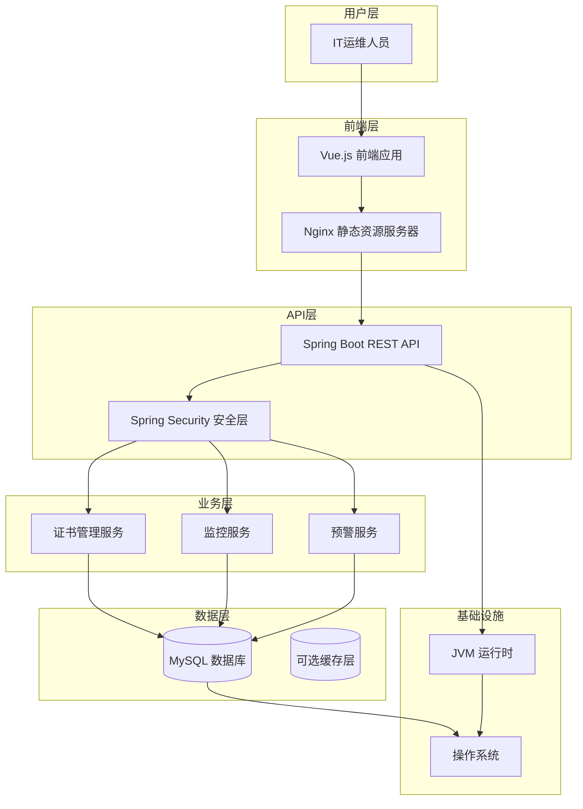

### 架构模式

- **领域驱动设计（DDD）**：采用 DDD 原则组织后端代码，将业务逻辑集中在领域层 - _理由_：确保业务逻辑的清晰性和可维护性，便于未来业务扩展

- **分层架构**：将系统分为表现层、应用层、领域层和基础设施层 - _理由_：实现关注点分离，提高代码的可测试性和可维护性

- **RESTful API**：使用 REST 风格设计 API 接口 - _理由_：标准化前后端通信，提高系统的互操作性

- **组件化前端**：使用 Vue 组件化开发前端界面 - _理由_：提高前端代码的复用性和可维护性

- **单仓库管理（Monorepo）**：前后端代码放在同一个仓库中管理 - _理由_：简化版本控制和依赖管理，便于团队协作

- **定时任务架构**：使用 Spring Scheduler 实现证书监控定时任务 - _理由_：轻量级实现，无需额外引入消息队列

- **安全优先设计**：在架构各层都考虑安全性 - _理由_：证书管理涉及敏感信息，安全性至关重要

## 技术栈

这是整个项目的最终技术选择。所有开发都必须使用这些确切版本，这是单一的真实来源。

### 技术栈表

| 类别 | 技术 | 版本 | 用途 | 理由 |
|------|------|------|------|------|
| 前端语言 | JavaScript | ES2020+ | 前端开发逻辑实现 | 现代 JavaScript 特性提供更好的开发体验和性能 |
| 前端框架 | Vue.js | 3.x | 构建响应式用户界面 | 轻量级、易学习、生态丰富，适合企业级应用 |
| 前端路由 | Vue Router | 4.x | 前端页面路由管理 | Vue.js 官方路由管理器，支持路由守卫和懒加载 |
| UI 组件库 | Element Plus | 2.x | 提供 UI 组件和设计系统 | 与 Vue.js 深度集成，提供丰富的企业级组件 |
| 状态管理 | Pinia | 2.x | 前端状态管理 | Vue 3 官方推荐，轻量且类型安全 |
| 后端语言 | Java | 8 | 后端业务逻辑实现 | 企业级标准，稳定可靠，生态系统成熟 |
| Java 开发工具包 | JDK (Oracle JDK 或 OpenJDK) | 8 | Java 运行环境 | 提供稳定的 Java 运行环境，与企业环境兼容性好 |
| 后端框架 | Spring Boot | 2.7.x | 构建 RESTful API 和后端服务 | 简化配置，快速开发，企业级特性丰富 |
| ORM 框架 | MyBatis Plus | 3.5.x | 数据访问层和对象关系映射 | 简化数据库操作，提供丰富的 CRUD 功能，与 Spring Boot 深度集成 |
| 定时任务框架 | Spring Scheduler | - | 证书监控定时任务 | Spring Boot 内置调度器，轻量级实现，无需额外依赖 |
| API 风格 | REST | - | 前后端通信接口 | 标准化、简单易用、工具支持丰富 |
| 数据库 | MySQL | 8.0 | 存储证书和系统数据 | 成熟可靠，性能优秀，与企业环境兼容性好 |
| 缓存 | - | - | 数据缓存（MVP 阶段暂不使用） | MVP 阶段简化架构，后续可根据性能需求添加 |
| 文件存储 | 本地文件系统 | - | 存储日志和临时文件 | MVP 阶段简化实现，后续可扩展为云存储 |
| 认证 | Spring Security + JWT | - | 用户认证和授权 | 企业级安全标准，无状态认证，易于扩展 |
| 安全通信 | HTTPS / SSL/TLS | - | 加密通信和数据传输安全 | 确保客户端和服务器之间的通信安全，防止数据窃听和篡改 |
| 前端测试 | Jest + Vue Test Utils | 最新 | 单元测试和组件测试 | Vue 生态系统标准测试工具，易于使用和维护 |
| 后端测试 | JUnit + Mockito | 5.x | 单元测试和集成测试 | Java 生态系统标准测试工具，与 Spring Boot 深度集成 |
| E2E 测试 | Selenium | 4.x | 端到端测试 | 成熟的浏览器自动化测试工具，支持多种浏览器 |
| 构建工具 | Maven | 3.8.x | 后端项目构建和依赖管理 | Java 生态系统标准，企业级依赖管理 |
| 打包工具 | Vite | 4.x | 前端资源打包和开发服务器 | 快速的构建和热重载，现代前端开发标准 |
| 基础设施即代码 | - | - | 基础设施管理（MVP 阶段暂不使用） | MVP 阶段简化部署，后续可添加 Docker 支持 |
| CI/CD | 基础脚本 | - | 持续集成和部署 | MVP 阶段使用简单脚本，后续可扩展为完整 CI/CD 流程 |
| 监控 | Spring Boot Actuator | - | 应用监控和健康检查 | Spring Boot 内置监控，提供基本的健康和指标信息 |
| 日志 | Logback | 1.3.x | 应用日志记录 | Spring Boot 默认日志框架，配置灵活，性能优秀 |
| CSS 框架 | Element Plus 内置样式 | 2.x | UI 样式和主题 | 与组件库深度集成，提供统一的设计系统 |

## 数据模型

定义将在前端和后端之间共享的核心数据模型/实体：

### Certificate（证书）

**目的：** 存储和管理证书的基本信息和状态

**关键属性：**
- id: Long - 证书唯一标识符
- name: String - 证书名称
- domain: String - 证书关联的域名
- issuer: String - 证书颁发机构
- issueDate: Date - 证书颁发日期
- expiryDate: Date - 证书到期日期
- certificateType: String - 证书类型（如 SSL/TLS、代码签名等）
- status: CertificateStatus - 证书状态（正常、即将过期、已过期）
- createdAt: Date - 记录创建时间
- updatedAt: Date - 记录更新时间

#### TypeScript 接口

```typescript
export interface Certificate {
  id: number;
  name: string;
  domain: string;
  issuer: string;
  issueDate: Date;
  expiryDate: Date;
  certificateType: string;
  status: CertificateStatus;
  createdAt: Date;
  updatedAt: Date;
}

export enum CertificateStatus {
  NORMAL = 'NORMAL',
  EXPIRING_SOON = 'EXPIRING_SOON',
  EXPIRED = 'EXPIRED'
}
```

#### 关系

- 与 MonitoringLog 一对多关系（一个证书可以有多个监控日志）

### MonitoringLog（监控日志）

**目的：** 记录证书监控和预警活动的日志

**关键属性：**
- id: Long - 日志唯一标识符
- certificateId: Long - 关联的证书ID
- logType: String - 日志类型（MONITORING、ALERT_EMAIL、ALERT_SMS）
- logTime: Date - 日志记录时间
- message: String - 日志消息内容
- daysUntilExpiry: Integer - 距离到期的天数
- createdAt: Date - 记录创建时间

#### TypeScript 接口

```typescript
export interface MonitoringLog {
  id: number;
  certificateId: number;
  logType: string;
  logTime: Date;
  message: string;
  daysUntilExpiry: number;
  createdAt: Date;
}

export enum LogType {
  MONITORING = 'MONITORING',
  ALERT_EMAIL = 'ALERT_EMAIL',
  ALERT_SMS = 'ALERT_SMS'
}
```

#### 关系

- 与 Certificate 多对一关系（多个监控日志属于一个证书）

## API 规范

定义系统的 REST API 接口，包括证书管理、监控和预警等功能。

### API 设计原则

- **RESTful 设计**：遵循 REST 架构风格，使用标准 HTTP 方法
- **统一响应格式**：所有 API 响应使用统一的 JSON 格式
- **状态码使用**：正确使用 HTTP 状态码表示请求结果
- **版本控制**：API 路径包含版本号（/api/v1/）
- **错误处理**：统一的错误响应格式，包含错误代码和消息
- **认证授权**：使用 JWT 进行 API 认证

### 统一响应格式

所有 API 响应使用以下统一格式：

```typescript
interface ApiResponse<T> {
  success: boolean;      // 请求是否成功
  code: number;          // 响应代码
  message: string;       // 响应消息
  data?: T;             // 响应数据（可选）
  timestamp: string;    // 响应时间戳
}
```

### 统一错误响应格式

```typescript
interface ApiError {
  success: boolean;      // 固定为 false
  code: number;          // 错误代码
  message: string;       // 错误消息
  error?: string;       // 详细错误信息（可选）
  timestamp: string;    // 响应时间戳
}
```

### 证书管理 API

#### 1. 获取证书列表

**端点：** `GET /api/v1/certificates`

**描述：** 获取证书列表，支持分页、排序和筛选

**请求参数：**
- `page` (number, 可选): 页码，默认为 1
- `size` (number, 可选): 每页大小，默认为 20
- `sort` (string, 可选): 排序字段，如 "expiryDate,desc"
- `status` (string, 可选): 筛选状态，如 "NORMAL"、"EXPIRING_SOON"、"EXPIRED"
- `search` (string, 可选): 搜索关键词，搜索证书名称和域名

**成功响应示例：**
```json
{
  "success": true,
  "code": 200,
  "message": "获取证书列表成功",
  "data": {
    "content": [
      {
        "id": 1,
        "name": "网站SSL证书",
        "domain": "example.com",
        "issuer": "Let's Encrypt",
        "issueDate": "2023-01-15T00:00:00Z",
        "expiryDate": "2024-01-15T00:00:00Z",
        "certificateType": "SSL/TLS",
        "status": "NORMAL",
        "createdAt": "2023-01-20T08:30:00Z",
        "updatedAt": "2023-01-20T08:30:00Z"
      }
    ],
    "pageable": {
      "sort": {
        "empty": false,
        "sorted": true,
        "unsorted": false
      },
      "offset": 0,
      "pageNumber": 0,
      "pageSize": 20,
      "paged": true,
      "unpaged": false
    },
    "last": true,
    "totalPages": 1,
    "totalElements": 1,
    "size": 20,
    "number": 0,
    "sort": {
      "empty": false,
      "sorted": true,
      "unsorted": false
    },
    "first": true,
    "numberOfElements": 1,
    "empty": false
  },
  "timestamp": "2023-06-15T10:30:00Z"
}
```

#### 2. 获取证书详情

**端点：** `GET /api/v1/certificates/{id}`

**描述：** 根据证书ID获取证书详情

**路径参数：**
- `id` (number): 证书ID

**成功响应示例：**
```json
{
  "success": true,
  "code": 200,
  "message": "获取证书详情成功",
  "data": {
    "id": 1,
    "name": "网站SSL证书",
    "domain": "example.com",
    "issuer": "Let's Encrypt",
    "issueDate": "2023-01-15T00:00:00Z",
    "expiryDate": "2024-01-15T00:00:00Z",
    "certificateType": "SSL/TLS",
    "status": "NORMAL",
    "createdAt": "2023-01-20T08:30:00Z",
    "updatedAt": "2023-01-20T08:30:00Z"
  },
  "timestamp": "2023-06-15T10:30:00Z"
}
```

#### 3. 创建证书

**端点：** `POST /api/v1/certificates`

**描述：** 创建新证书

**请求体：**
```json
{
  "name": "网站SSL证书",
  "domain": "example.com",
  "issuer": "Let's Encrypt",
  "issueDate": "2023-01-15T00:00:00Z",
  "expiryDate": "2024-01-15T00:00:00Z",
  "certificateType": "SSL/TLS"
}
```

**成功响应示例：**
```json
{
  "success": true,
  "code": 201,
  "message": "创建证书成功",
  "data": {
    "id": 1,
    "name": "网站SSL证书",
    "domain": "example.com",
    "issuer": "Let's Encrypt",
    "issueDate": "2023-01-15T00:00:00Z",
    "expiryDate": "2024-01-15T00:00:00Z",
    "certificateType": "SSL/TLS",
    "status": "NORMAL",
    "createdAt": "2023-06-15T10:30:00Z",
    "updatedAt": "2023-06-15T10:30:00Z"
  },
  "timestamp": "2023-06-15T10:30:00Z"
}
```

#### 4. 更新证书

**端点：** `PUT /api/v1/certificates/{id}`

**描述：** 更新证书信息

**路径参数：**
- `id` (number): 证书ID

**请求体：**
```json
{
  "name": "网站SSL证书（更新）",
  "domain": "example.com",
  "issuer": "Let's Encrypt",
  "issueDate": "2023-01-15T00:00:00Z",
  "expiryDate": "2024-06-15T00:00:00Z",
  "certificateType": "SSL/TLS"
}
```

**成功响应示例：**
```json
{
  "success": true,
  "code": 200,
  "message": "更新证书成功",
  "data": {
    "id": 1,
    "name": "网站SSL证书（更新）",
    "domain": "example.com",
    "issuer": "Let's Encrypt",
    "issueDate": "2023-01-15T00:00:00Z",
    "expiryDate": "2024-06-15T00:00:00Z",
    "certificateType": "SSL/TLS",
    "status": "NORMAL",
    "createdAt": "2023-01-20T08:30:00Z",
    "updatedAt": "2023-06-15T10:30:00Z"
  },
  "timestamp": "2023-06-15T10:30:00Z"
}
```

#### 5. 删除证书

**端点：** `DELETE /api/v1/certificates/{id}`

**描述：** 删除证书

**路径参数：**
- `id` (number): 证书ID

**成功响应示例：**
```json
{
  "success": true,
  "code": 200,
  "message": "删除证书成功",
  "timestamp": "2023-06-15T10:30:00Z"
}
```

### 监控日志 API

#### 1. 获取监控日志列表

**端点：** `GET /api/v1/monitoring-logs`

**描述：** 获取监控日志列表，支持分页、排序和筛选

**请求参数：**
- `page` (number, 可选): 页码，默认为 1
- `size` (number, 可选): 每页大小，默认为 20
- `sort` (string, 可选): 排序字段，如 "logTime,desc"
- `logType` (string, 可选): 筛选日志类型，如 "MONITORING"、"ALERT_EMAIL"、"ALERT_SMS"
- `certificateId` (number, 可选): 筛选证书ID
- `startDate` (string, 可选): 开始日期，格式为 "YYYY-MM-DD"
- `endDate` (string, 可选): 结束日期，格式为 "YYYY-MM-DD"

**成功响应示例：**
```json
{
  "success": true,
  "code": 200,
  "message": "获取监控日志列表成功",
  "data": {
    "content": [
      {
        "id": 1,
        "certificateId": 1,
        "logType": "MONITORING",
        "logTime": "2023-06-15T10:00:00Z",
        "message": "证书监控检查完成",
        "daysUntilExpiry": 30,
        "createdAt": "2023-06-15T10:00:00Z"
      },
      {
        "id": 2,
        "certificateId": 1,
        "logType": "ALERT_EMAIL",
        "logTime": "2023-06-15T10:00:00Z",
        "message": "发送证书过期预警邮件",
        "daysUntilExpiry": 30,
        "createdAt": "2023-06-15T10:00:00Z"
      }
    ],
    "pageable": {
      "sort": {
        "empty": false,
        "sorted": true,
        "unsorted": false
      },
      "offset": 0,
      "pageNumber": 0,
      "pageSize": 20,
      "paged": true,
      "unpaged": false
    },
    "last": true,
    "totalPages": 1,
    "totalElements": 2,
    "size": 20,
    "number": 0,
    "sort": {
      "empty": false,
      "sorted": true,
      "unsorted": false
    },
    "first": true,
    "numberOfElements": 2,
    "empty": false
  },
  "timestamp": "2023-06-15T10:30:00Z"
}
```

### 系统管理 API

#### 1. 手动触发证书监控

**端点：** `POST /api/v1/system/monitor-certificates`

**描述：** 手动触发证书监控检查

**成功响应示例：**
```json
{
  "success": true,
  "code": 200,
  "message": "证书监控检查已启动",
  "timestamp": "2023-06-15T10:30:00Z"
}
```

#### 2. 获取系统状态

**端点：** `GET /api/v1/system/status`

**描述：** 获取系统状态信息

**成功响应示例：**
```json
{
  "success": true,
  "code": 200,
  "message": "获取系统状态成功",
  "data": {
    "status": "RUNNING",
    "uptime": "2d 5h 30m",
    "certificateCount": 10,
    "normalCount": 8,
    "expiringSoonCount": 1,
    "expiredCount": 1,
    "lastMonitoringTime": "2023-06-15T10:00:00Z",
    "nextMonitoringTime": "2023-06-15T11:00:00Z"
  },
  "timestamp": "2023-06-15T10:30:00Z"
}
```

### 错误代码定义

| 代码 | 名称 | 描述 |
|------|------|------|
| 200 | OK | 请求成功 |
| 201 | Created | 资源创建成功 |
| 400 | Bad Request | 请求参数错误 |
| 401 | Unauthorized | 未授权访问 |
| 403 | Forbidden | 禁止访问 |
| 404 | Not Found | 资源不存在 |
| 500 | Internal Server Error | 服务器内部错误 |
| 10001 | Certificate Not Found | 证书不存在 |
| 10002 | Certificate Validation Failed | 证书验证失败 |
| 10003 | Certificate Already Exists | 证书已存在 |
| 10004 | Monitoring Failed | 监控失败 |
| 10005 | Alert Sending Failed | 预警发送失败 |

## 组件

定义前端和后端的核心组件，包括它们的职责和交互方式。

### 组件依赖关系和可重用性

#### 前端组件依赖关系图

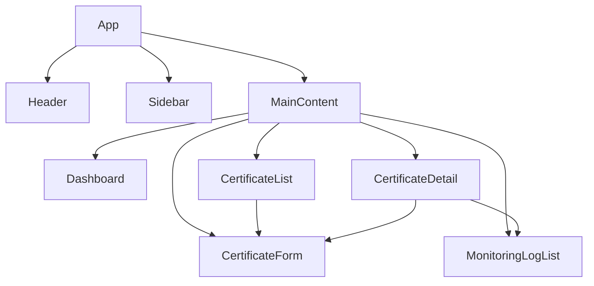

#### 后端组件依赖关系图

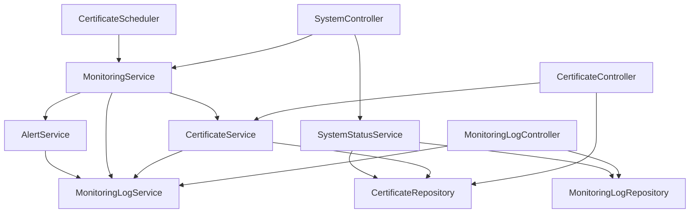

### 前端组件

#### 1. App.vue（根组件）

**职责：** 应用程序的根组件，负责整体布局和路由配置

**关键特性：**
- 应用整体布局结构
- 路由配置和导航
- 全局状态管理
- 全局样式和主题

**子组件：**
- Header
- Sidebar
- MainContent

**依赖关系：**
- 无父组件依赖
- 依赖 Vue Router 进行路由管理
- 依赖 Pinia 进行全局状态管理

**可重用性：**
- 高度可重用，作为整个应用的入口点
- 提供通用的布局结构，可以适应不同的内容需求
- 通过插槽（slots）机制允许灵活的内容插入

#### 2. CertificateList.vue（证书列表组件）

**职责：** 显示证书列表，提供搜索、筛选和排序功能

**关键特性：**
- 证书列表展示
- 分页功能
- 搜索功能（按证书名称和域名）
- 筛选功能（按证书状态）
- 排序功能（按到期日期和状态）
- 批量操作（查看、编辑、删除）

**数据依赖：**
- Certificate[] - 证书列表数据
- 分页信息
- 筛选和排序参数

**API 调用：**
- GET /api/v1/certificates - 获取证书列表
- DELETE /api/v1/certificates/{id} - 删除证书

**依赖关系：**
- 父组件：MainContent
- 子组件：CertificateForm（用于创建新证书）
- 依赖 Element Plus 的表格组件
- 依赖 Pinia 存储中的证书状态

**可重用性：**
- 中等可重用性，专为证书列表设计
- 分页、搜索和筛选逻辑可以抽象为可重用的混入（mixin）或组合式函数
- 表格列配置可以通过 props 动态调整，适应不同的展示需求
- 操作按钮可以通过插槽自定义，增加灵活性

#### 3. CertificateDetail.vue（证书详情组件）

**职责：** 显示单个证书的详细信息，提供编辑和删除功能

**关键特性：**
- 证书详细信息展示
- 证书状态可视化
- 编辑证书信息
- 删除证书
- 相关监控日志查看

**数据依赖：**
- Certificate - 证书详细信息
- MonitoringLog[] - 相关监控日志

**API 调用：**
- GET /api/v1/certificates/{id} - 获取证书详情
- PUT /api/v1/certificates/{id} - 更新证书
- DELETE /api/v1/certificates/{id} - 删除证书
- GET /api/v1/monitoring-logs?certificateId={id} - 获取相关监控日志

**依赖关系：**
- 父组件：MainContent
- 子组件：CertificateForm（用于编辑证书）、MonitoringLogList（用于显示相关日志）
- 依赖 Vue Router 的路由参数获取证书ID
- 依赖 Element Plus 的表单和卡片组件

**可重用性：**
- 中等可重用性，专为证书详情设计
- 详情展示部分可以抽象为通用的详情展示组件
- 状态可视化组件可以独立出来，用于其他需要状态展示的场景
- 通过 props 可以配置显示的字段和操作按钮，增加灵活性

#### 4. CertificateForm.vue（证书表单组件）

**职责：** 提供证书创建和编辑表单

**关键特性：**
- 表单验证
- 日期选择器
- 提交和取消按钮
- 错误提示

**数据依赖：**
- Certificate - 证书数据（编辑时）
- 表单验证规则

**API 调用：**
- POST /api/v1/certificates - 创建证书
- PUT /api/v1/certificates/{id} - 更新证书

**依赖关系：**
- 父组件：CertificateList（创建时）、CertificateDetail（编辑时）
- 依赖 Element Plus 的表单组件和日期选择器
- 依赖 Vuelidate 或类似库进行表单验证

**可重用性：**
- 高度可重用，同时支持创建和编辑模式
- 表单字段和验证规则可以通过 props 动态配置
- 表单提交逻辑可以抽象为可重用的混入（mixin）或组合式函数
- 通过事件发射（emit）与父组件通信，保持组件独立性

#### 5. Dashboard.vue（仪表板组件）

**职责：** 显示系统概览和关键指标

**关键特性：**
- 证书统计信息
- 证书状态分布图表
- 即将过期证书列表
- 最近添加的证书列表
- 系统状态信息

**数据依赖：**
- 证书统计数据
- 即将过期证书列表
- 系统状态信息

**API 调用：**
- GET /api/v1/certificates?status=EXPIRING_SOON - 获取即将过期证书
- GET /api/v1/certificates?sort=createdAt,desc - 获取最近添加的证书
- GET /api/v1/system/status - 获取系统状态

**依赖关系：**
- 父组件：MainContent
- 依赖 Element Plus 的卡片和统计组件
- 依赖图表库（如 ECharts 或 Chart.js）进行数据可视化
- 依赖 Pinia 存储中的系统状态

**可重用性：**
- 中等可重用性，专为系统仪表板设计
- 统计卡片组件可以独立出来，用于其他需要数据统计的场景
- 图表组件可以抽象为通用的图表包装器，支持不同类型的数据展示
- 通过 props 可以配置显示的指标和图表类型，增加灵活性

#### 6. MonitoringLogList.vue（监控日志列表组件）

**职责：** 显示监控日志列表，提供筛选和搜索功能

**关键特性：**
- 监控日志列表展示
- 分页功能
- 筛选功能（按日志类型和证书）
- 搜索功能
- 时间范围选择

**数据依赖：**
- MonitoringLog[] - 监控日志列表数据
- 分页信息
- 筛选参数

**API 调用：**
- GET /api/v1/monitoring-logs - 获取监控日志列表

**依赖关系：**
- 父组件：MainContent、CertificateDetail（作为子组件显示相关日志）
- 依赖 Element Plus 的表格组件和日期选择器
- 依赖 Pinia 存储中的监控日志状态

**可重用性：**
- 高度可重用，可以通过 props 配置为独立组件或嵌入其他组件
- 分页、搜索和筛选逻辑可以抽象为可重用的混入（mixin）或组合式函数
- 表格列配置可以通过 props 动态调整，适应不同的展示需求
- 时间范围选择器可以独立出来，用于其他需要时间筛选的场景

#### 7. Header.vue（页头组件）

**职责：** 显示应用程序页头，包含导航和用户信息

**关键特性：**
- 应用程序标题
- 导航菜单
- 用户信息显示
- 退出登录按钮

**依赖关系：**
- 父组件：App
- 依赖 Vue Router 进行导航
- 依赖 Pinia 存储中的用户状态

**可重用性：**
- 高度可重用，设计为通用的页头组件
- 导航菜单项可以通过 props 动态配置
- 用户信息显示区域可以通过插槽自定义
- 可以适应不同的布局需求，如固定顶部或跟随滚动

#### 8. Sidebar.vue（侧边栏组件）

**职责：** 显示侧边栏导航菜单

**关键特性：**
- 导航菜单项
- 菜单图标
- 当前活动项高亮

**依赖关系：**
- 父组件：App
- 依赖 Vue Router 进行导航和路由匹配
- 依赖 Pinia 存储中的导航状态

**可重用性：**
- 高度可重用，设计为通用的侧边栏导航组件
- 菜单项可以通过 props 动态配置，支持多级菜单
- 菜单图标可以通过插槽或 props 自定义
- 可以适应不同的布局需求，如固定左侧或可折叠
- 支持响应式设计，在移动设备上可以自动隐藏或转换为底部导航

### 后端组件

#### 1. CertificateController（证书控制器）

**职责：** 处理证书相关的 HTTP 请求

**关键方法：**
- getCertificates() - 获取证书列表
- getCertificate(id) - 获取单个证书
- createCertificate(certificate) - 创建证书
- updateCertificate(id, certificate) - 更新证书
- deleteCertificate(id) - 删除证书

**依赖服务：**
- CertificateService

**依赖关系：**
- 被 Spring MVC 框架管理和调用
- 依赖 CertificateService 处理业务逻辑
- 依赖 Spring Security 进行安全控制
- 依赖全局异常处理器处理异常

**可重用性：**
- 高度可重用，遵循标准的 RESTful API 设计模式
- 通过依赖注入可以轻松替换或扩展业务逻辑
- 可以通过 AOP 添加横切关注点，如日志记录、性能监控
- 支持不同的内容类型，如 JSON、XML

#### 2. MonitoringLogController（监控日志控制器）

**职责：** 处理监控日志相关的 HTTP 请求

**关键方法：**
- getMonitoringLogs() - 获取监控日志列表

**依赖服务：**
- MonitoringLogService

**依赖关系：**
- 被 Spring MVC 框架管理和调用
- 依赖 MonitoringLogService 处理业务逻辑
- 依赖 Spring Security 进行安全控制
- 依赖全局异常处理器处理异常

**可重用性：**
- 高度可重用，遵循标准的 RESTful API 设计模式
- 通过依赖注入可以轻松替换或扩展业务逻辑
- 可以通过 AOP 添加横切关注点，如日志记录、性能监控
- 支持不同的内容类型，如 JSON、XML
- 查询参数设计灵活，可以适应不同的筛选和排序需求

#### 3. SystemController（系统控制器）

**职责：** 处理系统管理相关的 HTTP 请求

**关键方法：**
- monitorCertificates() - 手动触发证书监控
- getSystemStatus() - 获取系统状态

**依赖服务：**
- MonitoringService
- SystemStatusService

**依赖关系：**
- 被 Spring MVC 框架管理和调用
- 依赖 MonitoringService 执行监控任务
- 依赖 SystemStatusService 获取系统状态
- 依赖 Spring Security 进行安全控制
- 依赖全局异常处理器处理异常

**可重用性：**
- 高度可重用，遵循标准的 RESTful API 设计模式
- 通过依赖注入可以轻松替换或扩展业务逻辑
- 可以通过 AOP 添加横切关注点，如日志记录、性能监控
- 系统状态信息可以扩展，包含更多的系统指标
- 监控触发机制可以扩展，支持不同的触发条件和参数

#### 4. CertificateService（证书服务）

**职责：** 实现证书相关的业务逻辑

**关键方法：**
- findAll() - 查询所有证书
- findById(id) - 根据ID查询证书
- save(certificate) - 保存证书
- update(id, certificate) - 更新证书
- deleteById(id) - 删除证书
- calculateStatus(certificate) - 计算证书状态
- validateCertificate(certificate) - 验证证书数据

**依赖组件：**
- CertificateRepository
- MonitoringLogService

**依赖关系：**
- 被 Controller 层调用，处理业务逻辑
- 依赖 CertificateRepository 进行数据访问
- 依赖 MonitoringLogService 记录操作日志
- 被 Spring 框架管理，支持事务管理

**可重用性：**
- 高度可重用，业务逻辑与数据访问分离
- 通过接口可以轻松实现不同的业务逻辑变体
- 支持事务管理，确保数据一致性
- 可以通过 AOP 添加横切关注点，如日志记录、性能监控
- 验证逻辑可以独立出来，用于不同的验证场景

#### 5. MonitoringLogService（监控日志服务）

**职责：** 实现监控日志相关的业务逻辑

**关键方法：**
- findAll() - 查询所有监控日志
- save(log) - 保存监控日志
- logMonitoring(certificate, daysUntilExpiry) - 记录监控日志
- logAlert(certificate, daysUntilExpiry, alertType) - 记录预警日志

**依赖组件：**
- MonitoringLogRepository

**依赖关系：**
- 被 Controller 层和其他 Service 层调用，处理日志业务逻辑
- 依赖 MonitoringLogRepository 进行数据访问
- 被 Spring 框架管理，支持事务管理

**可重用性：**
- 高度可重用，日志记录逻辑集中管理
- 通过接口可以轻松实现不同的日志记录策略
- 支持事务管理，确保日志记录的可靠性
- 可以通过 AOP 添加横切关注点，如性能监控
- 日志格式和内容可以灵活配置，适应不同的日志需求

#### 6. MonitoringService（监控服务）

**职责：** 实现证书监控的业务逻辑

**关键方法：**
- monitorAllCertificates() - 监控所有证书
- monitorCertificate(certificate) - 监控单个证书
- checkCertificateStatus(certificate) - 检查证书状态
- triggerAlerts(certificate, daysUntilExpiry) - 触发预警

**依赖组件：**
- CertificateService
- MonitoringLogService
- AlertService

**依赖关系：**
- 被 Controller 层和定时任务调用，执行监控逻辑
- 依赖 CertificateService 获取和更新证书信息
- 依赖 MonitoringLogService 记录监控日志
- 依赖 AlertService 发送预警通知
- 被 Spring 框架管理，支持事务管理

**可重用性：**
- 高度可重用，监控逻辑集中管理
- 通过接口可以轻松实现不同的监控策略
- 支持事务管理，确保监控和预警的一致性
- 可以通过 AOP 添加横切关注点，如性能监控
- 监控规则和预警阈值可以灵活配置，适应不同的业务需求

#### 7. AlertService（预警服务）

**职责：** 实现预警发送的业务逻辑

**关键方法：**
- sendEmailAlert(certificate, daysUntilExpiry) - 发送邮件预警
- sendSmsAlert(certificate, daysUntilExpiry) - 发送短信预警

**依赖组件：**
- MonitoringLogService

**依赖关系：**
- 被 MonitoringService 调用，执行预警发送逻辑
- 依赖 MonitoringLogService 记录预警日志
- 被 Spring 框架管理，支持事务管理

**可重用性：**
- 高度可重用，预警发送逻辑集中管理
- 通过接口可以轻松实现不同的预警发送策略
- 支持事务管理，确保预警发送和日志记录的一致性
- 可以通过 AOP 添加横切关注点，如性能监控、重试机制
- 预警模板和发送渠道可以灵活配置，适应不同的通知需求
- 在 MVP 阶段仅记录日志，后续可以扩展为实际的邮件和短信发送

#### 8. SystemStatusService（系统状态服务）

**职责：** 提供系统状态信息

**关键方法：**
- getSystemStatus() - 获取系统状态
- getCertificateStatistics() - 获取证书统计信息

**依赖组件：**
- CertificateRepository
- MonitoringLogRepository

**依赖关系：**
- 被 Controller 层调用，提供系统状态信息
- 依赖 CertificateRepository 获取证书统计数据
- 依赖 MonitoringLogRepository 获取监控日志统计数据
- 被 Spring 框架管理，支持缓存机制

**可重用性：**
- 高度可重用，系统状态信息集中管理
- 通过接口可以轻松实现不同的状态收集策略
- 支持缓存机制，提高频繁访问的性能
- 可以通过 AOP 添加横切关注点，如性能监控
- 状态指标可以灵活配置，适应不同的监控需求
- 可以扩展为更全面的健康检查服务

#### 9. Certificate（证书实体）

**职责：** 表示证书数据模型

**关键属性：**
- id: Long
- name: String
- domain: String
- issuer: String
- issueDate: Date
- expiryDate: Date
- certificateType: String
- status: CertificateStatus
- createdAt: Date
- updatedAt: Date

**依赖关系：**
- 被 MyBatis Plus 映射到数据库表
- 被 Service 层和 Repository 层使用
- 被 Controller 层序列化为 JSON 响应
- 被前端组件反序列化为 TypeScript 对象

**可重用性：**
- 高度可重用，作为数据模型在系统各层共享
- 通过 JPA 注解可以灵活配置数据库映射
- 通过 JSON 注解可以控制序列化和反序列化行为
- 验证注解可以确保数据完整性
- 可以扩展为更复杂的领域模型，包含业务方法和规则

#### 10. MonitoringLog（监控日志实体）

**职责：** 表示监控日志数据模型

**关键属性：**
- id: Long
- certificateId: Long
- logType: String
- logTime: Date
- message: String
- daysUntilExpiry: Integer
- createdAt: Date

**依赖关系：**
- 被 MyBatis Plus 映射到数据库表
- 被 Service 层和 Repository 层使用
- 被 Controller 层序列化为 JSON 响应
- 被前端组件反序列化为 TypeScript 对象
- 与 Certificate 实体存在多对一关系

**可重用性：**
- 高度可重用，作为数据模型在系统各层共享
- 通过 JPA 注解可以灵活配置数据库映射
- 通过 JSON 注解可以控制序列化和反序列化行为
- 日志类型可以通过枚举确保数据一致性
- 可以扩展为更复杂的领域模型，包含日志分析方法

#### 11. CertificateRepository（证书仓库）

**职责：** 提供证书数据访问层

**关键方法：**
- findAll() - 查询所有证书
- findById(id) - 根据ID查询证书
- save(certificate) - 保存证书
- update(certificate) - 更新证书
- deleteById(id) - 删除证书
- findByStatus(status) - 根据状态查询证书
- findByExpiryDateBefore(date) - 查询到期日期在指定日期之前的证书

**依赖关系：**
- 被 Service 层调用，提供数据访问功能
- 被 MyBatis Plus 实现，提供基本的 CRUD 操作
- 依赖数据库连接池管理数据库连接
- 支持事务管理，确保数据一致性

**可重用性：**
- 高度可重用，数据访问逻辑集中管理
- 通过接口可以轻松实现不同的数据访问策略
- MyBatis Plus 提供的通用方法减少了重复代码
- 自定义查询方法可以灵活适应不同的业务需求
- 支持分页、排序和动态查询，提高数据访问效率

#### 12. MonitoringLogRepository（监控日志仓库）

**职责：** 提供监控日志数据访问层

**关键方法：**
- findAll() - 查询所有监控日志
- save(log) - 保存监控日志
- findByCertificateId(certificateId) - 根据证书ID查询监控日志
- findByLogTypeAndDateRange(logType, startDate, endDate) - 根据日志类型和日期范围查询监控日志

**依赖关系：**
- 被 Service 层调用，提供数据访问功能
- 被 MyBatis Plus 实现，提供基本的 CRUD 操作
- 依赖数据库连接池管理数据库连接
- 支持事务管理，确保数据一致性

**可重用性：**
- 高度可重用，数据访问逻辑集中管理
- 通过接口可以轻松实现不同的数据访问策略
- MyBatis Plus 提供的通用方法减少了重复代码
- 自定义查询方法可以灵活适应不同的业务需求
- 支持分页、排序和动态查询，提高数据访问效率
- 日志查询方法可以优化，支持大量日志数据的高效检索

#### 13. CertificateScheduler（证书调度器）

**职责：** 定时执行证书监控任务

**关键方法：**
- monitorCertificatesTask() - 定时监控证书任务

**依赖组件：**
- MonitoringService

**依赖关系：**
- 被 Spring Scheduler 框架管理和调用
- 依赖 MonitoringService 执行监控逻辑
- 被 Spring 框架管理，支持事务管理
- 依赖系统配置确定调度频率

**可重用性：**
- 高度可重用，定时任务逻辑集中管理
- 通过注解可以灵活配置调度规则
- 支持事务管理，确保定时任务的数据一致性
- 可以通过 AOP 添加横切关注点，如性能监控、异常处理
- 调度参数可以通过外部配置，适应不同的业务需求
- 可以扩展为支持多种调度策略和触发条件

#### 14. SecurityConfig（安全配置）

**职责：** 配置应用程序安全性

**关键配置：**
- JWT 认证配置
- API 端点安全规则
- CORS 配置

**依赖关系：**
- 被 Spring Security 框架管理和调用
- 依赖 JWT 库进行令牌处理
- 依赖用户详情服务进行认证
- 被 Spring 框架管理，作为配置类

**可重用性：**
- 高度可重用，安全配置集中管理
- 通过配置可以灵活调整安全策略
- 支持多种认证方式，如 JWT、OAuth2
- 可以通过注解和方法级安全控制细粒度访问权限
- 安全规则可以动态配置，适应不同的部署环境
- 可以扩展为支持更复杂的安全需求，如多因素认证

#### 15. GlobalExceptionHandler（全局异常处理器）

**职责：** 处理应用程序异常并返回统一错误响应

**关键方法：**
- handleException() - 处理通用异常
- handleValidationException() - 处理验证异常
- handleBusinessException() - 处理业务异常

**依赖关系：**
- 被 Spring MVC 框架自动调用，处理 Controller 层抛出的异常
- 依赖消息源进行错误消息国际化
- 被 Spring 框架管理，作为全局异常处理器

**可重用性：**
- 高度可重用，异常处理逻辑集中管理
- 通过注解可以灵活配置处理的异常类型
- 支持统一的错误响应格式，提高 API 一致性
- 可以扩展为支持更多自定义异常类型和处理逻辑
- 错误消息可以国际化，适应不同语言环境
- 可以集成日志记录，便于问题追踪和分析

## 外部 API

定义系统与外部服务的接口，虽然 MVP 阶段可能不需要，但需要为未来扩展做准备。

### 外部 API 设计原则

- **接口稳定性**：外部 API 应保持稳定的接口版本，避免频繁变更
- **错误处理**：完善的错误处理机制，包括重试策略和降级方案
- **安全性**：所有外部 API 调用都应使用安全通信和认证机制
- **可配置性**：外部 API 的端点、超时和重试参数应可配置
- **监控和日志**：所有外部 API 调用都应有适当的监控和日志记录

### 邮件服务 API

**目的：** 发送证书过期预警邮件

**提供商选择：**
- **MVP 阶段**：仅记录日志，不实际发送邮件
- **未来扩展**：可集成 SendGrid、阿里云邮件服务或企业内部邮件服务器

**API 接口设计：**
```java
public interface EmailService {
    /**
     * 发送证书过期预警邮件
     * @param certificate 证书信息
     * @param daysUntilExpiry 距离到期的天数
     * @param recipientEmail 收件人邮箱
     * @return 发送结果
     */
    EmailResult sendExpiryAlertEmail(Certificate certificate, int daysUntilExpiry, String recipientEmail);
}

public class EmailResult {
    private boolean success;
    private String messageId;
    private String error;
    // getters and setters
}
```

**配置参数：**
```yaml
email:
  provider: log # 可选值：log, sendgrid, aliyun, smtp
  sendgrid:
    api-key: ${SENDGRID_API_KEY}
    from-email: noreply@example.com
  aliyun:
    access-key-id: ${ALIYUN_ACCESS_KEY_ID}
    access-key-secret: ${ALIYUN_ACCESS_KEY_SECRET}
    region: cn-hangzhou
  smtp:
    host: smtp.example.com
    port: 587
    username: ${SMTP_USERNAME}
    password: ${SMTP_PASSWORD}
    from-email: noreply@example.com
  timeout: 5000 # 超时时间（毫秒）
  retry:
    max-attempts: 3 # 最大重试次数
    interval: 1000 # 重试间隔（毫秒）
```

**错误处理策略：**
- 网络超时：自动重试，最多3次
- 认证失败：记录错误并通知管理员
- 邮件发送失败：记录错误并降级为日志记录
- 服务不可用：记录错误并启用备用邮件服务（如果配置）

### 短信服务 API

**目的：** 发送证书过期预警短信

**提供商选择：**
- **MVP 阶段**：仅记录日志，不实际发送短信
- **未来扩展**：可集成阿里云短信服务、腾讯云短信服务或 Twilio

**API 接口设计：**
```java
public interface SmsService {
    /**
     * 发送证书过期预警短信
     * @param certificate 证书信息
     * @param daysUntilExpiry 距离到期的天数
     * @param recipientPhone 收件人手机号
     * @return 发送结果
     */
    SmsResult sendExpiryAlertSms(Certificate certificate, int daysUntilExpiry, String recipientPhone);
}

public class SmsResult {
    private boolean success;
    private String messageId;
    private String error;
    // getters and setters
}
```

**配置参数：**
```yaml
sms:
  provider: log # 可选值：log, aliyun, tencent, twilio
  aliyun:
    access-key-id: ${ALIYUN_ACCESS_KEY_ID}
    access-key-secret: ${ALIYUN_ACCESS_KEY_SECRET}
    region: cn-hangzhou
    sign-name: 证书管理系统
    template-code: SMS_CERT_EXPIRY_ALERT
  tencent:
    secret-id: ${TENCENT_SECRET_ID}
    secret-key: ${TENCENT_SECRET_KEY}
    region: ap-beijing
    sign-name: 证书管理系统
    template-id: 123456
  twilio:
    account-sid: ${TWILIO_ACCOUNT_SID}
    auth-token: ${TWILIO_AUTH_TOKEN}
    from-number: +1234567890
  timeout: 5000 # 超时时间（毫秒）
  retry:
    max-attempts: 3 # 最大重试次数
    interval: 1000 # 重试间隔（毫秒）
```

**错误处理策略：**
- 网络超时：自动重试，最多3次
- 认证失败：记录错误并通知管理员
- 短信发送失败：记录错误并降级为日志记录
- 服务不可用：记录错误并启用备用短信服务（如果配置）

### 证书验证 API

**目的：** 验证证书的有效性和状态

**提供商选择：**
- **MVP 阶段**：使用 Java 内置证书验证功能
- **未来扩展**：可集成第三方证书验证服务，如 SSL Labs API

**API 接口设计：**
```java
public interface CertificateValidationService {
    /**
     * 验证证书的有效性和状态
     * @param certificate 证书信息
     * @return 验证结果
     */
    ValidationResult validateCertificate(Certificate certificate);
}

public class ValidationResult {
    private boolean valid;
    private String status;
    private int daysUntilExpiry;
    private List<String> issues;
    // getters and setters
}
```

**配置参数：**
```yaml
certificate-validation:
  provider: builtin # 可选值：builtin, ssl-labs
  ssl-labs:
    api-key: ${SSL_LABS_API_KEY}
    endpoint: https://api.ssllabs.com/api/v3/
    timeout: 30000 # 超时时间（毫秒）
    cache:
      ttl: 3600 # 缓存时间（秒）
      max-size: 1000 # 最大缓存条目数
```

**错误处理策略：**
- 网络超时：自动重试，最多2次
- API 限制：记录错误并使用内置验证作为降级方案
- 验证失败：记录错误并标记证书为无效
- 服务不可用：记录错误并使用内置验证作为降级方案

### 监控和日志服务 API

**目的：** 将系统监控和日志数据发送到外部服务

**提供商选择：**
- **MVP 阶段**：使用 Spring Boot Actuator 和 Logback 本地记录
- **未来扩展**：可集成 Prometheus、Grafana、ELK Stack 或阿里云日志服务

**API 接口设计：**
```java
public interface MonitoringService {
    /**
     * 发送监控指标
     * @param metrics 监控指标
     */
    void sendMetrics(Map<String, Object> metrics);
    
    /**
     * 发送日志
     * @param logs 日志数据
     */
    void sendLogs(List<LogEntry> logs);
}

public class LogEntry {
    private String timestamp;
    private String level;
    private String logger;
    private String message;
    private Map<String, Object> context;
    // getters and setters
}
```

**配置参数：**
```yaml
monitoring:
  metrics:
    enabled: true
    provider: prometheus # 可选值：prometheus, aliyun
    prometheus:
      endpoint: http://prometheus:9091/api/v1/write
      interval: 10000 # 发送间隔（毫秒）
    aliyun:
      endpoint: https://metrics.cn-hangzhou.aliyuncs.com
      access-key-id: ${ALIYUN_ACCESS_KEY_ID}
      access-key-secret: ${ALIYUN_ACCESS_KEY_SECRET}
      project: certificate-management
      interval: 10000 # 发送间隔（毫秒）
  logging:
    enabled: true
    provider: elasticsearch # 可选值：elasticsearch, aliyun
    elasticsearch:
      hosts: http://elasticsearch:9200
      index: certificate-management-logs
      batch-size: 100
      batch-interval: 5000 # 批量发送间隔（毫秒）
    aliyun:
      endpoint: https://elasticsearch.cn-hangzhou.aliyuncs.com
      access-key-id: ${ALIYUN_ACCESS_KEY_ID}
      access-key-secret: ${ALIYUN_ACCESS_KEY_SECRET}
      project: certificate-management
      logstore: application-logs
      batch-size: 100
      batch-interval: 5000 # 批量发送间隔（毫秒）
```

**错误处理策略：**
- 网络超时：自动重试，最多3次
- 认证失败：记录错误并通知管理员
- 数据发送失败：记录错误并降级为本地存储
- 服务不可用：记录错误并降级为本地存储，待服务恢复后重试

### 外部 API 集成架构

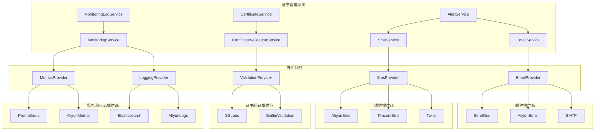

### 外部 API 调用模式

#### 1. 同步调用模式

**适用场景：** 需要立即获取结果的场景，如证书验证

**实现方式：**
```java
public class CertificateServiceImpl implements CertificateService {
    private final CertificateValidationService validationService;
    
    @Override
    public Certificate validateCertificate(Certificate certificate) {
        ValidationResult result = validationService.validateCertificate(certificate);
        // 处理验证结果
        return updateCertificateStatus(certificate, result);
    }
}
```

**优缺点：**
- 优点：实现简单，逻辑清晰
- 缺点：外部服务延迟会影响系统响应时间

#### 2. 异步调用模式

**适用场景：** 不需要立即获取结果的场景，如发送预警邮件和短信

**实现方式：**
```java
public class AlertServiceImpl implements AlertService {
    private final EmailService emailService;
    private final SmsService smsService;
    private final TaskExecutor taskExecutor;
    
    @Override
    public void sendExpiryAlert(Certificate certificate, int daysUntilExpiry) {
        // 异步发送邮件
        taskExecutor.execute(() -> {
            EmailResult emailResult = emailService.sendExpiryAlertEmail(
                certificate, daysUntilExpiry, certificate.getContactEmail());
            logEmailResult(emailResult);
        });
        
        // 异步发送短信
        taskExecutor.execute(() -> {
            SmsResult smsResult = smsService.sendExpiryAlertSms(
                certificate, daysUntilExpiry, certificate.getContactPhone());
            logSmsResult(smsResult);
        });
    }
}
```

**优缺点：**
- 优点：不会阻塞主线程，提高系统响应速度
- 缺点：实现复杂，需要处理异步任务失败的情况

#### 3. 批量调用模式

**适用场景：** 需要处理大量数据的场景，如批量发送监控指标和日志

**实现方式：**
```java
public class MonitoringServiceImpl implements MonitoringService {
    private final MetricsService metricsService;
    private final LoggingService loggingService;
    private final ScheduledExecutorService scheduler;
    private final Queue<Map<String, Object>> metricsQueue = new ConcurrentLinkedQueue<>();
    private final Queue<LogEntry> logsQueue = new ConcurrentLinkedQueue<>();
    
    @PostConstruct
    public void init() {
        // 定时批量发送监控指标
        scheduler.scheduleAtFixedRate(this::sendMetricsBatch, 10, 10, TimeUnit.SECONDS);
        
        // 定时批量发送日志
        scheduler.scheduleAtFixedRate(this::sendLogsBatch, 5, 5, TimeUnit.SECONDS);
    }
    
    private void sendMetricsBatch() {
        if (!metricsQueue.isEmpty()) {
            List<Map<String, Object>> batch = new ArrayList<>();
            while (!metricsQueue.isEmpty() && batch.size() < 100) {
                batch.add(metricsQueue.poll());
            }
            if (!batch.isEmpty()) {
                metricsService.sendMetrics(batch);
            }
        }
    }
    
    private void sendLogsBatch() {
        if (!logsQueue.isEmpty()) {
            List<LogEntry> batch = new ArrayList<>();
            while (!logsQueue.isEmpty() && batch.size() < 100) {
                batch.add(logsQueue.poll());
            }
            if (!batch.isEmpty()) {
                loggingService.sendLogs(batch);
            }
        }
    }
}
```

**优缺点：**
- 优点：减少网络调用次数，提高处理效率
- 缺点：数据会有一定延迟，需要处理队列满的情况

### 外部 API 安全考虑

#### 1. 认证和授权

- **API 密钥**：所有外部 API 调用都应使用 API 密钥进行认证
- **IP 白名单**：限制只有系统服务器的 IP 可以访问外部 API
- **最小权限原则**：API 密钥应只具有必要的权限

#### 2. 数据安全

- **HTTPS**：所有外部 API 调用都应使用 HTTPS 加密
- **敏感数据**：不在日志中记录敏感信息，如 API 密钥、个人身份信息
- **数据脱敏**：在发送到外部服务前，对敏感数据进行脱敏处理

#### 3. 错误处理

- **错误信息**：不在错误响应中暴露敏感信息
- **重试机制**：实现安全的重试机制，避免重试风暴
- **降级策略**：在外部服务不可用时，有安全的降级策略

### 外部 API 监控和日志

#### 1. 监控指标

- **调用次数**：记录每个外部 API 的调用次数
- **响应时间**：记录每个外部 API 的响应时间
- **错误率**：记录每个外部 API 的错误率
- **可用性**：记录每个外部 API 的可用性

#### 2. 日志记录

- **请求日志**：记录外部 API 的请求内容（脱敏后）
- **响应日志**：记录外部 API 的响应内容（脱敏后）
- **错误日志**：记录外部 API 调用的错误信息
- **性能日志**：记录外部 API 调用的性能数据

#### 3. 告警规则

- **高错误率**：当外部 API 的错误率超过阈值时发送告警
- **高响应时间**：当外部 API 的响应时间超过阈值时发送告警
- **服务不可用**：当外部 API 连续多次调用失败时发送告警
- **配额耗尽**：当外部 API 的配额即将耗尽时发送告警

## 核心工作流

定义系统的核心业务流程，包括证书管理、监控和预警等流程。

### 工作流设计原则

- **用户中心**：所有工作流都应以用户需求和体验为中心
- **端到端**：工作流应覆盖完整的业务流程，从开始到结束
- **异常处理**：每个工作流都应有完善的异常处理机制
- **可追踪**：工作流中的每个步骤都应有适当的日志记录
- **可配置**：工作流中的关键参数应可配置，以适应不同的业务需求

### 证书管理工作流

#### 1. 创建证书工作流

**目的：** 创建新的证书记录

**触发条件：** 用户通过前端界面提交创建证书表单

**工作流步骤：**
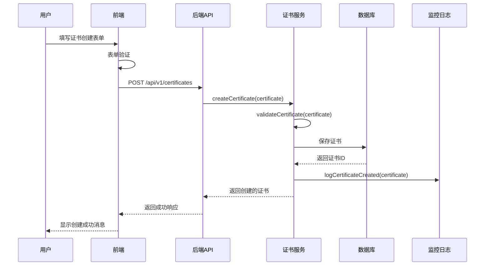

**关键业务规则：**
- 证书名称和域名不能为空
- 证书颁发日期不能晚于到期日期
- 证书类型必须是预定义的类型之一
- 证书创建后状态自动设置为 NORMAL

**异常处理：**
- 表单验证失败：显示具体的错误信息
- 证书名称或域名已存在：显示冲突错误
- 数据库保存失败：记录错误并显示服务器错误
- 系统异常：记录错误并显示服务器错误

#### 2. 更新证书工作流

**目的：** 更新现有证书的信息

**触发条件：** 用户通过前端界面提交更新证书表单

**工作流步骤：**
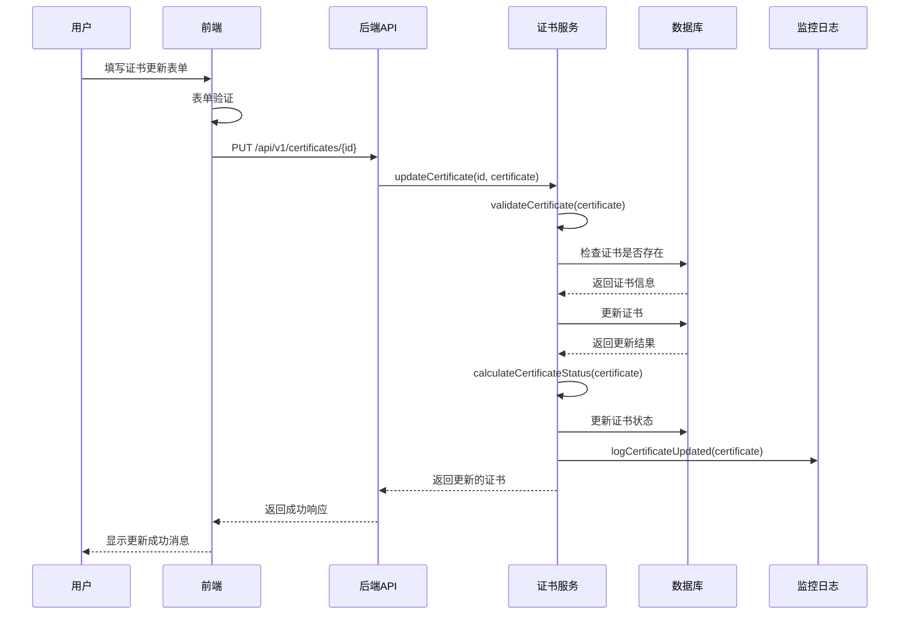

**关键业务规则：**
- 证书名称和域名不能为空
- 证书颁发日期不能晚于到期日期
- 证书类型必须是预定义的类型之一
- 证书状态根据到期日期自动计算

**异常处理：**
- 表单验证失败：显示具体的错误信息
- 证书不存在：显示未找到错误
- 证书名称或域名与其他证书冲突：显示冲突错误
- 数据库更新失败：记录错误并显示服务器错误
- 系统异常：记录错误并显示服务器错误

#### 3. 删除证书工作流

**目的：** 删除现有证书及其相关数据

**触发条件：** 用户通过前端界面确认删除证书

**工作流步骤：**
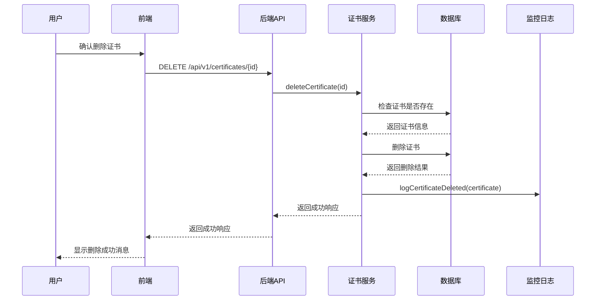

**关键业务规则：**
- 只有存在的证书才能被删除
- 证书删除后，相关的监控日志应保留
- 证书删除操作不可逆

**异常处理：**
- 证书不存在：显示未找到错误
- 数据库删除失败：记录错误并显示服务器错误
- 系统异常：记录错误并显示服务器错误

### 证书监控工作流

#### 1. 自动监控工作流

**目的：** 定期检查所有证书的状态和到期时间

**触发条件：** 定时任务（默认每小时执行一次）

**工作流步骤：**
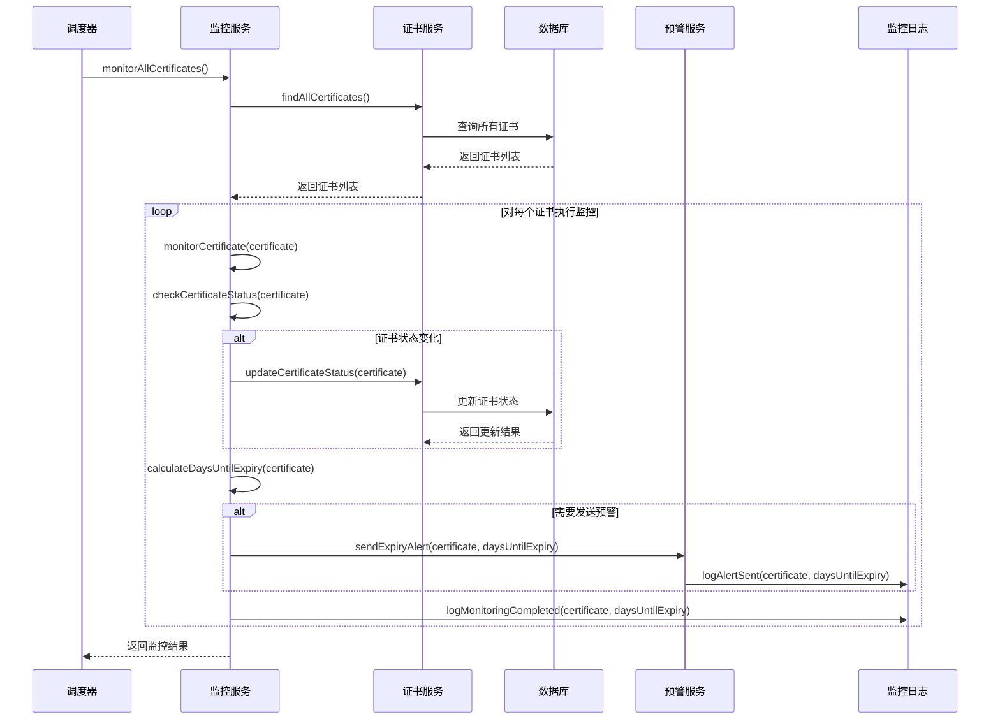

**关键业务规则：**
- 证书状态根据到期日期自动计算：
  - NORMAL：距离到期超过30天
  - EXPIRING_SOON：距离到期30天以内（含30天）
  - EXPIRED：已过期
- 当证书状态变为 EXPIRING_SOON 或 EXPIRED 时，发送预警
- 预警仅记录日志，不实际发送邮件或短信（MVP阶段）

**异常处理：**
- 证书查询失败：记录错误并跳过该证书
- 证书状态更新失败：记录错误并继续处理其他证书
- 预警发送失败：记录错误并继续处理其他证书
- 系统异常：记录错误并终止监控流程

#### 2. 手动监控工作流

**目的：** 手动触发证书监控检查

**触发条件：** 用户通过前端界面点击手动监控按钮

**工作流步骤：**
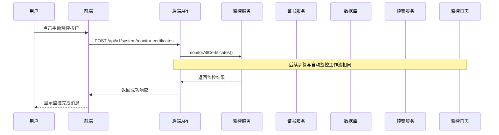

**关键业务规则：**
- 与自动监控工作流使用相同的业务逻辑
- 手动监控会检查所有证书，不受定时调度限制
- 手动监控的结果会记录到监控日志中

**异常处理：**
- 与自动监控工作流的异常处理相同
- 监控启动失败：记录错误并显示服务器错误
- 系统异常：记录错误并显示服务器错误

### 证书预警工作流

#### 1. 证书状态变更预警工作流

**目的：** 当证书状态发生变化时发送预警

**触发条件：** 证书状态从 NORMAL 变为 EXPIRING_SOON 或 EXPIRED

**工作流步骤：**
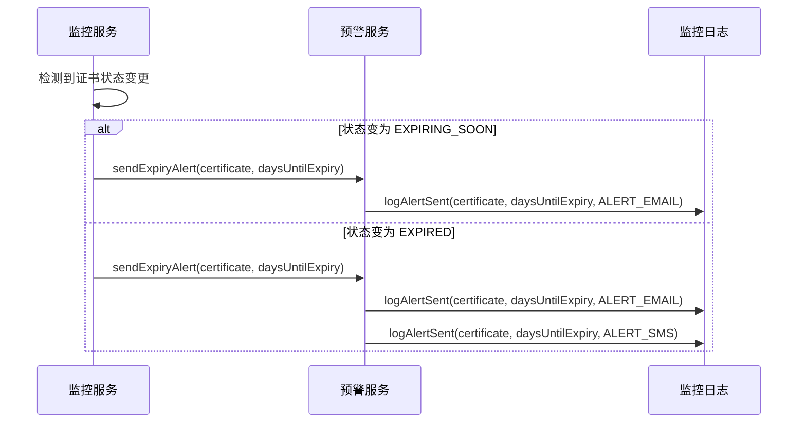

**关键业务规则：**
- 当证书状态变为 EXPIRING_SOON 时，发送邮件预警
- 当证书状态变为 EXPIRED 时，发送邮件预警和短信预警
- 预警仅记录日志，不实际发送邮件或短信（MVP阶段）
- 同一证书的同一状态变更只发送一次预警

**异常处理：**
- 预警发送失败：记录错误并继续处理
- 系统异常：记录错误并终止预警流程

#### 2. 定期预警工作流

**目的：** 定期发送证书状态摘要，提醒用户关注即将过期或已过期的证书

**触发条件：** 定时任务（默认每天上午9点执行）

**工作流步骤：**
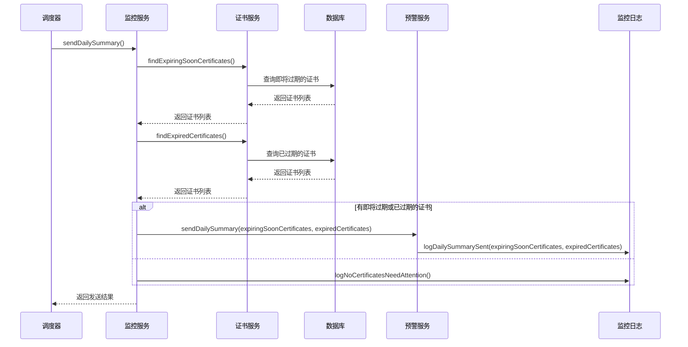

**关键业务规则：**
- 每天发送一次证书状态摘要
- 摘要包含即将过期和已过期的证书列表
- 如果没有需要关注的证书，记录日志但不发送摘要
- 预警仅记录日志，不实际发送邮件或短信（MVP阶段）

**异常处理：**
- 证书查询失败：记录错误并跳过该查询
- 摘要发送失败：记录错误并继续处理
- 系统异常：记录错误并终止摘要发送流程

### 系统管理工作流

#### 1. 系统状态查询工作流

**目的：** 查询系统的运行状态和统计信息

**触发条件：** 用户访问仪表板页面或手动刷新系统状态

**工作流步骤：**
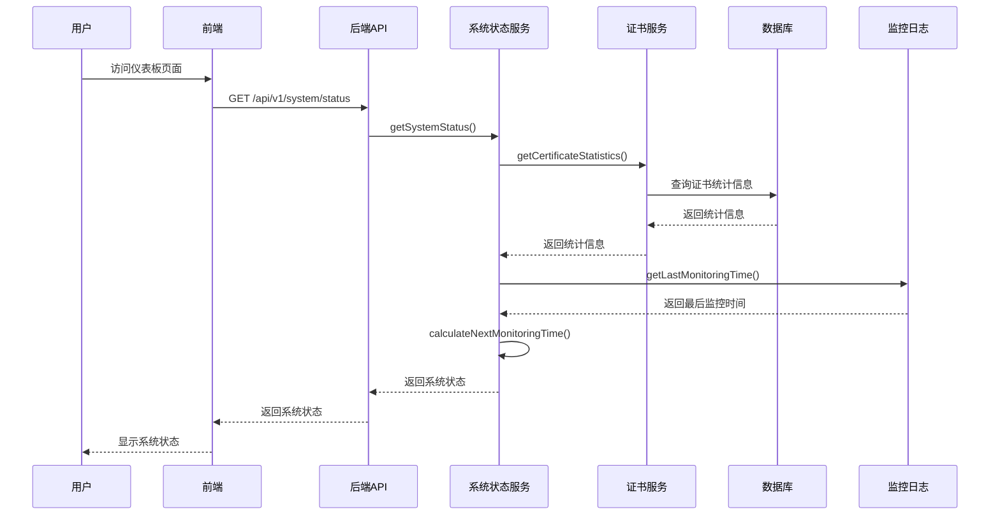

**关键业务规则：**
- 系统状态包括：
  - 系统运行状态（RUNNING、MAINTENANCE、ERROR）
  - 系统运行时间
  - 证书总数
  - 各状态证书数量
  - 最后监控时间
  - 下次监控时间
- 系统状态信息应实时更新

**异常处理：**
- 统计信息查询失败：记录错误并使用默认值
- 系统异常：记录错误并返回错误状态

#### 2. 监控日志查询工作流

**目的：** 查询系统的监控日志记录

**触发条件：** 用户访问监控日志页面或执行日志搜索

**工作流步骤：**
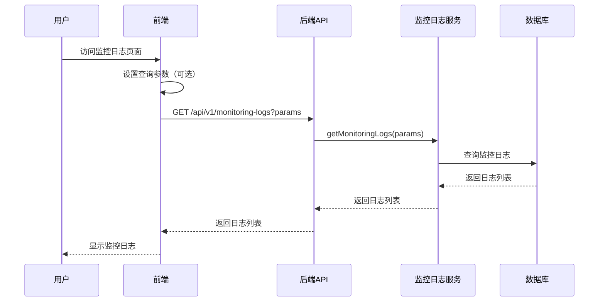

**关键业务规则：**
- 监控日志可以按以下条件筛选：
  - 日志类型（MONITORING、ALERT_EMAIL、ALERT_SMS）
  - 证书ID
  - 时间范围
- 监控日志支持分页和排序
- 监控日志查询结果应包含总记录数

**异常处理：**
- 日志查询失败：记录错误并返回空列表
- 系统异常：记录错误并返回错误状态

### 工作流配置

#### 1. 监控配置

```yaml
monitoring:
  # 自动监控调度配置
  scheduler:
    enabled: true
    cron: 0 0 * * * # 每天午夜执行
    timezone: Asia/Shanghai
    # 手动触发是否需要管理员权限
    manual-trigger-requires-admin: false
  
  # 证书状态计算规则
  status-rules:
    expiring-soon-threshold: 30 # 距离到期30天以内为即将过期
    expired-threshold: 0 # 距离到期0天以内为已过期
  
  # 预警配置
  alerts:
    # 状态变更预警
    status-change:
      enabled: true
      expiring-soon:
        channels:
          - email
      expired:
        channels:
          - email
          - sms
    # 定期预警
    daily-summary:
      enabled: true
      time: 09:00:00 # 每天上午9点
      timezone: Asia/Shanghai
      channels:
        - email
```

#### 2. 工作流重试配置

```yaml
workflow:
  # 重试配置
  retry:
    max-attempts: 3
    backoff-multiplier: 2
    initial-interval: 1000 # 初始间隔1秒
    max-interval: 10000 # 最大间隔10秒
  
  # 超时配置
  timeout:
    certificate-monitoring: 300000 # 证书监控超时5分钟
    alert-sending: 30000 # 预警发送超时30秒
    status-query: 10000 # 状态查询超时10秒
  
  # 降级配置
  fallback:
    alert-sending: log # 预警发送失败时降级为记录日志
    certificate-validation: builtin # 证书验证失败时降级为内置验证
```

### 工作流监控和日志

#### 1. 工作流监控指标

- **执行次数**：记录每个工作流的执行次数
- **执行时间**：记录每个工作流的执行时间
- **成功率**：记录每个工作流的成功率
- **错误率**：记录每个工作流的错误率
- **预警发送次数**：记录预警发送的次数和成功率

#### 2. 工作流日志记录

- **开始日志**：记录工作流开始执行的时间和参数
- **步骤日志**：记录工作流中每个关键步骤的执行情况
- **错误日志**：记录工作流执行过程中的错误信息
- **完成日志**：记录工作流完成执行的时间和结果

#### 3. 工作流告警规则

- **工作流失败**：当关键工作流连续多次失败时发送告警
- **执行超时**：当工作流执行时间超过阈值时发送告警
- **预警发送失败**：当预警发送连续多次失败时发送告警
- **证书状态异常**：当大量证书状态异常时发送告警

## 数据库架构

定义系统的数据库结构，包括表设计、字段定义、索引和关系等。

### 数据库设计原则

- **规范化**：遵循数据库规范化原则，避免数据冗余
- **性能优化**：合理设计索引，优化查询性能
- **可扩展性**：设计支持未来业务扩展的表结构
- **数据完整性**：使用外键约束和触发器确保数据完整性
- **安全性**：敏感数据加密存储，限制数据访问权限

### 数据库选型

- **数据库类型**：MySQL 8.0
- **字符集**：utf8mb4
- **排序规则**：utf8mb4_general_ci
- **存储引擎**：InnoDB
- **事务隔离级别**：READ COMMITTED

### 表结构设计

#### 1. 证书表 (certificate)

**用途**：存储证书的基本信息和状态

```sql
CREATE TABLE `certificate` (
  `id` bigint NOT NULL AUTO_INCREMENT COMMENT '证书唯一标识符',
  `name` varchar(100) NOT NULL COMMENT '证书名称',
  `domain` varchar(255) NOT NULL COMMENT '证书关联的域名',
  `issuer` varchar(100) NOT NULL COMMENT '证书颁发机构',
  `issue_date` datetime NOT NULL COMMENT '证书颁发日期',
  `expiry_date` datetime NOT NULL COMMENT '证书到期日期',
  `certificate_type` varchar(50) NOT NULL COMMENT '证书类型',
  `status` varchar(20) NOT NULL DEFAULT 'NORMAL' COMMENT '证书状态（NORMAL、EXPIRING_SOON、EXPIRED）',
  `created_at` datetime NOT NULL DEFAULT CURRENT_TIMESTAMP COMMENT '记录创建时间',
  `updated_at` datetime NOT NULL DEFAULT CURRENT_TIMESTAMP ON UPDATE CURRENT_TIMESTAMP COMMENT '记录更新时间',
  PRIMARY KEY (`id`),
  UNIQUE KEY `uk_domain` (`domain`),
  KEY `idx_status` (`status`),
  KEY `idx_expiry_date` (`expiry_date`),
  KEY `idx_created_at` (`created_at`)
) ENGINE=InnoDB DEFAULT CHARSET=utf8mb4 COLLATE=utf8mb4_general_ci COMMENT='证书信息表';
```

**字段说明**：
- `id`：主键，自增长
- `name`：证书名称，必填
- `domain`：证书关联的域名，必填，唯一
- `issuer`：证书颁发机构，必填
- `issue_date`：证书颁发日期，必填
- `expiry_date`：证书到期日期，必填
- `certificate_type`：证书类型，必填
- `status`：证书状态，默认为 NORMAL
- `created_at`：记录创建时间，默认为当前时间
- `updated_at`：记录更新时间，默认为当前时间，更新时自动更新

**索引说明**：
- `PRIMARY KEY (`id`)`：主键索引
- `UNIQUE KEY `uk_domain` (`domain`)`：域名唯一索引
- `KEY `idx_status` (`status`)`：状态索引，用于按状态查询
- `KEY `idx_expiry_date` (`expiry_date`)`：到期日期索引，用于按到期日期查询
- `KEY `idx_created_at` (`created_at`)`：创建时间索引，用于按创建时间查询

#### 2. 监控日志表 (monitoring_log)

**用途**：记录证书监控和预警活动的日志

```sql
CREATE TABLE `monitoring_log` (
  `id` bigint NOT NULL AUTO_INCREMENT COMMENT '日志唯一标识符',
  `certificate_id` bigint NOT NULL COMMENT '关联的证书ID',
  `log_type` varchar(20) NOT NULL COMMENT '日志类型（MONITORING、ALERT_EMAIL、ALERT_SMS）',
  `log_time` datetime NOT NULL DEFAULT CURRENT_TIMESTAMP COMMENT '日志记录时间',
  `message` varchar(500) NOT NULL COMMENT '日志消息内容',
  `days_until_expiry` int DEFAULT NULL COMMENT '距离到期的天数',
  `created_at` datetime NOT NULL DEFAULT CURRENT_TIMESTAMP COMMENT '记录创建时间',
  PRIMARY KEY (`id`),
  KEY `idx_certificate_id` (`certificate_id`),
  KEY `idx_log_type` (`log_type`),
  KEY `idx_log_time` (`log_time`),
  KEY `idx_created_at` (`created_at`),
  CONSTRAINT `fk_monitoring_log_certificate` FOREIGN KEY (`certificate_id`) REFERENCES `certificate` (`id`) ON DELETE CASCADE
) ENGINE=InnoDB DEFAULT CHARSET=utf8mb4 COLLATE=utf8mb4_general_ci COMMENT='监控日志表';
```

**字段说明**：
- `id`：主键，自增长
- `certificate_id`：关联的证书ID，必填，外键
- `log_type`：日志类型，必填
- `log_time`：日志记录时间，必填，默认为当前时间
- `message`：日志消息内容，必填
- `days_until_expiry`：距离到期的天数，可选
- `created_at`：记录创建时间，默认为当前时间

**索引说明**：
- `PRIMARY KEY (`id`)`：主键索引
- `KEY `idx_certificate_id` (`certificate_id`)`：证书ID索引，用于按证书查询日志
- `KEY `idx_log_type` (`log_type`)`：日志类型索引，用于按日志类型查询
- `KEY `idx_log_time` (`log_time`)`：日志时间索引，用于按日志时间查询
- `KEY `idx_created_at` (`created_at`)`：创建时间索引，用于按创建时间查询

**外键约束**：
- `CONSTRAINT `fk_monitoring_log_certificate` FOREIGN KEY (`certificate_id`) REFERENCES `certificate` (`id`) ON DELETE CASCADE`：证书ID外键，级联删除

### 数据库关系图

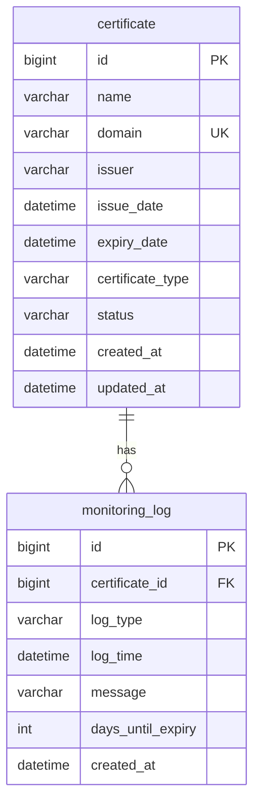

### 数据库初始化脚本

```sql
-- 创建数据库
CREATE DATABASE IF NOT EXISTS `certificate_management` DEFAULT CHARACTER SET utf8mb4 COLLATE utf8mb4_general_ci;

-- 使用数据库
USE `certificate_management`;

-- 创建证书表
CREATE TABLE IF NOT EXISTS `certificate` (
  `id` bigint NOT NULL AUTO_INCREMENT COMMENT '证书唯一标识符',
  `name` varchar(100) NOT NULL COMMENT '证书名称',
  `domain` varchar(255) NOT NULL COMMENT '证书关联的域名',
  `issuer` varchar(100) NOT NULL COMMENT '证书颁发机构',
  `issue_date` datetime NOT NULL COMMENT '证书颁发日期',
  `expiry_date` datetime NOT NULL COMMENT '证书到期日期',
  `certificate_type` varchar(50) NOT NULL COMMENT '证书类型',
  `status` varchar(20) NOT NULL DEFAULT 'NORMAL' COMMENT '证书状态（NORMAL、EXPIRING_SOON、EXPIRED）',
  `created_at` datetime NOT NULL DEFAULT CURRENT_TIMESTAMP COMMENT '记录创建时间',
  `updated_at` datetime NOT NULL DEFAULT CURRENT_TIMESTAMP ON UPDATE CURRENT_TIMESTAMP COMMENT '记录更新时间',
  PRIMARY KEY (`id`),
  UNIQUE KEY `uk_domain` (`domain`),
  KEY `idx_status` (`status`),
  KEY `idx_expiry_date` (`expiry_date`),
  KEY `idx_created_at` (`created_at`)
) ENGINE=InnoDB DEFAULT CHARSET=utf8mb4 COLLATE=utf8mb4_general_ci COMMENT='证书信息表';

-- 创建监控日志表
CREATE TABLE IF NOT EXISTS `monitoring_log` (
  `id` bigint NOT NULL AUTO_INCREMENT COMMENT '日志唯一标识符',
  `certificate_id` bigint NOT NULL COMMENT '关联的证书ID',
  `log_type` varchar(20) NOT NULL COMMENT '日志类型（MONITORING、ALERT_EMAIL、ALERT_SMS）',
  `log_time` datetime NOT NULL DEFAULT CURRENT_TIMESTAMP COMMENT '日志记录时间',
  `message` varchar(500) NOT NULL COMMENT '日志消息内容',
  `days_until_expiry` int DEFAULT NULL COMMENT '距离到期的天数',
  `created_at` datetime NOT NULL DEFAULT CURRENT_TIMESTAMP COMMENT '记录创建时间',
  PRIMARY KEY (`id`),
  KEY `idx_certificate_id` (`certificate_id`),
  KEY `idx_log_type` (`log_type`),
  KEY `idx_log_time` (`log_time`),
  KEY `idx_created_at` (`created_at`),
  CONSTRAINT `fk_monitoring_log_certificate` FOREIGN KEY (`certificate_id`) REFERENCES `certificate` (`id`) ON DELETE CASCADE
) ENGINE=InnoDB DEFAULT CHARSET=utf8mb4 COLLATE=utf8mb4_general_ci COMMENT='监控日志表';

-- 插入示例数据
INSERT INTO `certificate` (`name`, `domain`, `issuer`, `issue_date`, `expiry_date`, `certificate_type`, `status`) VALUES
('网站SSL证书', 'example.com', 'Let''s Encrypt', '2023-01-15 00:00:00', '2024-01-15 00:00:00', 'SSL/TLS', 'NORMAL'),
('API网关证书', 'api.example.com', 'DigiCert', '2023-03-01 00:00:00', '2024-03-01 00:00:00', 'SSL/TLS', 'NORMAL'),
('内部服务证书', 'service.internal', 'Self-Signed', '2023-02-01 00:00:00', '2023-08-01 00:00:00', 'SSL/TLS', 'EXPIRING_SOON'),
('测试环境证书', 'test.example.com', 'Let''s Encrypt', '2023-01-01 00:00:00', '2023-04-01 00:00:00', 'SSL/TLS', 'EXPIRED');

INSERT INTO `monitoring_log` (`certificate_id`, `log_type`, `log_time`, `message`, `days_until_expiry`) VALUES
(1, 'MONITORING', '2023-06-15 10:00:00', '证书监控检查完成', 214),
(2, 'MONITORING', '2023-06-15 10:00:00', '证书监控检查完成', 259),
(3, 'MONITORING', '2023-06-15 10:00:00', '证书监控检查完成', 47),
(4, 'MONITORING', '2023-06-15 10:00:00', '证书监控检查完成', -75),
(3, 'ALERT_EMAIL', '2023-06-15 10:00:00', '发送证书过期预警邮件', 47),
(4, 'ALERT_EMAIL', '2023-06-15 10:00:00', '发送证书过期预警邮件', -75),
(4, 'ALERT_SMS', '2023-06-15 10:00:00', '发送证书过期预警短信', -75);
```

### 数据库性能优化

#### 1. 查询优化

**常用查询及优化建议**：

1. **查询所有证书**
   ```sql
   SELECT * FROM certificate ORDER BY created_at DESC;
   ```
   - 优化：使用 `idx_created_at` 索引

2. **按状态查询证书**
   ```sql
   SELECT * FROM certificate WHERE status = 'EXPIRING_SOON';
   ```
   - 优化：使用 `idx_status` 索引

3. **查询即将过期的证书**
   ```sql
   SELECT * FROM certificate WHERE expiry_date BETWEEN NOW() AND DATE_ADD(NOW(), INTERVAL 30 DAY);
   ```
   - 优化：使用 `idx_expiry_date` 索引

4. **查询证书的监控日志**
   ```sql
   SELECT * FROM monitoring_log WHERE certificate_id = 1 ORDER BY log_time DESC;
   ```
   - 优化：使用 `idx_certificate_id` 和 `idx_log_time` 索引

5. **按日志类型查询监控日志**
   ```sql
   SELECT * FROM monitoring_log WHERE log_type = 'ALERT_EMAIL';
   ```
   - 优化：使用 `idx_log_type` 索引

#### 2. 分页查询优化

**证书列表分页查询**：
```sql
-- 使用 LIMIT 和 OFFSET 进行分页
SELECT * FROM certificate ORDER BY created_at DESC LIMIT 20 OFFSET 0;

-- 对于大数据量，使用游标分页更高效
SELECT * FROM certificate WHERE created_at < '2023-06-15 10:00:00' ORDER BY created_at DESC LIMIT 20;
```

**监控日志分页查询**：
```sql
-- 使用 LIMIT 和 OFFSET 进行分页
SELECT * FROM monitoring_log WHERE certificate_id = 1 ORDER BY log_time DESC LIMIT 20 OFFSET 0;

-- 对于大数据量，使用游标分页更高效
SELECT * FROM monitoring_log WHERE certificate_id = 1 AND log_time < '2023-06-15 10:00:00' ORDER BY log_time DESC LIMIT 20;
```

#### 3. 索引优化建议

1. **复合索引**：对于经常一起查询的字段，考虑创建复合索引
   ```sql
   -- 证书状态和到期日期复合索引
   CREATE INDEX `idx_status_expiry_date` ON `certificate` (`status`, `expiry_date`);
   
   -- 监控日志证书ID和日志类型复合索引
   CREATE INDEX `idx_certificate_id_log_type` ON `monitoring_log` (`certificate_id`, `log_type`);
   ```

2. **覆盖索引**：对于只查询索引字段的场景，使用覆盖索引
   ```sql
   -- 证书ID和名称覆盖索引
   CREATE INDEX `idx_id_name` ON `certificate` (`id`, `name`);
   
   -- 监控日志ID和消息覆盖索引
   CREATE INDEX `idx_id_message` ON `monitoring_log` (`id`, `message`);
   ```

### 数据库备份和恢复策略

#### 1. 备份策略

- **全量备份**：每天凌晨2点执行一次全量备份
- **增量备份**：每小时执行一次增量备份
- **备份保留期**：保留30天的备份

**备份脚本示例**：
```bash
#!/bin/bash

# 数据库配置
DB_HOST="localhost"
DB_PORT="3306"
DB_USER="root"
DB_PASS="password"
DB_NAME="certificate_management"

# 备份目录
BACKUP_DIR="/var/backups/mysql"
DATE=$(date +%Y%m%d_%H%M%S)

# 创建备份目录
mkdir -p $BACKUP_DIR

# 全量备份
mysqldump -h$DB_HOST -P$DB_PORT -u$DB_USER -p$DB_PASS --single-transaction --routines --triggers --events $DB_NAME | gzip > $BACKUP_DIR/${DB_NAME}_full_${DATE}.sql.gz

# 删除30天前的备份
find $BACKUP_DIR -name "${DB_NAME}_full_*.sql.gz" -type f -mtime +30 -delete

# 记录备份日志
echo "[$(date '+%Y-%m-%d %H:%M:%S')] Full backup completed: ${DB_NAME}_full_${DATE}.sql.gz" >> $BACKUP_DIR/backup.log
```

#### 2. 恢复策略

- **全量恢复**：从最新的全量备份恢复
- **时间点恢复**：从全量备份和增量备份恢复到指定时间点

**恢复脚本示例**：
```bash
#!/bin/bash

# 数据库配置
DB_HOST="localhost"
DB_PORT="3306"
DB_USER="root"
DB_PASS="password"
DB_NAME="certificate_management"

# 备份目录
BACKUP_DIR="/var/backups/mysql"
BACKUP_FILE=$1

# 检查备份文件是否存在
if [ ! -f "$BACKUP_FILE" ]; then
    echo "Backup file not found: $BACKUP_FILE"
    exit 1
fi

# 创建数据库（如果不存在）
mysql -h$DB_HOST -P$DB_PORT -u$DB_USER -p$DB_PASS -e "CREATE DATABASE IF NOT EXISTS $DB_NAME"

# 恢复数据
gunzip < $BACKUP_FILE | mysql -h$DB_HOST -P$DB_PORT -u$DB_USER -p$DB_PASS $DB_NAME

# 记录恢复日志
echo "[$(date '+%Y-%m-%d %H:%M:%S')] Recovery completed: $BACKUP_FILE" >> $BACKUP_DIR/recovery.log
```

### 数据库安全策略

#### 1. 访问控制

- **最小权限原则**：为应用程序用户分配最小必要的权限
- **用户角色分离**：区分管理员、开发人员和应用程序用户
- **IP白名单**：限制数据库访问的IP地址

**用户权限配置示例**：
```sql
-- 创建应用程序用户
CREATE USER 'cert_app'@'%' IDENTIFIED BY 'secure_password';

-- 授予应用程序用户最小必要权限
GRANT SELECT, INSERT, UPDATE, DELETE ON `certificate_management`.* TO 'cert_app'@'%';

-- 创建只读用户
CREATE USER 'cert_readonly'@'%' IDENTIFIED BY 'readonly_password';

-- 授予只读用户只读权限
GRANT SELECT ON `certificate_management`.* TO 'cert_readonly'@'%';

-- 刷新权限
FLUSH PRIVILEGES;
```

#### 2. 数据加密

- **传输加密**：使用 SSL/TLS 加密数据库连接
- **存储加密**：对敏感字段进行加密存储

**SSL配置示例**：
```sql
-- 检查SSL是否启用
SHOW VARIABLES LIKE '%ssl%';

-- 强制使用SSL连接
ALTER USER 'cert_app'@'%' REQUIRE SSL;
ALTER USER 'cert_readonly'@'%' REQUIRE SSL;

-- 刷新权限
FLUSH PRIVILEGES;
```

#### 3. 审计日志

- **操作审计**：记录所有数据库操作
- **登录审计**：记录所有数据库登录尝试

**审计插件配置示例**：
```sql
-- 安装审计插件
INSTALL PLUGIN audit_log SONAME 'audit_log.so';

-- 启用审计日志
SET GLOBAL audit_log_format = 'JSON';
SET GLOBAL audit_log_policy = 'ALL';

-- 配置审计日志文件路径
SET GLOBAL audit_log_file = '/var/log/mysql/audit.log';
```

### 数据库监控和告警

#### 1. 监控指标

- **性能指标**：查询响应时间、慢查询数、连接数
- **资源指标**：CPU使用率、内存使用率、磁盘空间
- **业务指标**：证书数量、监控日志数量、预警数量

#### 2. 告警规则

- **高CPU使用率**：当CPU使用率超过80%时告警
- **高内存使用率**：当内存使用率超过90%时告警
- **磁盘空间不足**：当磁盘空间使用率超过85%时告警
- **慢查询**：当慢查询数量超过阈值时告警
- **连接数过多**：当连接数超过最大连接数的80%时告警

#### 3. 监控工具

- **MySQL Enterprise Monitor**：官方监控工具
- **Percona Monitoring and Management (PMM)**：开源监控工具
- **Prometheus + Grafana**：开源监控和可视化解决方案

## 前端架构

定义前端架构，包括技术栈、项目结构、组件设计、状态管理、路由等。

### 前端架构设计原则

- **组件化**：将UI拆分为可重用的组件，提高开发效率和代码复用性
- **响应式**：使用Vue 3的响应式系统，确保UI与数据同步
- **性能优化**：采用懒加载、代码分割等技术优化前端性能
- **可维护性**：清晰的目录结构和代码组织，便于维护和扩展
- **用户体验**：流畅的交互和友好的错误处理，提升用户体验

### 前端技术栈

| 类别 | 技术 | 版本 | 用途 |
|------|------|------|------|
| 核心框架 | Vue.js | 3.x | 构建响应式用户界面 |
| 构建工具 | Vite | 4.x | 项目构建和开发服务器 |
| 路由管理 | Vue Router | 4.x | 前端路由管理 |
| 状态管理 | Pinia | 2.x | 应用状态管理 |
| UI组件库 | Element Plus | 2.x | UI组件和设计系统 |
| HTTP客户端 | Axios | 1.x | API请求处理 |
| 表单验证 | Vuelidate | 2.x | 表单验证 |
| 图表库 | ECharts | 5.x | 数据可视化 |
| 工具库 | Lodash | 4.x | 工具函数 |
| 日期处理 | Day.js | 1.x | 日期格式化和处理 |
| 测试框架 | Jest | 29.x | 单元测试 |
| 组件测试 | Vue Test Utils | 2.x | 组件测试 |
| 端到端测试 | Cypress | 12.x | 端到端测试 |
| 代码规范 | ESLint | 8.x | 代码质量检查 |
| 格式化工具 | Prettier | 2.x | 代码格式化 |
| Git钩子 | Husky | 8.x | Git钩子管理 |
| 提交规范 | Commitizen | 4.x | 规范化提交信息 |

### 项目结构

```
frontend/
├── public/                    # 静态资源
│   ├── favicon.ico           # 网站图标
│   └── index.html            # HTML模板
├── src/                      # 源代码
│   ├── api/                  # API接口
│   │   ├── index.js          # API实例配置
│   │   ├── certificate.js    # 证书相关API
│   │   ├── monitoring.js     # 监控相关API
│   │   └── system.js         # 系统相关API
│   ├── assets/               # 静态资源
│   │   ├── images/           # 图片资源
│   │   └── styles/           # 样式资源
│   │       ├── global.scss   # 全局样式
│   │       ├── variables.scss # SCSS变量
│   │       └── mixins.scss    # SCSS混入
│   ├── components/           # 通用组件
│   │   ├── common/           # 通用组件
│   │   │   ├── BaseTable.vue      # 基础表格组件
│   │   │   ├── BaseForm.vue       # 基础表单组件
│   │   │   ├── BaseDialog.vue     # 基础对话框组件
│   │   │   ├── Loading.vue        # 加载组件
│   │   │   └── Pagination.vue     # 分页组件
│   │   ├── layout/            # 布局组件
│   │   │   ├── AppLayout.vue      # 应用布局
│   │   │   ├── Header.vue         # 页头组件
│   │   │   ├── Sidebar.vue        # 侧边栏组件
│   │   │   └── MainContent.vue    # 主内容区组件
│   │   └── business/          # 业务组件
│   │       ├── CertificateList.vue    # 证书列表组件
│   │       ├── CertificateDetail.vue  # 证书详情组件
│   │       ├── CertificateForm.vue    # 证书表单组件
│   │       ├── Dashboard.vue         # 仪表板组件
│   │       └── MonitoringLogList.vue # 监控日志列表组件
│   ├── composables/          # 组合式函数
│   │   ├── useApi.js         # API调用组合函数
│   │   ├── useTable.js       # 表格操作组合函数
│   │   ├── useForm.js        # 表单操作组合函数
│   │   ├── usePagination.js  # 分页组合函数
│   │   └── useDebounce.js    # 防抖组合函数
│   ├── directives/           # 自定义指令
│   │   ├── permission.js     # 权限指令
│   │   └── loading.js        # 加载指令
│   ├── hooks/                # 钩子函数
│   │   ├── useAuth.js        # 认证钩子
│   │   ├── useCertificate.js # 证书钩子
│   │   └── useMonitoring.js  # 监控钩子
│   ├── layouts/              # 布局
│   │   ├── DefaultLayout.vue # 默认布局
│   │   └── AuthLayout.vue    # 认证布局
│   ├── mixins/               # 混入
│   │   ├── validation.js     # 验证混入
│   │   └── pagination.js     # 分页混入
│   ├── plugins/              # 插件
│   │   ├── element-plus.js  # Element Plus插件
│   │   ├── echarts.js       # ECharts插件
│   │   └── dayjs.js         # Day.js插件
│   ├── router/               # 路由配置
│   │   ├── index.js         # 路由实例
│   │   ├── modules/         # 路由模块
│   │   │   ├── certificate.js # 证书路由
│   │   │   ├── monitoring.js  # 监控路由
│   │   │   └── system.js      # 系统路由
│   │   └── guards.js        # 路由守卫
│   ├── stores/               # 状态管理
│   │   ├── index.js         # Pinia实例
│   │   ├── modules/         # 状态模块
│   │   │   ├── auth.js        # 认证状态
│   │   │   ├── certificate.js # 证书状态
│   │   │   ├── monitoring.js  # 监控状态
│   │   │   └── system.js      # 系统状态
│   │   └── composables/      # 状态组合函数
│   │       ├── useAuthStore.js    # 认证状态组合函数
│   │       ├── useCertificateStore.js # 证书状态组合函数
│   │       └── useMonitoringStore.js # 监控状态组合函数
│   ├── utils/                # 工具函数
│   │   ├── request.js       # 请求工具
│   │   ├── auth.js          # 认证工具
│   │   ├── validation.js    # 验证工具
│   │   ├── date.js          # 日期工具
│   │   └── common.js        # 通用工具
│   ├── views/                # 页面视图
│   │   ├── auth/            # 认证页面
│   │   │   ├── Login.vue        # 登录页面
│   │   │   └── ForgotPassword.vue # 忘记密码页面
│   │   ├── certificate/     # 证书页面
│   │   │   ├── CertificateList.vue   # 证书列表页面
│   │   │   ├── CertificateDetail.vue # 证书详情页面
│   │   │   └── CertificateForm.vue   # 证书表单页面
│   │   ├── monitoring/      # 监控页面
│   │   │   ├── Dashboard.vue        # 仪表板页面
│   │   │   └── MonitoringLogList.vue # 监控日志列表页面
│   │   ├── system/          # 系统页面
│   │   │   ├── Profile.vue         # 个人资料页面
│   │   │   └── Settings.vue        # 系统设置页面
│   │   └── error/           # 错误页面
│   │       ├── NotFound.vue       # 404页面
│   │       ├── Forbidden.vue      # 403页面
│   │       └── ServerError.vue    # 500页面
│   ├── App.vue               # 根组件
│   └── main.js               # 应用入口
├── tests/                    # 测试文件
│   ├── unit/                # 单元测试
│   │   ├── components/      # 组件测试
│   │   ├── composables/     # 组合式函数测试
│   │   ├── stores/          # 状态管理测试
│   │   └── utils/           # 工具函数测试
│   ├── e2e/                 # 端到端测试
│   │   ├── auth/            # 认证测试
│   │   ├── certificate/     # 证书测试
│   │   └── monitoring/      # 监控测试
│   └── fixtures/            # 测试数据
│       ├── certificates.json # 证书测试数据
│       └── monitoring-logs.json # 监控日志测试数据
├── .env                     # 环境变量
├── .env.development         # 开发环境变量
├── .env.production          # 生产环境变量
├── .env.staging             # 预发布环境变量
├── .eslintrc.js             # ESLint配置
├── .prettierrc.js           # Prettier配置
├── babel.config.js          # Babel配置
├── cypress.config.js        # Cypress配置
├── jest.config.js           # Jest配置
├── vite.config.js           # Vite配置
├── package.json             # 项目依赖
└── README.md                # 项目说明
```

### 组件设计

#### 1. 组件分层架构

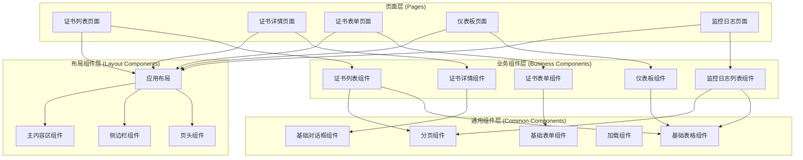

#### 2. 组件通信方式

- **Props / Emits**：父子组件之间的通信
- **Provide / Inject**：跨层级组件之间的通信
- **Pinia**：全局状态管理，任意组件之间的通信
- **Event Bus**：组件之间的事件通信（仅在必要时使用）

#### 3. 组件设计模式

- **容器组件与展示组件分离**：将数据获取逻辑与UI展示分离
- **组合式API**：使用Vue 3的组合式API组织组件逻辑
- **插槽（Slots）**：使用插槽提高组件的灵活性
- **混入（Mixins）**：使用混入复用组件逻辑

### 状态管理

#### 1. 状态管理架构

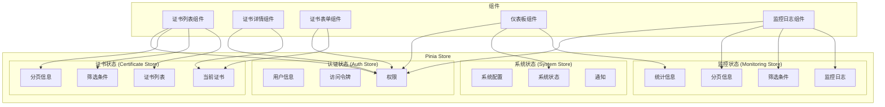

#### 2. 状态管理设计原则

- **单一数据源**：每个状态在应用中只有一个来源
- **状态只读**：组件不能直接修改状态，必须通过actions修改
- **纯函数修改**：使用纯函数修改状态，确保可预测性
- **模块化**：将状态按功能模块划分，便于管理

#### 3. 状态持久化

- **本地存储**：使用localStorage存储用户认证信息和系统配置
- **会话存储**：使用sessionStorage存储临时数据
- **Cookie**：使用Cookie存储认证令牌（可选）

### 路由设计

#### 1. 路由结构

```javascript
// 路由配置示例
const routes = [
  {
    path: '/',
    component: DefaultLayout,
    meta: { requiresAuth: true },
    children: [
      {
        path: '',
        name: 'Dashboard',
        component: () => import('@/views/monitoring/Dashboard.vue'),
        meta: { title: '仪表板', icon: 'dashboard' }
      },
      {
        path: 'certificates',
        name: 'CertificateList',
        component: () => import('@/views/certificate/CertificateList.vue'),
        meta: { title: '证书列表', icon: 'certificate' }
      },
      {
        path: 'certificates/:id',
        name: 'CertificateDetail',
        component: () => import('@/views/certificate/CertificateDetail.vue'),
        meta: { title: '证书详情', icon: 'detail', hidden: true }
      },
      {
        path: 'certificates/create',
        name: 'CertificateCreate',
        component: () => import('@/views/certificate/CertificateForm.vue'),
        meta: { title: '创建证书', icon: 'create', hidden: true }
      },
      {
        path: 'certificates/:id/edit',
        name: 'CertificateEdit',
        component: () => import('@/views/certificate/CertificateForm.vue'),
        meta: { title: '编辑证书', icon: 'edit', hidden: true }
      },
      {
        path: 'monitoring-logs',
        name: 'MonitoringLogList',
        component: () => import('@/views/monitoring/MonitoringLogList.vue'),
        meta: { title: '监控日志', icon: 'log' }
      }
    ]
  },
  {
    path: '/login',
    component: AuthLayout,
    meta: { requiresAuth: false },
    children: [
      {
        path: '',
        name: 'Login',
        component: () => import('@/views/auth/Login.vue'),
        meta: { title: '登录' }
      }
    ]
  },
  {
    path: '/:pathMatch(.*)*',
    name: 'NotFound',
    component: () => import('@/views/error/NotFound.vue'),
    meta: { title: '页面不存在' }
  }
]
```

#### 2. 路由守卫

- **全局前置守卫**：检查用户认证状态和权限
- **全局后置守卫**：设置页面标题和滚动位置
- **路由独享守卫**：特定路由的访问控制
- **组件内守卫**：组件内的导航控制

#### 3. 路由懒加载

- **动态导入**：使用动态导入实现路由组件的懒加载
- **代码分割**：将路由组件分割成独立的代码块
- **预加载**：在用户可能访问路由时预加载组件

### API 请求处理

#### 1. API 请求架构

```javascript
// API实例配置示例
import axios from 'axios'
import { useAuthStore } from '@/stores/modules/auth'
import router from '@/router'

// 创建axios实例
const api = axios.create({
  baseURL: import.meta.env.VITE_API_BASE_URL,
  timeout: 10000,
  headers: {
    'Content-Type': 'application/json'
  }
})

// 请求拦截器
api.interceptors.request.use(
  config => {
    const authStore = useAuthStore()
    if (authStore.token) {
      config.headers.Authorization = `Bearer ${authStore.token}`
    }
    return config
  },
  error => {
    return Promise.reject(error)
  }
)

// 响应拦截器
api.interceptors.response.use(
  response => {
    return response.data
  },
  error => {
    if (error.response) {
      switch (error.response.status) {
        case 401:
          // 未授权，跳转到登录页
          const authStore = useAuthStore()
          authStore.logout()
          router.push('/login')
          break
        case 403:
          // 禁止访问
          router.push('/403')
          break
        case 404:
          // 资源不存在
          router.push('/404')
          break
        case 500:
          // 服务器错误
          router.push('/500')
          break
        default:
          // 其他错误
          console.error('API Error:', error)
      }
    }
    return Promise.reject(error)
  }
)

export default api
```

#### 2. API 模块化

- **按功能模块划分**：将API按功能模块划分，便于管理
- **统一错误处理**：统一的错误处理机制
- **请求/响应拦截**：请求和响应拦截器处理通用逻辑
- **取消请求**：支持取消未完成的请求

### 样式设计

#### 1. 样式架构

- **SCSS预处理器**：使用SCSS作为CSS预处理器
- **CSS模块化**：使用CSS模块或作用域样式避免样式冲突
- **主题系统**：使用CSS变量实现主题系统
- **响应式设计**：使用媒体查询实现响应式布局

#### 2. 样式组织

```scss
// variables.scss - 变量定义
$primary-color: #409EFF;
$success-color: #67C23A;
$warning-color: #E6A23C;
$danger-color: #F56C6C;
$info-color: #909399;

$border-radius: 4px;
$box-shadow: 0 2px 12px 0 rgba(0, 0, 0, 0.1);

$breakpoints: (
  'xs': 480px,
  'sm': 768px,
  'md': 992px,
  'lg': 1200px,
  'xl': 1920px
);

// mixins.scss - 混入定义
@mixin respond-to($breakpoint) {
  @if map-has-key($breakpoints, $breakpoint) {
    @media (min-width: map-get($breakpoints, $breakpoint)) {
      @content;
    }
  } @else {
    @warn "Unfortunately, no value could be retrieved from `#{$breakpoint}`. "
        + "Available breakpoints are: #{map-keys($breakpoints)}.";
  }
}

@mixin flex-center {
  display: flex;
  justify-content: center;
  align-items: center;
}

// global.scss - 全局样式
body {
  margin: 0;
  font-family: 'Helvetica Neue', Helvetica, 'PingFang SC', 'Hiragino Sans GB', 'Microsoft YaHei', Arial, sans-serif;
  -webkit-font-smoothing: antialiased;
  -moz-osx-font-smoothing: grayscale;
  color: #333;
  background-color: #f5f7fa;
}

.container {
  width: 100%;
  max-width: 1200px;
  margin: 0 auto;
  padding: 0 20px;
  @include respond-to('md') {
    padding: 0 30px;
  }
}
```

#### 3. 组件样式

- **作用域样式**：使用Vue的scoped属性限制样式作用域
- **CSS模块**：使用CSS模块避免样式冲突
- **BEM命名规范**：使用BEM命名规范组织样式类名

### 性能优化

#### 1. 代码分割

- **路由级别代码分割**：按路由分割代码块
- **组件级别代码分割**：按需加载组件
- **库级别代码分割**：分离第三方库

#### 2. 懒加载

- **图片懒加载**：使用Intersection Observer实现图片懒加载
- **组件懒加载**：使用Vue的异步组件实现组件懒加载
- **路由懒加载**：使用动态导入实现路由懒加载

#### 3. 缓存策略

- **HTTP缓存**：配置HTTP缓存头
- **本地存储缓存**：使用localStorage缓存API数据
- **内存缓存**：使用内存缓存频繁访问的数据

#### 4. 优化工具

- **Vite构建优化**：配置Vite的构建选项
- **Tree Shaking**：移除未使用的代码
- **代码压缩**：压缩JavaScript和CSS代码
- **图片优化**：压缩和优化图片资源

### 测试策略

#### 1. 单元测试

- **组件测试**：使用Vue Test Utils测试组件
- **组合式函数测试**：测试组合式函数的逻辑
- **工具函数测试**：测试工具函数的功能
- **状态管理测试**：测试Pinia store的逻辑

#### 2. 集成测试

- **API测试**：测试API请求和响应
- **路由测试**：测试路由导航和守卫
- **组件交互测试**：测试组件之间的交互

#### 3. 端到端测试

- **用户流程测试**：测试完整的用户操作流程
- **关键功能测试**：测试关键功能的正确性
- **兼容性测试**：测试不同浏览器和设备的兼容性

### 部署策略

#### 1. 构建流程

- **开发构建**：使用Vite的开发服务器进行开发
- **生产构建**：使用Vite的生产模式构建
- **环境配置**：使用环境变量配置不同环境

#### 2. 静态资源部署

- **CDN部署**：使用CDN部署静态资源
- **版本控制**：使用文件名哈希实现版本控制
- **缓存策略**：配置静态资源的缓存策略

#### 3. 容器化部署

- **Docker镜像**：创建前端应用的Docker镜像
- **Nginx配置**：配置Nginx作为静态资源服务器
- **Kubernetes部署**：使用Kubernetes部署前端应用

## 后端架构

定义后端架构，包括技术栈、项目结构、分层架构、设计模式、安全策略等。

### 后端架构设计原则

- **分层架构**：采用清晰的分层架构，实现关注点分离
- **领域驱动设计**：使用DDD原则组织业务逻辑
- **依赖注入**：使用Spring的依赖注入机制，降低组件间耦合
- **面向接口编程**：通过接口定义组件契约，提高可测试性和可扩展性
- **异常处理**：统一的异常处理机制，提供友好的错误响应

### 后端技术栈

| 类别 | 技术 | 版本 | 用途 |
|------|------|------|------|
| 核心框架 | Spring Boot | 2.7.x | 应用框架 |
| 安全框架 | Spring Security | 5.7.x | 安全认证和授权 |
| 数据访问 | MyBatis Plus | 3.5.x | ORM框架 |
| 数据库 | MySQL | 8.0 | 关系型数据库 |
| 连接池 | HikariCP | 5.0.x | 数据库连接池 |
| 缓存 | Spring Cache | 2.7.x | 缓存抽象 |
| 定时任务 | Spring Scheduler | 2.7.x | 定时任务调度 |
| 验证框架 | Spring Validation | 2.7.x | 数据验证 |
| 文档工具 | SpringDoc OpenAPI | 1.6.x | API文档生成 |
| 日志框架 | Logback | 1.3.x | 日志记录 |
| 监控工具 | Spring Boot Actuator | 2.7.x | 应用监控 |
| 测试框架 | JUnit | 5.8.x | 单元测试 |
| Mock框架 | Mockito | 4.5.x | Mock对象 |
| 构建工具 | Maven | 3.8.x | 项目构建和依赖管理 |
| 开发工具 | Lombok | 1.18.x | 代码生成 |
| 开发工具 | MapStruct | 1.4.x | 对象映射 |
| 开发工具 | Spring Boot DevTools | 2.7.x | 开发工具 |

### 项目结构

```
backend/
├── src/
│   ├── main/
│   │   ├── java/
│   │   │   └── com/
│   │   │       └── example/
│   │   │           └── certificate/
│   │   │               ├── CertificateManagementApplication.java # 应用入口
│   │   │               ├── config/                                    # 配置类
│   │   │               │   ├── DatabaseConfig.java                   # 数据库配置
│   │   │               │   ├── SecurityConfig.java                   # 安全配置
│   │   │               │   ├── WebConfig.java                        # Web配置
│   │   │               │   ├── SwaggerConfig.java                    # Swagger配置
│   │   │               │   ├── CacheConfig.java                      # 缓存配置
│   │   │               │   └── SchedulerConfig.java                 # 定时任务配置
│   │   │               ├── common/                                   # 通用模块
│   │   │               │   ├── constant/                             # 常量
│   │   │               │   │   ├── Constants.java                    # 通用常量
│   │   │               │   │   ├── CertificateConstants.java         # 证书常量
│   │   │               │   │   └── MonitoringConstants.java          # 监控常量
│   │   │               │   ├── exception/                            # 异常处理
│   │   │               │   │   ├── GlobalExceptionHandler.java       # 全局异常处理器
│   │   │               │   │   ├── BusinessException.java            # 业务异常
│   │   │               │   │   ├── ResourceNotFoundException.java    # 资源未找到异常
│   │   │               │   │   └── ValidationException.java           # 验证异常
│   │   │               │   ├── response/                             # 响应封装
│   │   │               │   │   ├── ApiResponse.java                   # API响应封装
│   │   │               │   │   ├── PageResult.java                   # 分页结果
│   │   │               │   │   └── ResultCode.java                   # 响应码枚举
│   │   │               │   ├── util/                                 # 工具类
│   │   │               │   │   ├── DateUtils.java                     # 日期工具
│   │   │               │   │   ├── ValidationUtils.java              # 验证工具
│   │   │               │   │   └── SecurityUtils.java                 # 安全工具
│   │   │               │   └── annotation/                           # 自定义注解
│   │   │               │       ├── LogExecutionTime.java            # 执行时间日志注解
│   │   │               │       └── ValidateCertificate.java         # 证书验证注解
│   │   │               ├── controller/                              # 控制器层
│   │   │               │   ├── CertificateController.java            # 证书控制器
│   │   │               │   ├── MonitoringLogController.java         # 监控日志控制器
│   │   │               │   └── SystemController.java                 # 系统控制器
│   │   │               ├── service/                                 # 服务层
│   │   │               │   ├── dto/                                 # 数据传输对象
│   │   │               │   │   ├── CertificateDto.java               # 证书DTO
│   │   │               │   │   ├── CertificateCreateDto.java         # 证书创建DTO
│   │   │               │   │   ├── CertificateUpdateDto.java         # 证书更新DTO
│   │   │               │   │   ├── MonitoringLogDto.java            # 监控日志DTO
│   │   │               │   │   ├── SystemStatusDto.java             # 系统状态DTO
│   │   │               │   │   └── CertificateStatisticsDto.java    # 证书统计DTO
│   │   │               │   ├── vo/                                  # 视图对象
│   │   │               │   │   ├── CertificateVo.java                # 证书VO
│   │   │               │   │   ├── MonitoringLogVo.java             # 监控日志VO
│   │   │               │   │   └── SystemStatusVo.java              # 系统状态VO
│   │   │               │   ├── mapper/                              # 对象映射器
│   │   │               │   │   ├── CertificateMapper.java            # 证书映射器
│   │   │               │   │   └── MonitoringLogMapper.java         # 监控日志映射器
│   │   │               │   ├── CertificateService.java              # 证书服务接口
│   │   │               │   ├── CertificateServiceImpl.java         # 证书服务实现
│   │   │               │   ├── MonitoringLogService.java           # 监控日志服务接口
│   │   │               │   ├── MonitoringLogServiceImpl.java        # 监控日志服务实现
│   │   │               │   ├── MonitoringService.java              # 监控服务接口
│   │   │               │   ├── MonitoringServiceImpl.java         # 监控服务实现
│   │   │               │   ├── AlertService.java                   # 预警服务接口
│   │   │               │   ├── AlertServiceImpl.java                # 预警服务实现
│   │   │               │   ├── SystemStatusService.java            # 系统状态服务接口
│   │   │               │   └── SystemStatusServiceImpl.java         # 系统状态服务实现
│   │   │               ├── domain/                                  # 领域层
│   │   │               │   ├── model/                              # 领域模型
│   │   │               │   │   ├── Certificate.java                 # 证书实体
│   │   │               │   │   ├── MonitoringLog.java                # 监控日志实体
│   │   │               │   │   └── CertificateStatus.java           # 证书状态枚举
│   │   │               │   ├── repository/                          # 仓库接口
│   │   │               │   │   ├── CertificateRepository.java        # 证书仓库接口
│   │   │               │   │   └── MonitoringLogRepository.java     # 监控日志仓库接口
│   │   │               │   ├── service/                            # 领域服务
│   │   │               │   │   ├── CertificateDomainService.java    # 证书领域服务
│   │   │               │   │   └── MonitoringDomainService.java      # 监控领域服务
│   │   │               │   └── event/                              # 领域事件
│   │   │               │       ├── CertificateCreatedEvent.java      # 证书创建事件
│   │   │               │       ├── CertificateUpdatedEvent.java      # 证书更新事件
│   │   │               │       ├── CertificateDeletedEvent.java      # 证书删除事件
│   │   │               │       └── CertificateStatusChangedEvent.java # 证书状态变更事件
│   │   │               ├── infrastructure/                          # 基础设施层
│   │   │               │   ├── repository/impl/                     # 仓库实现
│   │   │               │   │   ├── CertificateRepositoryImpl.java    # 证书仓库实现
│   │   │               │   │   └── MonitoringLogRepositoryImpl.java # 监控日志仓库实现
│   │   │               │   ├── persistence/                        # 持久化
│   │   │               │   │   ├── entity/                          # 数据库实体
│   │   │               │   │   │   ├── CertificateEntity.java        # 证书数据库实体
│   │   │               │   │   │   └── MonitoringLogEntity.java       # 监控日志数据库实体
│   │   │               │   │   ├── mapper/                         # MyBatis映射器
│   │   │               │   │   │   ├── CertificateMapper.java         # 证书MyBatis映射器
│   │   │               │   │   │   └── MonitoringLogMapper.java      # 监控日志MyBatis映射器
│   │   │               │   │   └── repository/                     # MyBatis仓库
│   │   │               │   │       ├── CertificateMyBatisRepository.java # 证书MyBatis仓库
│   │   │               │   │       └── MonitoringLogMyBatisRepository.java # 监控日志MyBatis仓库
│   │   │               │   ├── external/                           # 外部服务
│   │   │               │   │   ├── email/                           # 邮件服务
│   │   │               │   │   │   ├── EmailService.java           # 邮件服务接口
│   │   │               │   │   │   ├── EmailServiceImpl.java        # 邮件服务实现
│   │   │               │   │   │   └── LogEmailServiceImpl.java     # 日志邮件服务实现
│   │   │               │   │   ├── sms/                             # 短信服务
│   │   │               │   │   │   ├── SmsService.java             # 短信服务接口
│   │   │               │   │   │   ├── SmsServiceImpl.java          # 短信服务实现
│   │   │               │   │   │   └── LogSmsServiceImpl.java       # 日志短信服务实现
│   │   │               │   │   └── validation/                      # 证书验证服务
│   │   │               │   │       ├── CertificateValidationService.java # 证书验证服务接口
│   │   │               │   │       ├── CertificateValidationServiceImpl.java # 证书验证服务实现
│   │   │               │   │       └── BuiltinCertificateValidationServiceImpl.java # 内置证书验证服务实现
│   │   │               │   ├── config/                            # 基础设施配置
│   │   │               │   │   ├── DatabaseConfig.java              # 数据库配置
│   │   │               │   │   ├── CacheConfig.java                # 缓存配置
│   │   │               │   │   └── SchedulerConfig.java             # 定时任务配置
│   │   │               │   └── scheduler/                         # 定时任务
│   │   │               │       ├── CertificateScheduler.java       # 证书定时任务
│   │   │               │       └── DailySummaryScheduler.java      # 每日摘要定时任务
│   │   │               └── security/                              # 安全模块
│   │   │                   ├── jwt/                               # JWT相关
│   │   │                   │   ├── JwtTokenProvider.java          # JWT令牌提供者
│   │   │                   │   ├── JwtTokenFilter.java            # JWT令牌过滤器
│   │   │                   │   └── JwtAuthenticationEntryPoint.java # JWT认证入口点
│   │   │                   ├── user/                              # 用户相关
│   │   │                   │   ├── UserDetailsServiceImpl.java     # 用户详情服务实现
│   │   │                   │   └── UserPrincipal.java              # 用户主体
│   │   │                   └── util/                              # 安全工具
│   │   │                       └── SecurityUtils.java             # 安全工具
│   │   └── resources/
│   │       ├── application.yml                              # 应用配置
│   │       ├── application-dev.yml                          # 开发环境配置
│   │       ├── application-prod.yml                         # 生产环境配置
│   │       ├── application-test.yml                         # 测试环境配置
│   │       ├── mapper/                                      # MyBatis映射文件
│   │       │   ├── CertificateMapper.xml                     # 证书映射文件
│   │       │   └── MonitoringLogMapper.xml                  # 监控日志映射文件
│   │       ├── db/migration/                                # 数据库迁移脚本
│   │       │   ├── V1__Create_certificate_table.sql         # 创建证书表
│   │       │   └── V2__Create_monitoring_log_table.sql      # 创建监控日志表
│   │       ├── static/                                      # 静态资源
│   │       └── templates/                                   # 模板文件
│   ├── test/
│   │   ├── java/
│   │   │   └── com/
│   │   │       └── example/
│   │   │           └── certificate/
│   │   │               ├── controller/                         # 控制器测试
│   │   │               │   ├── CertificateControllerTest.java
│   │   │               │   ├── MonitoringLogControllerTest.java
│   │   │               │   └── SystemControllerTest.java
│   │   │               ├── service/                           # 服务测试
│   │   │               │   ├── CertificateServiceTest.java
│   │   │               │   ├── MonitoringLogServiceTest.java
│   │   │               │   ├── MonitoringServiceTest.java
│   │   │               │   ├── AlertServiceTest.java
│   │   │               │   └── SystemStatusServiceTest.java
│   │   │               ├── domain/                            # 领域测试
│   │   │               │   ├── CertificateTest.java
│   │   │               │   ├── MonitoringLogTest.java
│   │   │               │   └── CertificateDomainServiceTest.java
│   │   │               ├── infrastructure/                    # 基础设施测试
│   │   │               │   ├── repository/                     # 仓库测试
│   │   │               │   │   ├── CertificateRepositoryTest.java
│   │   │               │   │   └── MonitoringLogRepositoryTest.java
│   │   │               │   ├── external/                       # 外部服务测试
│   │   │               │   │   ├── EmailServiceTest.java
│   │   │               │   │   ├── SmsServiceTest.java
│   │   │               │   │   └── CertificateValidationServiceTest.java
│   │   │               │   └── scheduler/                      # 定时任务测试
│   │   │               │       ├── CertificateSchedulerTest.java
│   │   │               │       └── DailySummarySchedulerTest.java
│   │   │               ├── security/                          # 安全测试
│   │   │               │   ├── JwtTokenProviderTest.java
│   │   │               │   └── SecurityUtilsTest.java
│   │   │               ├── common/                            # 通用测试
│   │   │               │   ├── exception/GlobalExceptionHandlerTest.java
│   │   │               │   └── util/DateUtilsTest.java
│   │   │               ├── IntegrationTest.java                # 集成测试基类
│   │   │               └── TestApplication.java                # 测试应用配置
│   │   └── resources/
│   │       ├── application-test.yml                        # 测试环境配置
│   │       └── test-data/                                  # 测试数据
│   │           ├── certificates.json                         # 证书测试数据
│   │           └── monitoring-logs.json                      # 监控日志测试数据
├── .gitignore
├── Dockerfile
├── pom.xml
└── README.md
```

### 分层架构

#### 1. 分层架构图

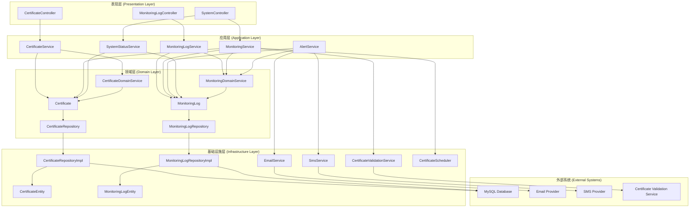

#### 2. 分层职责

- **表现层 (Presentation Layer)**：
  - 负责处理HTTP请求和响应
  - 验证输入参数
  - 调用应用层服务处理业务逻辑
  - 返回统一的API响应格式

- **应用层 (Application Layer)**：
  - 实现应用业务用例
  - 协调领域对象和基础设施服务
  - 处理事务边界
  - 提供DTO和VO之间的转换

- **领域层 (Domain Layer)**：
  - 包含核心业务逻辑和领域模型
  - 定义领域实体、值对象和领域服务
  - 定义仓库接口，不关心具体实现
  - 发布领域事件

- **基础设施层 (Infrastructure Layer)**：
  - 实现仓库接口，提供数据持久化
  - 集成外部系统和服务
  - 提供技术基础设施支持
  - 实现横切关注点（如日志、缓存）

### 设计模式

#### 1. 依赖注入模式

- **描述**：使用Spring的依赖注入机制，通过构造函数注入依赖
- **优点**：降低组件间耦合，提高可测试性和可维护性
- **实现示例**：
  ```java
  @Service
  public class CertificateServiceImpl implements CertificateService {
      private final CertificateRepository certificateRepository;
      private final MonitoringLogService monitoringLogService;
      
      @Autowired
      public CertificateServiceImpl(CertificateRepository certificateRepository, 
                                  MonitoringLogService monitoringLogService) {
          this.certificateRepository = certificateRepository;
          this.monitoringLogService = monitoringLogService;
      }
      
      // 其他方法...
  }
  ```

#### 2. 仓库模式

- **描述**：在领域层定义仓库接口，在基础设施层实现
- **优点**：分离领域逻辑和数据访问逻辑，提高可测试性
- **实现示例**：
  ```java
  // 领域层 - 仓库接口
  public interface CertificateRepository {
      Optional<Certificate> findById(Long id);
      List<Certificate> findAll();
      Certificate save(Certificate certificate);
      void deleteById(Long id);
      List<Certificate> findByStatus(CertificateStatus status);
      List<Certificate> findByExpiryDateBefore(Date date);
  }
  
  // 基础设施层 - 仓库实现
  @Repository
  public class CertificateRepositoryImpl implements CertificateRepository {
      private final CertificateMyBatisRepository myBatisRepository;
      
      @Autowired
      public CertificateRepositoryImpl(CertificateMyBatisRepository myBatisRepository) {
          this.myBatisRepository = myBatisRepository;
      }
      
      @Override
      public Optional<Certificate> findById(Long id) {
          return myBatisRepository.findById(id)
              .map(entity -> convertToDomain(entity));
      }
      
      // 其他方法实现...
      
      private Certificate convertToDomain(CertificateEntity entity) {
          // 转换逻辑...
      }
  }
  ```

#### 3. 策略模式

- **描述**：为不同的算法或行为定义统一的接口，实现可互换的算法族
- **优点**：提高代码的灵活性和可扩展性
- **实现示例**：
  ```java
  // 策略接口
  public interface EmailService {
      EmailResult sendExpiryAlertEmail(Certificate certificate, int daysUntilExpiry, String recipientEmail);
  }
  
  // 具体策略实现 - 实际邮件服务
  @Service("realEmailService")
  public class EmailServiceImpl implements EmailService {
      // 实际邮件发送逻辑...
  }
  
  // 具体策略实现 - 日志邮件服务
  @Service("logEmailService")
  @Primary
  public class LogEmailServiceImpl implements EmailService {
      @Override
      public EmailResult sendExpiryAlertEmail(Certificate certificate, int daysUntilExpiry, String recipientEmail) {
          // 记录日志而不实际发送邮件
          log.info("Email alert would be sent to {} for certificate {} expiring in {} days", 
                  recipientEmail, certificate.getName(), daysUntilExpiry);
          
          EmailResult result = new EmailResult();
          result.setSuccess(true);
          result.setMessage("Email alert logged (MVP mode)");
          return result;
      }
  }
  
  // 策略使用
  @Service
  public class AlertServiceImpl implements AlertService {
      private final EmailService emailService;
      
      @Autowired
      public AlertServiceImpl(@Qualifier("logEmailService") EmailService emailService) {
          this.emailService = emailService;
      }
      
      // 其他方法...
  }
  ```

#### 4. 工厂模式

- **描述**：提供一个创建对象的接口，让子类决定实例化哪一个类
- **优点**：封装对象的创建逻辑，提高代码的灵活性和可维护性
- **实现示例**：
  ```java
  // 工厂接口
  public interface CertificateValidationServiceFactory {
      CertificateValidationService createValidationService(String provider);
  }
  
  // 工厂实现
  @Service
  public class CertificateValidationServiceFactoryImpl implements CertificateValidationServiceFactory {
      private final Map<String, CertificateValidationService> serviceMap;
      
      @Autowired
      public CertificateValidationServiceFactoryImpl(
          Map<String, CertificateValidationService> serviceMap) {
          this.serviceMap = serviceMap;
      }
      
      @Override
      public CertificateValidationService createValidationService(String provider) {
          CertificateValidationService service = serviceMap.get(provider);
          if (service == null) {
              throw new IllegalArgumentException("Unsupported validation provider: " + provider);
          }
          return service;
      }
  }
  
  // 工厂使用
  @Service
  public class MonitoringServiceImpl implements MonitoringService {
      private final CertificateValidationServiceFactory validationServiceFactory;
      
      @Autowired
      public MonitoringServiceImpl(CertificateValidationServiceFactory validationServiceFactory) {
          this.validationServiceFactory = validationServiceFactory;
      }
      
      public ValidationResult validateCertificate(Certificate certificate) {
          String provider = "builtin"; // 可以从配置中读取
          CertificateValidationService validationService = validationServiceFactory.createValidationService(provider);
          return validationService.validateCertificate(certificate);
      }
  }
  ```

#### 5. 观察者模式

- **描述**：定义对象间的一种一对多依赖关系，当一个对象状态发生改变时，所有依赖于它的对象都得到通知
- **优点**：实现对象间的松耦合，支持动态添加和删除观察者
- **实现示例**：
  ```java
  // 事件发布者
  @Service
  public class CertificateEventPublisher {
      private final ApplicationEventPublisher eventPublisher;
      
      @Autowired
      public CertificateEventPublisher(ApplicationEventPublisher eventPublisher) {
          this.eventPublisher = eventPublisher;
      }
      
      public void publishCertificateCreatedEvent(Certificate certificate) {
          eventPublisher.publishEvent(new CertificateCreatedEvent(certificate));
      }
      
      public void publishCertificateUpdatedEvent(Certificate certificate) {
          eventPublisher.publishEvent(new CertificateUpdatedEvent(certificate));
      }
      
      public void publishCertificateDeletedEvent(Certificate certificate) {
          eventPublisher.publishEvent(new CertificateDeletedEvent(certificate));
      }
      
      public void publishCertificateStatusChangedEvent(Certificate certificate, CertificateStatus oldStatus) {
          eventPublisher.publishEvent(new CertificateStatusChangedEvent(certificate, oldStatus));
      }
  }
  
  // 事件监听者
  @Service
  public class CertificateEventListener {
      private final MonitoringLogService monitoringLogService;
      
      @Autowired
      public CertificateEventListener(MonitoringLogService monitoringLogService) {
          this.monitoringLogService = monitoringLogService;
      }
      
      @EventListener
      public void handleCertificateCreatedEvent(CertificateCreatedEvent event) {
          Certificate certificate = event.getCertificate();
          monitoringLogService.logCertificateCreated(certificate);
      }
      
      @EventListener
      public void handleCertificateUpdatedEvent(CertificateUpdatedEvent event) {
          Certificate certificate = event.getCertificate();
          monitoringLogService.logCertificateUpdated(certificate);
      }
      
      @EventListener
      public void handleCertificateDeletedEvent(CertificateDeletedEvent event) {
          Certificate certificate = event.getCertificate();
          monitoringLogService.logCertificateDeleted(certificate);
      }
      
      @EventListener
      public void handleCertificateStatusChangedEvent(CertificateStatusChangedEvent event) {
          Certificate certificate = event.getCertificate();
          CertificateStatus oldStatus = event.getOldStatus();
          monitoringLogService.logCertificateStatusChanged(certificate, oldStatus);
      }
  }
  ```

### 安全架构

#### 1. 安全架构图

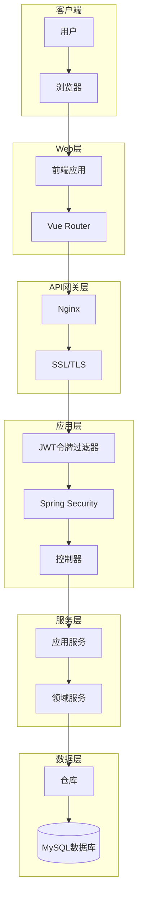

#### 2. 认证机制

- **JWT认证**：使用JSON Web Token进行无状态认证
- **令牌结构**：
  ```json
  {
    "sub": "1234567890",
    "name": "John Doe",
    "roles": ["USER", "ADMIN"],
    "iat": 1516239022,
    "exp": 1516242622
  }
  ```
- **认证流程**：
  1. 用户提交用户名和密码
  2. 服务器验证凭据
  3. 服务器生成JWT令牌
  4. 服务器返回JWT令牌给客户端
  5. 客户端在后续请求中携带JWT令牌
  6. 服务器验证JWT令牌
  7. 服务器处理请求并返回响应

#### 3. 授权机制

- **基于角色的访问控制**：使用Spring Security的基于角色的访问控制
- **角色定义**：
  - `ROLE_USER`：普通用户，可以查看和管理证书
  - `ROLE_ADMIN`：管理员，具有所有权限
- **权限配置**：
  ```java
  @Configuration
  @EnableWebSecurity
  @EnableGlobalMethodSecurity(prePostEnabled = true)
  public class SecurityConfig extends WebSecurityConfigurerAdapter {
      
      @Override
      protected void configure(HttpSecurity http) throws Exception {
          http
              .csrf().disable()
              .exceptionHandling().authenticationEntryPoint(unauthorizedHandler).and()
              .sessionManagement().sessionCreationPolicy(SessionCreationPolicy.STATELESS).and()
              .authorizeRequests()
              .antMatchers("/api/auth/**").permitAll()
              .antMatchers(HttpMethod.GET, "/api/certificates/**").hasAnyRole("USER", "ADMIN")
              .antMatchers(HttpMethod.POST, "/api/certificates/**").hasRole("ADMIN")
              .antMatchers(HttpMethod.PUT, "/api/certificates/**").hasRole("ADMIN")
              .antMatchers(HttpMethod.DELETE, "/api/certificates/**").hasRole("ADMIN")
              .antMatchers("/api/monitoring-logs/**").hasAnyRole("USER", "ADMIN")
              .antMatchers("/api/system/**").hasRole("ADMIN")
              .anyRequest().authenticated();
          
          http.addFilterBefore(jwtTokenFilter(), UsernamePasswordAuthenticationFilter.class);
      }
      
      // 其他配置...
  }
  ```

#### 4. 数据安全

- **密码加密**：使用BCryptPasswordEncoder加密存储用户密码
- **敏感数据加密**：对数据库中的敏感数据进行加密存储
- **HTTPS通信**：使用SSL/TLS加密客户端和服务器之间的通信
- **SQL注入防护**：使用参数化查询防止SQL注入攻击
- **XSS防护**：对用户输入进行转义，防止跨站脚本攻击

### 性能优化

#### 1. 缓存策略

- **Spring Cache抽象**：使用Spring Cache抽象实现缓存
- **缓存配置**：
  ```java
  @Configuration
  @EnableCaching
  public class CacheConfig {
      
      @Bean
      public CacheManager cacheManager() {
          SimpleCacheManager cacheManager = new SimpleCacheManager();
          cacheManager.setCaches(Arrays.asList(
              new ConcurrentMapCache("certificates"),
              new ConcurrentMapCache("monitoringLogs"),
              new ConcurrentMapCache("systemStatus")
          ));
          return cacheManager;
      }
  }
  ```
- **缓存使用**：
  ```java
  @Service
  public class CertificateServiceImpl implements CertificateService {
      
      @Cacheable(value = "certificates", key = "#id")
      public Certificate findById(Long id) {
          // 查询逻辑...
      }
      
      @CacheEvict(value = "certificates", key = "#certificate.id")
      public Certificate update(Certificate certificate) {
          // 更新逻辑...
      }
      
      @CacheEvict(value = "certificates", key = "#id")
      public void deleteById(Long id) {
          // 删除逻辑...
      }
  }
  ```

#### 2. 数据库优化

- **连接池配置**：使用HikariCP高性能连接池
- **索引优化**：为常用查询字段创建索引
- **查询优化**：使用MyBatis的动态SQL和分页查询
- **批量操作**：使用批量插入和更新提高效率

#### 3. 异步处理

- **@Async注解**：使用Spring的@Async注解实现异步方法调用
- **异步配置**：
  ```java
  @Configuration
  @EnableAsync
  public class AsyncConfig implements AsyncConfigurer {
      
      @Override
      public Executor getAsyncExecutor() {
          ThreadPoolTaskExecutor executor = new ThreadPoolTaskExecutor();
          executor.setCorePoolSize(5);
          executor.setMaxPoolSize(10);
          executor.setQueueCapacity(25);
          executor.setThreadNamePrefix("Async-Executor-");
          executor.initialize();
          return executor;
      }
      
      @Override
      public AsyncUncaughtExceptionHandler getAsyncUncaughtExceptionHandler() {
          return new CustomAsyncExceptionHandler();
      }
  }
  ```
- **异步使用**：
  ```java
  @Service
  public class AlertServiceImpl implements AlertService {
      
      @Async
      public CompletableFuture<EmailResult> sendExpiryAlertEmail(Certificate certificate, int daysUntilExpiry, String recipientEmail) {
          // 发送邮件逻辑...
          return CompletableFuture.completedFuture(emailResult);
      }
      
      @Async
      public CompletableFuture<SmsResult> sendExpiryAlertSms(Certificate certificate, int daysUntilExpiry, String recipientPhone) {
          // 发送短信逻辑...
          return CompletableFuture.completedFuture(smsResult);
      }
  }
  ```

### 测试策略

#### 1. 单元测试

- **JUnit 5**：使用JUnit 5作为单元测试框架
- **Mockito**：使用Mockito模拟依赖对象
- **测试覆盖**：确保核心业务逻辑的测试覆盖率达到80%以上
- **测试示例**：
  ```java
  @ExtendWith(MockitoExtension.class)
  class CertificateServiceTest {
      
      @Mock
      private CertificateRepository certificateRepository;
      
      @Mock
      private MonitoringLogService monitoringLogService;
      
      @InjectMocks
      private CertificateServiceImpl certificateService;
      
      @Test
      void findById_shouldReturnCertificate() {
          // Given
          Long certificateId = 1L;
          Certificate certificate = new Certificate();
          certificate.setId(certificateId);
          certificate.setName("Test Certificate");
          
          when(certificateRepository.findById(certificateId)).thenReturn(Optional.of(certificate));
          
          // When
          Optional<Certificate> result = certificateService.findById(certificateId);
          
          // Then
          assertTrue(result.isPresent());
          assertEquals(certificateId, result.get().getId());
          assertEquals("Test Certificate", result.get().getName());
          verify(certificateRepository).findById(certificateId);
      }
      
      // 其他测试方法...
  }
  ```

#### 2. 集成测试

- **Spring Boot Test**：使用Spring Boot Test进行集成测试
- **测试数据库**：使用H2内存数据库进行测试
- **测试示例**：
  ```java
  @SpringBootTest
  @AutoConfigureTestDatabase(replace = AutoConfigureTestDatabase.Replace.NONE)
  @TestPropertySource(properties = {
      "spring.datasource.url=jdbc:h2:mem:testdb",
      "spring.datasource.driver-class-name=org.h2.Driver",
      "spring.datasource.username=sa",
      "spring.datasource.password=password",
      "spring.jpa.database-platform=org.hibernate.dialect.H2Dialect"
  })
  class CertificateControllerIntegrationTest {
      
      @Autowired
      private MockMvc mockMvc;
      
      @Autowired
      private CertificateRepository certificateRepository;
      
      @Test
      void getAllCertificates_shouldReturnCertificateList() throws Exception {
          // Given
          Certificate certificate = new Certificate();
          certificate.setName("Test Certificate");
          certificate.setDomain("example.com");
          certificateRepository.save(certificate);
          
          // When & Then
          mockMvc.perform(get("/api/v1/certificates"))
              .andExpect(status().isOk())
              .andExpect(jsonPath("$.success").value(true))
              .andExpect(jsonPath("$.data.content[0].name").value("Test Certificate"));
      }
      
      // 其他测试方法...
  }
  ```

#### 3. 端到端测试

- **Postman**：使用Postman进行API端到端测试
- **测试场景**：覆盖主要的业务流程和边界情况
- **测试自动化**：使用Postman的集合和测试脚本实现自动化测试

### 日志和监控

#### 1. 日志配置

- **Logback**：使用Logback作为日志框架
- **日志级别**：根据环境配置不同的日志级别
- **日志格式**：统一的日志格式，包含时间戳、日志级别、类名、线程名和日志消息
- **日志配置示例**：
  ```xml
  <configuration>
      <property name="LOG_PATH" value="logs"/>
      <property name="LOG_PATTERN" value="%d{yyyy-MM-dd HH:mm:ss.SSS} [%thread] %-5level %logger{36} - %msg%n"/>
      
      <appender name="CONSOLE" class="ch.qos.logback.core.ConsoleAppender">
          <encoder>
              <pattern>${LOG_PATTERN}</pattern>
          </encoder>
      </appender>
      
      <appender name="FILE" class="ch.qos.logback.core.rolling.RollingFileAppender">
          <file>${LOG_PATH}/certificate-management.log</file>
          <rollingPolicy class="ch.qos.logback.core.rolling.TimeBasedRollingPolicy">
              <fileNamePattern>${LOG_PATH}/certificate-management.%d{yyyy-MM-dd}.%i.log</fileNamePattern>
              <maxFileSize>10MB</maxFileSize>
              <maxHistory>30</maxHistory>
              <totalSizeCap>1GB</totalSizeCap>
          </rollingPolicy>
          <encoder>
              <pattern>${LOG_PATTERN}</pattern>
          </encoder>
      </appender>
      
      <root level="INFO">
          <appender-ref ref="CONSOLE"/>
          <appender-ref ref="FILE"/>
      </root>
      
      <logger name="com.example.certificate" level="DEBUG"/>
  </configuration>
  ```

#### 2. 监控配置

- **Spring Boot Actuator**：使用Spring Boot Actuator提供应用监控端点
- **健康检查**：配置健康检查端点，监控应用状态
- **指标收集**：收集应用性能指标，如内存使用、GC情况、HTTP请求等
- **监控配置示例**：
  ```yaml
  management:
    endpoints:
      web:
        exposure:
          include: health,info,metrics,prometheus
    endpoint:
      health:
        show-details: always
    metrics:
      export:
        prometheus:
          enabled: true
    health:
      db:
        enabled: true
      diskspace:
        enabled: true
  ```

#### 3. 告警配置

- **自定义健康指标**：实现自定义健康指标，监控证书状态和预警发送情况
- **告警规则**：配置告警规则，当特定条件满足时发送告警
- **告警渠道**：支持邮件、短信等多种告警渠道

