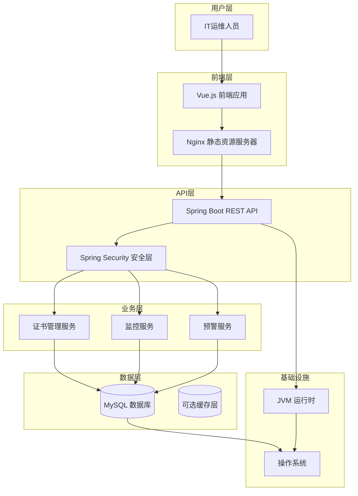

# 证书生命周期管理系统全栈架构文档

## 简介

本文档概述了证书生命周期管理系统的完整全栈架构，包括后端系统、前端实现及其集成。它作为 AI 驱动开发的单一真实来源，确保整个技术栈的一致性。

这种统一方法结合了传统上分离的后端和前端架构文档，简化了现代全栈应用程序的开发过程，因为这些关注点日益交织在一起。

### 启动模板或现有项目

**选择的模板：** 基于 Spring Boot + Vue 的标准企业应用模板

**理由：** 这个选择与 PRD 中概述的技术假设完全一致，该假设指定后端使用 Spring Boot，前端使用 Vue.js。此模板为企业级应用程序提供了坚实的基础，具有内置的安全性、可扩展性和可维护性支持。

**关键约束和考虑因素：**
- 后端将使用 JDK 8、Spring Boot 框架和 MyBatis Plus 作为 ORM
- 前端将使用 Vue.js 和 Vue Router 进行路由管理
- 将采用 Monorepo 结构进行统一的代码管理
- 领域驱动设计（DDD）原则将指导后端架构
- 该模板支持 MVP 要求，同时允许未来的可扩展性

### 变更日志

| 日期 | 版本 | 描述 | 作者 |
|------|------|------|------|
| 2025-08-11 | 1.0 | 初始全栈架构文档创建 | Winston（架构师） |

**详细理由说明：**
我选择了基于 Spring Boot + Vue 的标准企业应用模板，这完全符合 PRD 中技术假设部分的要求。这个选择有以下优势：

1. **技术一致性**：与 PRD 中指定的技术栈（JDK 8、Spring Boot、MyBatis Plus、Vue.js）完全匹配
2. **企业级特性**：Spring Boot 提供了内置的安全性、可扩展性和可维护性支持
3. **开发效率**：标准模板减少了初始配置工作，可以更快地进入实际功能开发
4. **团队熟悉度**：作为企业级标准技术栈，大多数开发团队都具备相关经验
5. **社区支持**：两个框架都有活跃的社区和丰富的文档资源
6. **MVP 适配**：这个模板非常适合 MVP 阶段的快速开发和部署
7. **未来扩展性**：虽然开始是单体架构，但为未来可能的微服务迁移预留了可能性

**需要用户关注的决策点：**
- 是否需要调整模板中的特定配置或依赖
- 是否有特定的安全要求需要额外配置
- 是否需要集成特定的企业级工具或服务

## 高层架构

### 技术摘要

证书生命周期管理系统采用基于 Spring Boot + Vue 的全栈架构，结合了企业级后端框架和现代化前端技术。系统使用领域驱动设计（DDD）原则组织后端代码，通过 REST API 实现前后端分离，采用 MySQL 作为主数据库，并实现了自动化的证书监控和预警功能。这种架构设计确保了系统的可扩展性、可维护性和安全性，同时满足了 MVP 阶段的快速开发需求和未来的业务增长。

### 平台和基础设施选择

**推荐平台：** 传统服务器架构（Spring Boot + Vue + MySQL）

**理由：**
- **技术成熟度**：Spring Boot 和 Vue.js 都是成熟的企业级技术，拥有丰富的生态系统和社区支持
- **团队熟悉度**：作为标准企业技术栈，大多数开发团队都具备相关经验，降低学习成本
- **MVP 适配性**：这种架构非常适合 MVP 阶段的快速开发和部署
- **成本效益**：相比云原生解决方案，初期投入更低，运维成本可控
- **数据安全**：自托管数据库提供了更好的数据控制权和安全性

**核心服务：**
- **应用服务器**：Spring Boot 内嵌 Tomcat
- **数据库**：MySQL 8.0
- **前端服务器**：Nginx（静态资源服务）
- **监控服务**：Spring Boot Actuator
- **日志服务**：Logback

**部署主机和区域：**
- **开发环境**：本地开发服务器
- **测试环境**：内部测试服务器
- **生产环境**：企业内部服务器或云主机（根据企业政策决定）

### 仓库结构

**结构：** Monorepo（单一代码仓库）

**Monorepo 工具：** Maven（后端）+ npm（前端）

**包组织策略：**
```
certificate-management-system/
├── backend/                 # Spring Boot 后端应用
│   ├── src/main/java/      # Java 源代码
│   ├── src/main/resources/ # 配置文件
│   └── src/test/java/      # 测试代码
├── frontend/               # Vue.js 前端应用
│   ├── src/               # Vue 源代码
│   ├── public/            # 静态资源
│   └── tests/             # 测试代码
├── shared/                # 共享代码和类型定义
│   ├── types/             # TypeScript 类型定义
│   └── utils/             # 共享工具函数
├── docs/                  # 项目文档
├── docker/                # Docker 配置
└── scripts/               # 构建和部署脚本
```

### 高层架构图



### 架构模式

- **领域驱动设计（DDD）**：采用 DDD 原则组织后端代码，将业务逻辑集中在领域层 - _理由_：确保业务逻辑的清晰性和可维护性，便于未来业务扩展

- **分层架构**：将系统分为表现层、应用层、领域层和基础设施层 - _理由_：实现关注点分离，提高代码的可测试性和可维护性

- **RESTful API**：使用 REST 风格设计 API 接口 - _理由_：标准化前后端通信，提高系统的互操作性

- **组件化前端**：使用 Vue 组件化开发前端界面 - _理由_：提高前端代码的复用性和可维护性

- **单仓库管理（Monorepo）**：前后端代码放在同一个仓库中管理 - _理由_：简化版本控制和依赖管理，便于团队协作

- **定时任务架构**：使用 Spring Scheduler 实现证书监控定时任务 - _理由_：轻量级实现，无需额外引入消息队列

- **安全优先设计**：在架构各层都考虑安全性 - _理由_：证书管理涉及敏感信息，安全性至关重要

## 技术栈

这是整个项目的最终技术选择。所有开发都必须使用这些确切版本，这是单一的真实来源。

### 技术栈表

| 类别 | 技术 | 版本 | 用途 | 理由 |
|------|------|------|------|------|
| 前端语言 | JavaScript | ES2020+ | 前端开发逻辑实现 | 现代 JavaScript 特性提供更好的开发体验和性能 |
| 前端框架 | Vue.js | 3.x | 构建响应式用户界面 | 轻量级、易学习、生态丰富，适合企业级应用 |
| 前端路由 | Vue Router | 4.x | 前端页面路由管理 | Vue.js 官方路由管理器，支持路由守卫和懒加载 |
| UI 组件库 | Element Plus | 2.x | 提供 UI 组件和设计系统 | 与 Vue.js 深度集成，提供丰富的企业级组件 |
| 状态管理 | Pinia | 2.x | 前端状态管理 | Vue 3 官方推荐，轻量且类型安全 |
| 后端语言 | Java | 8 | 后端业务逻辑实现 | 企业级标准，稳定可靠，生态系统成熟 |
| Java 开发工具包 | JDK (Oracle JDK 或 OpenJDK) | 8 | Java 运行环境 | 提供稳定的 Java 运行环境，与企业环境兼容性好 |
| 后端框架 | Spring Boot | 2.7.x | 构建 RESTful API 和后端服务 | 简化配置，快速开发，企业级特性丰富 |
| ORM 框架 | MyBatis Plus | 3.5.x | 数据访问层和对象关系映射 | 简化数据库操作，提供丰富的 CRUD 功能，与 Spring Boot 深度集成 |
| 定时任务框架 | Spring Scheduler | - | 证书监控定时任务 | Spring Boot 内置调度器，轻量级实现，无需额外依赖 |
| API 风格 | REST | - | 前后端通信接口 | 标准化、简单易用、工具支持丰富 |
| 数据库 | MySQL | 8.0 | 存储证书和系统数据 | 成熟可靠，性能优秀，与企业环境兼容性好 |
| 缓存 | - | - | 数据缓存（MVP 阶段暂不使用） | MVP 阶段简化架构，后续可根据性能需求添加 |
| 文件存储 | 本地文件系统 | - | 存储日志和临时文件 | MVP 阶段简化实现，后续可扩展为云存储 |
| 认证 | Spring Security + JWT | - | 用户认证和授权 | 企业级安全标准，无状态认证，易于扩展 |
| 安全通信 | HTTPS / SSL/TLS | - | 加密通信和数据传输安全 | 确保客户端和服务器之间的通信安全，防止数据窃听和篡改 |
| 前端测试 | Jest + Vue Test Utils | 最新 | 单元测试和组件测试 | Vue 生态系统标准测试工具，易于使用和维护 |
| 后端测试 | JUnit + Mockito | 5.x | 单元测试和集成测试 | Java 生态系统标准测试工具，与 Spring Boot 深度集成 |
| E2E 测试 | Selenium | 4.x | 端到端测试 | 成熟的浏览器自动化测试工具，支持多种浏览器 |
| 构建工具 | Maven | 3.8.x | 后端项目构建和依赖管理 | Java 生态系统标准，企业级依赖管理 |
| 打包工具 | Vite | 4.x | 前端资源打包和开发服务器 | 快速的构建和热重载，现代前端开发标准 |
| 基础设施即代码 | - | - | 基础设施管理（MVP 阶段暂不使用） | MVP 阶段简化部署，后续可添加 Docker 支持 |
| CI/CD | 基础脚本 | - | 持续集成和部署 | MVP 阶段使用简单脚本，后续可扩展为完整 CI/CD 流程 |
| 监控 | Spring Boot Actuator | - | 应用监控和健康检查 | Spring Boot 内置监控，提供基本的健康和指标信息 |
| 日志 | Logback | 1.3.x | 应用日志记录 | Spring Boot 默认日志框架，配置灵活，性能优秀 |
| CSS 框架 | Element Plus 内置样式 | 2.x | UI 样式和主题 | 与组件库深度集成，提供统一的设计系统 |