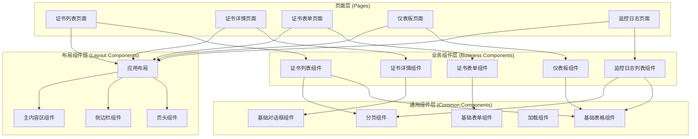
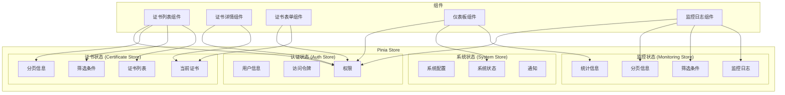

# 前端架构

定义前端架构，包括技术栈、项目结构、组件设计、状态管理、路由等。

## 前端架构设计原则

- **组件化**：将UI拆分为可重用的组件，提高开发效率和代码复用性
- **响应式**：使用Vue 3的响应式系统，确保UI与数据同步
- **性能优化**：采用懒加载、代码分割等技术优化前端性能
- **可维护性**：清晰的目录结构和代码组织，便于维护和扩展
- **用户体验**：流畅的交互和友好的错误处理，提升用户体验

## 前端技术栈

| 类别 | 技术 | 版本 | 用途 |
|------|------|------|------|
| 核心框架 | Vue.js | 3.x | 构建响应式用户界面 |
| 构建工具 | Vite | 4.x | 项目构建和开发服务器 |
| 路由管理 | Vue Router | 4.x | 前端路由管理 |
| 状态管理 | Pinia | 2.x | 应用状态管理 |
| UI组件库 | Element Plus | 2.x | UI组件和设计系统 |
| HTTP客户端 | Axios | 1.x | API请求处理 |
| 表单验证 | Vuelidate | 2.x | 表单验证 |
| 图表库 | ECharts | 5.x | 数据可视化 |
| 工具库 | Lodash | 4.x | 工具函数 |
| 日期处理 | Day.js | 1.x | 日期格式化和处理 |
| 测试框架 | Jest | 29.x | 单元测试 |
| 组件测试 | Vue Test Utils | 2.x | 组件测试 |
| 端到端测试 | Cypress | 12.x | 端到端测试 |
| 代码规范 | ESLint | 8.x | 代码质量检查 |
| 格式化工具 | Prettier | 2.x | 代码格式化 |
| Git钩子 | Husky | 8.x | Git钩子管理 |
| 提交规范 | Commitizen | 4.x | 规范化提交信息 |

## 项目结构

```
frontend/
├── public/                    # 静态资源
│   ├── favicon.ico           # 网站图标
│   └── index.html            # HTML模板
├── src/                      # 源代码
│   ├── api/                  # API接口
│   │   ├── index.js          # API实例配置
│   │   ├── certificate.js    # 证书相关API
│   │   ├── monitoring.js     # 监控相关API
│   │   └── system.js         # 系统相关API
│   ├── assets/               # 静态资源
│   │   ├── images/           # 图片资源
│   │   └── styles/           # 样式资源
│   │       ├── global.scss   # 全局样式
│   │       ├── variables.scss # SCSS变量
│   │       └── mixins.scss    # SCSS混入
│   ├── components/           # 通用组件
│   │   ├── common/           # 通用组件
│   │   │   ├── BaseTable.vue      # 基础表格组件
│   │   │   ├── BaseForm.vue       # 基础表单组件
│   │   │   ├── BaseDialog.vue     # 基础对话框组件
│   │   │   ├── Loading.vue        # 加载组件
│   │   │   └── Pagination.vue     # 分页组件
│   │   ├── layout/            # 布局组件
│   │   │   ├── AppLayout.vue      # 应用布局
│   │   │   ├── Header.vue         # 页头组件
│   │   │   ├── Sidebar.vue        # 侧边栏组件
│   │   │   └── MainContent.vue    # 主内容区组件
│   │   └── business/          # 业务组件
│   │       ├── CertificateList.vue    # 证书列表组件
│   │       ├── CertificateDetail.vue  # 证书详情组件
│   │       ├── CertificateForm.vue    # 证书表单组件
│   │       ├── Dashboard.vue         # 仪表板组件
│   │       └── MonitoringLogList.vue # 监控日志列表组件
│   ├── composables/          # 组合式函数
│   │   ├── useApi.js         # API调用组合函数
│   │   ├── useTable.js       # 表格操作组合函数
│   │   ├── useForm.js        # 表单操作组合函数
│   │   ├── usePagination.js  # 分页组合函数
│   │   └── useDebounce.js    # 防抖组合函数
│   ├── directives/           # 自定义指令
│   │   ├── permission.js     # 权限指令
│   │   └── loading.js        # 加载指令
│   ├── hooks/                # 钩子函数
│   │   ├── useAuth.js        # 认证钩子
│   │   ├── useCertificate.js # 证书钩子
│   │   └── useMonitoring.js  # 监控钩子
│   ├── layouts/              # 布局
│   │   ├── DefaultLayout.vue # 默认布局
│   │   └── AuthLayout.vue    # 认证布局
│   ├── mixins/               # 混入
│   │   ├── validation.js     # 验证混入
│   │   └── pagination.js     # 分页混入
│   ├── plugins/              # 插件
│   │   ├── element-plus.js  # Element Plus插件
│   │   ├── echarts.js       # ECharts插件
│   │   └── dayjs.js         # Day.js插件
│   ├── router/               # 路由配置
│   │   ├── index.js         # 路由实例
│   │   ├── modules/         # 路由模块
│   │   │   ├── certificate.js # 证书路由
│   │   │   ├── monitoring.js  # 监控路由
│   │   │   └── system.js      # 系统路由
│   │   └── guards.js        # 路由守卫
│   ├── stores/               # 状态管理
│   │   ├── index.js         # Pinia实例
│   │   ├── modules/         # 状态模块
│   │   │   ├── auth.js        # 认证状态
│   │   │   ├── certificate.js # 证书状态
│   │   │   ├── monitoring.js  # 监控状态
│   │   │   └── system.js      # 系统状态
│   │   └── composables/      # 状态组合函数
│   │       ├── useAuthStore.js    # 认证状态组合函数
│   │       ├── useCertificateStore.js # 证书状态组合函数
│   │       └── useMonitoringStore.js # 监控状态组合函数
│   ├── utils/                # 工具函数
│   │   ├── request.js       # 请求工具
│   │   ├── auth.js          # 认证工具
│   │   ├── validation.js    # 验证工具
│   │   ├── date.js          # 日期工具
│   │   └── common.js        # 通用工具
│   ├── views/                # 页面视图
│   │   ├── auth/            # 认证页面
│   │   │   ├── Login.vue        # 登录页面
│   │   │   └── ForgotPassword.vue # 忘记密码页面
│   │   ├── certificate/     # 证书页面
│   │   │   ├── CertificateList.vue   # 证书列表页面
│   │   │   ├── CertificateDetail.vue # 证书详情页面
│   │   │   └── CertificateForm.vue   # 证书表单页面
│   │   ├── monitoring/      # 监控页面
│   │   │   ├── Dashboard.vue        # 仪表板页面
│   │   │   └── MonitoringLogList.vue # 监控日志列表页面
│   │   ├── system/          # 系统页面
│   │   │   ├── Profile.vue         # 个人资料页面
│   │   │   └── Settings.vue        # 系统设置页面
│   │   └── error/           # 错误页面
│   │       ├── NotFound.vue       # 404页面
│   │       ├── Forbidden.vue      # 403页面
│   │       └── ServerError.vue    # 500页面
│   ├── App.vue               # 根组件
│   └── main.js               # 应用入口
├── tests/                    # 测试文件
│   ├── unit/                # 单元测试
│   │   ├── components/      # 组件测试
│   │   ├── composables/     # 组合式函数测试
│   │   ├── stores/          # 状态管理测试
│   │   └── utils/           # 工具函数测试
│   ├── e2e/                 # 端到端测试
│   │   ├── auth/            # 认证测试
│   │   ├── certificate/     # 证书测试
│   │   └── monitoring/      # 监控测试
│   └── fixtures/            # 测试数据
│       ├── certificates.json # 证书测试数据
│       └── monitoring-logs.json # 监控日志测试数据
├── .env                     # 环境变量
├── .env.development         # 开发环境变量
├── .env.production          # 生产环境变量
├── .env.staging             # 预发布环境变量
├── .eslintrc.js             # ESLint配置
├── .prettierrc.js           # Prettier配置
├── babel.config.js          # Babel配置
├── cypress.config.js        # Cypress配置
├── jest.config.js           # Jest配置
├── vite.config.js           # Vite配置
├── package.json             # 项目依赖
└── README.md                # 项目说明
```

## 组件设计

### 1. 组件分层架构



### 2. 组件通信方式

- **Props / Emits**：父子组件之间的通信
- **Provide / Inject**：跨层级组件之间的通信
- **Pinia**：全局状态管理，任意组件之间的通信
- **Event Bus**：组件之间的事件通信（仅在必要时使用）

### 3. 组件设计模式

- **容器组件与展示组件分离**：将数据获取逻辑与UI展示分离
- **组合式API**：使用Vue 3的组合式API组织组件逻辑
- **插槽（Slots）**：使用插槽提高组件的灵活性
- **混入（Mixins）**：使用混入复用组件逻辑

## 状态管理

### 1. 状态管理架构



### 2. 状态管理设计原则

- **单一数据源**：每个状态在应用中只有一个来源
- **状态只读**：组件不能直接修改状态，必须通过actions修改
- **纯函数修改**：使用纯函数修改状态，确保可预测性
- **模块化**：将状态按功能模块划分，便于管理

### 3. 状态持久化

- **本地存储**：使用localStorage存储用户认证信息和系统配置
- **会话存储**：使用sessionStorage存储临时数据
- **Cookie**：使用Cookie存储认证令牌（可选）

## 路由设计

### 1. 路由结构

```javascript
// 路由配置示例
const routes = [
  {
    path: '/',
    component: DefaultLayout,
    meta: { requiresAuth: true },
    children: [
      {
        path: '',
        name: 'Dashboard',
        component: () => import('@/views/monitoring/Dashboard.vue'),
        meta: { title: '仪表板', icon: 'dashboard' }
      },
      {
        path: 'certificates',
        name: 'CertificateList',
        component: () => import('@/views/certificate/CertificateList.vue'),
        meta: { title: '证书列表', icon: 'certificate' }
      },
      {
        path: 'certificates/:id',
        name: 'CertificateDetail',
        component: () => import('@/views/certificate/CertificateDetail.vue'),
        meta: { title: '证书详情', icon: 'detail', hidden: true }
      },
      {
        path: 'certificates/create',
        name: 'CertificateCreate',
        component: () => import('@/views/certificate/CertificateForm.vue'),
        meta: { title: '创建证书', icon: 'create', hidden: true }
      },
      {
        path: 'certificates/:id/edit',
        name: 'CertificateEdit',
        component: () => import('@/views/certificate/CertificateForm.vue'),
        meta: { title: '编辑证书', icon: 'edit', hidden: true }
      },
      {
        path: 'monitoring-logs',
        name: 'MonitoringLogList',
        component: () => import('@/views/monitoring/MonitoringLogList.vue'),
        meta: { title: '监控日志', icon: 'log' }
      }
    ]
  },
  {
    path: '/login',
    component: AuthLayout,
    meta: { requiresAuth: false },
    children: [
      {
        path: '',
        name: 'Login',
        component: () => import('@/views/auth/Login.vue'),
        meta: { title: '登录' }
      }
    ]
  },
  {
    path: '/:pathMatch(.*)*',
    name: 'NotFound',
    component: () => import('@/views/error/NotFound.vue'),
    meta: { title: '页面不存在' }
  }
]
```

### 2. 路由守卫

- **全局前置守卫**：检查用户认证状态和权限
- **全局后置守卫**：设置页面标题和滚动位置
- **路由独享守卫**：特定路由的访问控制
- **组件内守卫**：组件内的导航控制

### 3. 路由懒加载

- **动态导入**：使用动态导入实现路由组件的懒加载
- **代码分割**：将路由组件分割成独立的代码块
- **预加载**：在用户可能访问路由时预加载组件

## API 请求处理

### 1. API 请求架构

```javascript
// API实例配置示例
import axios from 'axios'
import { useAuthStore } from '@/stores/modules/auth'
import router from '@/router'

// 创建axios实例
const api = axios.create({
  baseURL: import.meta.env.VITE_API_BASE_URL,
  timeout: 10000,
  headers: {
    'Content-Type': 'application/json'
  }
})

// 请求拦截器
api.interceptors.request.use(
  config => {
    const authStore = useAuthStore()
    if (authStore.token) {
      config.headers.Authorization = `Bearer ${authStore.token}`
    }
    return config
  },
  error => {
    return Promise.reject(error)
  }
)

// 响应拦截器
api.interceptors.response.use(
  response => {
    return response.data
  },
  error => {
    if (error.response) {
      switch (error.response.status) {
        case 401:
          // 未授权，跳转到登录页
          const authStore = useAuthStore()
          authStore.logout()
          router.push('/login')
          break
        case 403:
          // 禁止访问
          router.push('/403')
          break
        case 404:
          // 资源不存在
          router.push('/404')
          break
        case 500:
          // 服务器错误
          router.push('/500')
          break
        default:
          // 其他错误
          console.error('API Error:', error)
      }
    }
    return Promise.reject(error)
  }
)

export default api
```

### 2. API 模块化

- **按功能模块划分**：将API按功能模块划分，便于管理
- **统一错误处理**：统一的错误处理机制
- **请求/响应拦截**：请求和响应拦截器处理通用逻辑
- **取消请求**：支持取消未完成的请求

## 样式设计

### 1. 样式架构

- **SCSS预处理器**：使用SCSS作为CSS预处理器
- **CSS模块化**：使用CSS模块或作用域样式避免样式冲突
- **主题系统**：使用CSS变量实现主题系统
- **响应式设计**：使用媒体查询实现响应式布局

### 2. 样式组织

```scss
// variables.scss - 变量定义
$primary-color: #409EFF;
$success-color: #67C23A;
$warning-color: #E6A23C;
$danger-color: #F56C6C;
$info-color: #909399;

$border-radius: 4px;
$box-shadow: 0 2px 12px 0 rgba(0, 0, 0, 0.1);

$breakpoints: (
  'xs': 480px,
  'sm': 768px,
  'md': 992px,
  'lg': 1200px,
  'xl': 1920px
);

// mixins.scss - 混入定义
@mixin respond-to($breakpoint) {
  @if map-has-key($breakpoints, $breakpoint) {
    @media (min-width: map-get($breakpoints, $breakpoint)) {
      @content;
    }
  } @else {
    @warn "Unfortunately, no value could be retrieved from `#{$breakpoint}`. "
        + "Available breakpoints are: #{map-keys($breakpoints)}.";
  }
}

@mixin flex-center {
  display: flex;
  justify-content: center;
  align-items: center;
}

// global.scss - 全局样式
body {
  margin: 0;
  font-family: 'Helvetica Neue', Helvetica, 'PingFang SC', 'Hiragino Sans GB', 'Microsoft YaHei', Arial, sans-serif;
  -webkit-font-smoothing: antialiased;
  -moz-osx-font-smoothing: grayscale;
  color: #333;
  background-color: #f5f7fa;
}

.container {
  width: 100%;
  max-width: 1200px;
  margin: 0 auto;
  padding: 0 20px;
  @include respond-to('md') {
    padding: 0 30px;
  }
}
```

### 3. 组件样式

- **作用域样式**：使用Vue的scoped属性限制样式作用域
- **CSS模块**：使用CSS模块避免样式冲突
- **BEM命名规范**：使用BEM命名规范组织样式类名

## 性能优化

### 1. 代码分割

- **路由级别代码分割**：按路由分割代码块
- **组件级别代码分割**：按需加载组件
- **库级别代码分割**：分离第三方库

### 2. 懒加载

- **图片懒加载**：使用Intersection Observer实现图片懒加载
- **组件懒加载**：使用Vue的异步组件实现组件懒加载
- **路由懒加载**：使用动态导入实现路由懒加载

### 3. 缓存策略

- **HTTP缓存**：配置HTTP缓存头
- **本地存储缓存**：使用localStorage缓存API数据
- **内存缓存**：使用内存缓存频繁访问的数据

### 4. 优化工具

- **Vite构建优化**：配置Vite的构建选项
- **Tree Shaking**：移除未使用的代码
- **代码压缩**：压缩JavaScript和CSS代码
- **图片优化**：压缩和优化图片资源

## 测试策略

### 1. 单元测试

- **组件测试**：使用Vue Test Utils测试组件
- **组合式函数测试**：测试组合式函数的逻辑
- **工具函数测试**：测试工具函数的功能
- **状态管理测试**：测试Pinia store的逻辑

### 2. 集成测试

- **API测试**：测试API请求和响应
- **路由测试**：测试路由导航和守卫
- **组件交互测试**：测试组件之间的交互

### 3. 端到端测试

- **用户流程测试**：测试完整的用户操作流程
- **关键功能测试**：测试关键功能的正确性
- **兼容性测试**：测试不同浏览器和设备的兼容性

## 部署策略

### 1. 构建流程

- **开发构建**：使用Vite的开发服务器进行开发
- **生产构建**：使用Vite的生产模式构建
- **环境配置**：使用环境变量配置不同环境

### 2. 静态资源部署

- **CDN部署**：使用CDN部署静态资源
- **版本控制**：使用文件名哈希实现版本控制
- **缓存策略**：配置静态资源的缓存策略

### 3. 容器化部署

- **Docker镜像**：创建前端应用的Docker镜像
- **Nginx配置**：配置Nginx作为静态资源服务器
- **Kubernetes部署**：使用Kubernetes部署前端应用