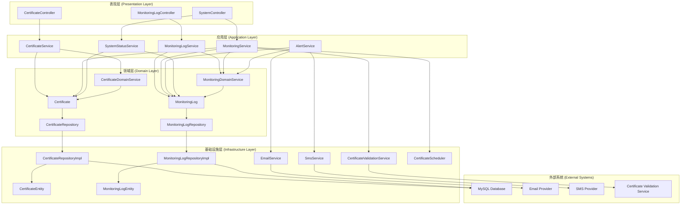
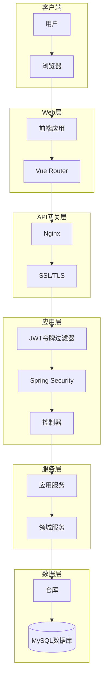

# 后端架构

定义后端架构，包括技术栈、项目结构、分层架构、设计模式、安全策略等。

## 后端架构设计原则

- **分层架构**：采用清晰的分层架构，实现关注点分离
- **领域驱动设计**：使用DDD原则组织业务逻辑
- **依赖注入**：使用Spring的依赖注入机制，降低组件间耦合
- **面向接口编程**：通过接口定义组件契约，提高可测试性和可扩展性
- **异常处理**：统一的异常处理机制，提供友好的错误响应

## 后端技术栈

| 类别 | 技术 | 版本 | 用途 |
|------|------|------|------|
| 核心框架 | Spring Boot | 2.7.x | 应用框架 |
| 安全框架 | Spring Security | 5.7.x | 安全认证和授权 |
| 数据访问 | MyBatis Plus | 3.5.x | ORM框架 |
| 数据库 | MySQL | 8.0 | 关系型数据库 |
| 连接池 | HikariCP | 5.0.x | 数据库连接池 |
| 缓存 | Spring Cache | 2.7.x | 缓存抽象 |
| 定时任务 | Spring Scheduler | 2.7.x | 定时任务调度 |
| 验证框架 | Spring Validation | 2.7.x | 数据验证 |
| 文档工具 | SpringDoc OpenAPI | 1.6.x | API文档生成 |
| 日志框架 | Logback | 1.3.x | 日志记录 |
| 监控工具 | Spring Boot Actuator | 2.7.x | 应用监控 |
| 测试框架 | JUnit | 5.8.x | 单元测试 |
| Mock框架 | Mockito | 4.5.x | Mock对象 |
| 构建工具 | Maven | 3.8.x | 项目构建和依赖管理 |
| 开发工具 | Lombok | 1.18.x | 代码生成 |
| 开发工具 | MapStruct | 1.4.x | 对象映射 |
| 开发工具 | Spring Boot DevTools | 2.7.x | 开发工具 |

## 项目结构

```
backend/
├── src/
│   ├── main/
│   │   ├── java/
│   │   │   └── com/
│   │   │       └── example/
│   │   │           └── certificate/
│   │   │               ├── CertificateManagementApplication.java # 应用入口
│   │   │               ├── config/                                    # 配置类
│   │   │               │   ├── DatabaseConfig.java                   # 数据库配置
│   │   │               │   ├── SecurityConfig.java                   # 安全配置
│   │   │               │   ├── WebConfig.java                        # Web配置
│   │   │               │   ├── SwaggerConfig.java                    # Swagger配置
│   │   │               │   ├── CacheConfig.java                      # 缓存配置
│   │   │               │   └── SchedulerConfig.java                 # 定时任务配置
│   │   │               ├── common/                                   # 通用模块
│   │   │               │   ├── constant/                             # 常量
│   │   │               │   │   ├── Constants.java                    # 通用常量
│   │   │               │   │   ├── CertificateConstants.java         # 证书常量
│   │   │               │   │   └── MonitoringConstants.java          # 监控常量
│   │   │               │   ├── exception/                            # 异常处理
│   │   │               │   │   ├── GlobalExceptionHandler.java       # 全局异常处理器
│   │   │               │   │   ├── BusinessException.java            # 业务异常
│   │   │               │   │   ├── ResourceNotFoundException.java    # 资源未找到异常
│   │   │               │   │   └── ValidationException.java           # 验证异常
│   │   │               │   ├── response/                             # 响应封装
│   │   │               │   │   ├── ApiResponse.java                   # API响应封装
│   │   │               │   │   ├── PageResult.java                   # 分页结果
│   │   │               │   │   └── ResultCode.java                   # 响应码枚举
│   │   │               │   ├── util/                                 # 工具类
│   │   │               │   │   ├── DateUtils.java                     # 日期工具
│   │   │               │   │   ├── ValidationUtils.java              # 验证工具
│   │   │               │   │   └── SecurityUtils.java                 # 安全工具
│   │   │               │   └── annotation/                           # 自定义注解
│   │   │               │       ├── LogExecutionTime.java            # 执行时间日志注解
│   │   │               │       └── ValidateCertificate.java         # 证书验证注解
│   │   │               ├── controller/                              # 控制器层
│   │   │               │   ├── CertificateController.java            # 证书控制器
│   │   │               │   ├── MonitoringLogController.java         # 监控日志控制器
│   │   │               │   └── SystemController.java                 # 系统控制器
│   │   │               ├── service/                                 # 服务层
│   │   │               │   ├── dto/                                 # 数据传输对象
│   │   │               │   │   ├── CertificateDto.java               # 证书DTO
│   │   │               │   │   ├── CertificateCreateDto.java         # 证书创建DTO
│   │   │               │   │   ├── CertificateUpdateDto.java         # 证书更新DTO
│   │   │               │   │   ├── MonitoringLogDto.java            # 监控日志DTO
│   │   │               │   │   ├── SystemStatusDto.java             # 系统状态DTO
│   │   │               │   │   └── CertificateStatisticsDto.java    # 证书统计DTO
│   │   │               │   ├── vo/                                  # 视图对象
│   │   │               │   │   ├── CertificateVo.java                # 证书VO
│   │   │               │   │   ├── MonitoringLogVo.java             # 监控日志VO
│   │   │               │   │   └── SystemStatusVo.java              # 系统状态VO
│   │   │               │   ├── mapper/                              # 对象映射器
│   │   │               │   │   ├── CertificateMapper.java            # 证书映射器
│   │   │               │   │   └── MonitoringLogMapper.java         # 监控日志映射器
│   │   │               │   ├── CertificateService.java              # 证书服务接口
│   │   │               │   ├── CertificateServiceImpl.java         # 证书服务实现
│   │   │               │   ├── MonitoringLogService.java           # 监控日志服务接口
│   │   │               │   ├── MonitoringLogServiceImpl.java        # 监控日志服务实现
│   │   │               │   ├── MonitoringService.java              # 监控服务接口
│   │   │               │   ├── MonitoringServiceImpl.java         # 监控服务实现
│   │   │               │   ├── AlertService.java                   # 预警服务接口
│   │   │               │   ├── AlertServiceImpl.java                # 预警服务实现
│   │   │               │   ├── SystemStatusService.java            # 系统状态服务接口
│   │   │               │   └── SystemStatusServiceImpl.java         # 系统状态服务实现
│   │   │               ├── domain/                                  # 领域层
│   │   │               │   ├── model/                              # 领域模型
│   │   │               │   │   ├── Certificate.java                 # 证书实体
│   │   │               │   │   ├── MonitoringLog.java                # 监控日志实体
│   │   │               │   │   └── CertificateStatus.java           # 证书状态枚举
│   │   │               │   ├── repository/                          # 仓库接口
│   │   │               │   │   ├── CertificateRepository.java        # 证书仓库接口
│   │   │               │   │   └── MonitoringLogRepository.java     # 监控日志仓库接口
│   │   │               │   ├── service/                            # 领域服务
│   │   │               │   │   ├── CertificateDomainService.java    # 证书领域服务
│   │   │               │   │   └── MonitoringDomainService.java      # 监控领域服务
│   │   │               │   └── event/                              # 领域事件
│   │   │               │       ├── CertificateCreatedEvent.java      # 证书创建事件
│   │   │               │       ├── CertificateUpdatedEvent.java      # 证书更新事件
│   │   │               │       ├── CertificateDeletedEvent.java      # 证书删除事件
│   │   │               │       └── CertificateStatusChangedEvent.java # 证书状态变更事件
│   │   │               ├── infrastructure/                          # 基础设施层
│   │   │               │   ├── repository/impl/                     # 仓库实现
│   │   │               │   │   ├── CertificateRepositoryImpl.java    # 证书仓库实现
│   │   │               │   │   └── MonitoringLogRepositoryImpl.java # 监控日志仓库实现
│   │   │               │   ├── persistence/                        # 持久化
│   │   │               │   │   ├── entity/                          # 数据库实体
│   │   │               │   │   │   ├── CertificateEntity.java        # 证书数据库实体
│   │   │               │   │   │   └── MonitoringLogEntity.java       # 监控日志数据库实体
│   │   │               │   │   ├── mapper/                         # MyBatis映射器
│   │   │               │   │   │   ├── CertificateMapper.java         # 证书MyBatis映射器
│   │   │               │   │   │   └── MonitoringLogMapper.java      # 监控日志MyBatis映射器
│   │   │               │   │   └── repository/                     # MyBatis仓库
│   │   │               │   │       ├── CertificateMyBatisRepository.java # 证书MyBatis仓库
│   │   │               │   │       └── MonitoringLogMyBatisRepository.java # 监控日志MyBatis仓库
│   │   │               │   ├── external/                           # 外部服务
│   │   │               │   │   ├── email/                           # 邮件服务
│   │   │               │   │   │   ├── EmailService.java           # 邮件服务接口
│   │   │               │   │   │   ├── EmailServiceImpl.java        # 邮件服务实现
│   │   │               │   │   │   └── LogEmailServiceImpl.java     # 日志邮件服务实现
│   │   │               │   │   ├── sms/                             # 短信服务
│   │   │               │   │   │   ├── SmsService.java             # 短信服务接口
│   │   │               │   │   │   ├── SmsServiceImpl.java          # 短信服务实现
│   │   │               │   │   │   └── LogSmsServiceImpl.java       # 日志短信服务实现
│   │   │               │   │   └── validation/                      # 证书验证服务
│   │   │               │   │       ├── CertificateValidationService.java # 证书验证服务接口
│   │   │               │   │       ├── CertificateValidationServiceImpl.java # 证书验证服务实现
│   │   │               │   │       └── BuiltinCertificateValidationServiceImpl.java # 内置证书验证服务实现
│   │   │               │   ├── config/                            # 基础设施配置
│   │   │               │   │   ├── DatabaseConfig.java              # 数据库配置
│   │   │               │   │   ├── CacheConfig.java                # 缓存配置
│   │   │               │   │   └── SchedulerConfig.java             # 定时任务配置
│   │   │               │   └── scheduler/                         # 定时任务
│   │   │               │       ├── CertificateScheduler.java       # 证书定时任务
│   │   │               │       └── DailySummaryScheduler.java      # 每日摘要定时任务
│   │   │               └── security/                              # 安全模块
│   │   │                   ├── jwt/                               # JWT相关
│   │   │                   │   ├── JwtTokenProvider.java          # JWT令牌提供者
│   │   │                   │   ├── JwtTokenFilter.java            # JWT令牌过滤器
│   │   │                   │   └── JwtAuthenticationEntryPoint.java # JWT认证入口点
│   │   │                   ├── user/                              # 用户相关
│   │   │                   │   ├── UserDetailsServiceImpl.java     # 用户详情服务实现
│   │   │                   │   └── UserPrincipal.java              # 用户主体
│   │   │                   └── util/                              # 安全工具
│   │   │                       └── SecurityUtils.java             # 安全工具
│   │   └── resources/
│   │       ├── application.yml                              # 应用配置
│   │       ├── application-dev.yml                          # 开发环境配置
│   │       ├── application-prod.yml                         # 生产环境配置
│   │       ├── application-test.yml                         # 测试环境配置
│   │       ├── mapper/                                      # MyBatis映射文件
│   │       │   ├── CertificateMapper.xml                     # 证书映射文件
│   │       │   └── MonitoringLogMapper.xml                  # 监控日志映射文件
│   │       ├── db/migration/                                # 数据库迁移脚本
│   │       │   ├── V1__Create_certificate_table.sql         # 创建证书表
│   │       │   └── V2__Create_monitoring_log_table.sql      # 创建监控日志表
│   │       ├── static/                                      # 静态资源
│   │       └── templates/                                   # 模板文件
│   ├── test/
│   │   ├── java/
│   │   │   └── com/
│   │   │       └── example/
│   │   │           └── certificate/
│   │   │               ├── controller/                         # 控制器测试
│   │   │               │   ├── CertificateControllerTest.java
│   │   │               │   ├── MonitoringLogControllerTest.java
│   │   │               │   └── SystemControllerTest.java
│   │   │               ├── service/                           # 服务测试
│   │   │               │   ├── CertificateServiceTest.java
│   │   │               │   ├── MonitoringLogServiceTest.java
│   │   │               │   ├── MonitoringServiceTest.java
│   │   │               │   ├── AlertServiceTest.java
│   │   │               │   └── SystemStatusServiceTest.java
│   │   │               ├── domain/                            # 领域测试
│   │   │               │   ├── CertificateTest.java
│   │   │               │   ├── MonitoringLogTest.java
│   │   │               │   └── CertificateDomainServiceTest.java
│   │   │               ├── infrastructure/                    # 基础设施测试
│   │   │               │   ├── repository/                     # 仓库测试
│   │   │               │   │   ├── CertificateRepositoryTest.java
│   │   │               │   │   └── MonitoringLogRepositoryTest.java
│   │   │               │   ├── external/                       # 外部服务测试
│   │   │               │   │   ├── EmailServiceTest.java
│   │   │               │   │   ├── SmsServiceTest.java
│   │   │               │   │   └── CertificateValidationServiceTest.java
│   │   │               │   └── scheduler/                      # 定时任务测试
│   │   │               │       ├── CertificateSchedulerTest.java
│   │   │               │       └── DailySummarySchedulerTest.java
│   │   │               ├── security/                          # 安全测试
│   │   │               │   ├── JwtTokenProviderTest.java
│   │   │               │   └── SecurityUtilsTest.java
│   │   │               ├── common/                            # 通用测试
│   │   │               │   ├── exception/GlobalExceptionHandlerTest.java
│   │   │               │   └── util/DateUtilsTest.java
│   │   │               ├── IntegrationTest.java                # 集成测试基类
│   │   │               └── TestApplication.java                # 测试应用配置
│   │   └── resources/
│   │       ├── application-test.yml                        # 测试环境配置
│   │       └── test-data/                                  # 测试数据
│   │           ├── certificates.json                         # 证书测试数据
│   │           └── monitoring-logs.json                      # 监控日志测试数据
├── .gitignore
├── Dockerfile
├── pom.xml
└── README.md
```

## 分层架构

### 1. 分层架构图



### 2. 分层职责

- **表现层 (Presentation Layer)**：
  - 负责处理HTTP请求和响应
  - 验证输入参数
  - 调用应用层服务处理业务逻辑
  - 返回统一的API响应格式

- **应用层 (Application Layer)**：
  - 实现应用业务用例
  - 协调领域对象和基础设施服务
  - 处理事务边界
  - 提供DTO和VO之间的转换

- **领域层 (Domain Layer)**：
  - 包含核心业务逻辑和领域模型
  - 定义领域实体、值对象和领域服务
  - 定义仓库接口，不关心具体实现
  - 发布领域事件

- **基础设施层 (Infrastructure Layer)**：
  - 实现仓库接口，提供数据持久化
  - 集成外部系统和服务
  - 提供技术基础设施支持
  - 实现横切关注点（如日志、缓存）

## 设计模式

### 1. 依赖注入模式

- **描述**：使用Spring的依赖注入机制，通过构造函数注入依赖
- **优点**：降低组件间耦合，提高可测试性和可维护性
- **实现示例**：
  ```java
  @Service
  public class CertificateServiceImpl implements CertificateService {
      private final CertificateRepository certificateRepository;
      private final MonitoringLogService monitoringLogService;
      
      @Autowired
      public CertificateServiceImpl(CertificateRepository certificateRepository, 
                                  MonitoringLogService monitoringLogService) {
          this.certificateRepository = certificateRepository;
          this.monitoringLogService = monitoringLogService;
      }
      
      // 其他方法...
  }
  ```

### 2. 仓库模式

- **描述**：在领域层定义仓库接口，在基础设施层实现
- **优点**：分离领域逻辑和数据访问逻辑，提高可测试性
- **实现示例**：
  ```java
  // 领域层 - 仓库接口
  public interface CertificateRepository {
      Optional<Certificate> findById(Long id);
      List<Certificate> findAll();
      Certificate save(Certificate certificate);
      void deleteById(Long id);
      List<Certificate> findByStatus(CertificateStatus status);
      List<Certificate> findByExpiryDateBefore(Date date);
  }
  
  // 基础设施层 - 仓库实现
  @Repository
  public class CertificateRepositoryImpl implements CertificateRepository {
      private final CertificateMyBatisRepository myBatisRepository;
      
      @Autowired
      public CertificateRepositoryImpl(CertificateMyBatisRepository myBatisRepository) {
          this.myBatisRepository = myBatisRepository;
      }
      
      @Override
      public Optional<Certificate> findById(Long id) {
          return myBatisRepository.findById(id)
              .map(entity -> convertToDomain(entity));
      }
      
      // 其他方法实现...
      
      private Certificate convertToDomain(CertificateEntity entity) {
          // 转换逻辑...
      }
  }
  ```

### 3. 策略模式

- **描述**：为不同的算法或行为定义统一的接口，实现可互换的算法族
- **优点**：提高代码的灵活性和可扩展性
- **实现示例**：
  ```java
  // 策略接口
  public interface EmailService {
      EmailResult sendExpiryAlertEmail(Certificate certificate, int daysUntilExpiry, String recipientEmail);
  }
  
  // 具体策略实现 - 实际邮件服务
  @Service("realEmailService")
  public class EmailServiceImpl implements EmailService {
      // 实际邮件发送逻辑...
  }
  
  // 具体策略实现 - 日志邮件服务
  @Service("logEmailService")
  @Primary
  public class LogEmailServiceImpl implements EmailService {
      @Override
      public EmailResult sendExpiryAlertEmail(Certificate certificate, int daysUntilExpiry, String recipientEmail) {
          // 记录日志而不实际发送邮件
          log.info("Email alert would be sent to {} for certificate {} expiring in {} days", 
                  recipientEmail, certificate.getName(), daysUntilExpiry);
          
          EmailResult result = new EmailResult();
          result.setSuccess(true);
          result.setMessage("Email alert logged (MVP mode)");
          return result;
      }
  }
  
  // 策略使用
  @Service
  public class AlertServiceImpl implements AlertService {
      private final EmailService emailService;
      
      @Autowired
      public AlertServiceImpl(@Qualifier("logEmailService") EmailService emailService) {
          this.emailService = emailService;
      }
      
      // 其他方法...
  }
  ```

### 4. 工厂模式

- **描述**：提供一个创建对象的接口，让子类决定实例化哪一个类
- **优点**：封装对象的创建逻辑，提高代码的灵活性和可维护性
- **实现示例**：
  ```java
  // 工厂接口
  public interface CertificateValidationServiceFactory {
      CertificateValidationService createValidationService(String provider);
  }
  
  // 工厂实现
  @Service
  public class CertificateValidationServiceFactoryImpl implements CertificateValidationServiceFactory {
      private final Map<String, CertificateValidationService> serviceMap;
      
      @Autowired
      public CertificateValidationServiceFactoryImpl(
          Map<String, CertificateValidationService> serviceMap) {
          this.serviceMap = serviceMap;
      }
      
      @Override
      public CertificateValidationService createValidationService(String provider) {
          CertificateValidationService service = serviceMap.get(provider);
          if (service == null) {
              throw new IllegalArgumentException("Unsupported validation provider: " + provider);
          }
          return service;
      }
  }
  
  // 工厂使用
  @Service
  public class MonitoringServiceImpl implements MonitoringService {
      private final CertificateValidationServiceFactory validationServiceFactory;
      
      @Autowired
      public MonitoringServiceImpl(CertificateValidationServiceFactory validationServiceFactory) {
          this.validationServiceFactory = validationServiceFactory;
      }
      
      public ValidationResult validateCertificate(Certificate certificate) {
          String provider = "builtin"; // 可以从配置中读取
          CertificateValidationService validationService = validationServiceFactory.createValidationService(provider);
          return validationService.validateCertificate(certificate);
      }
  }
  ```

### 5. 观察者模式

- **描述**：定义对象间的一种一对多依赖关系，当一个对象状态发生改变时，所有依赖于它的对象都得到通知
- **优点**：实现对象间的松耦合，支持动态添加和删除观察者
- **实现示例**：
  ```java
  // 事件发布者
  @Service
  public class CertificateEventPublisher {
      private final ApplicationEventPublisher eventPublisher;
      
      @Autowired
      public CertificateEventPublisher(ApplicationEventPublisher eventPublisher) {
          this.eventPublisher = eventPublisher;
      }
      
      public void publishCertificateCreatedEvent(Certificate certificate) {
          eventPublisher.publishEvent(new CertificateCreatedEvent(certificate));
      }
      
      public void publishCertificateUpdatedEvent(Certificate certificate) {
          eventPublisher.publishEvent(new CertificateUpdatedEvent(certificate));
      }
      
      public void publishCertificateDeletedEvent(Certificate certificate) {
          eventPublisher.publishEvent(new CertificateDeletedEvent(certificate));
      }
      
      public void publishCertificateStatusChangedEvent(Certificate certificate, CertificateStatus oldStatus) {
          eventPublisher.publishEvent(new CertificateStatusChangedEvent(certificate, oldStatus));
      }
  }
  
  // 事件监听者
  @Service
  public class CertificateEventListener {
      private final MonitoringLogService monitoringLogService;
      
      @Autowired
      public CertificateEventListener(MonitoringLogService monitoringLogService) {
          this.monitoringLogService = monitoringLogService;
      }
      
      @EventListener
      public void handleCertificateCreatedEvent(CertificateCreatedEvent event) {
          Certificate certificate = event.getCertificate();
          monitoringLogService.logCertificateCreated(certificate);
      }
      
      @EventListener
      public void handleCertificateUpdatedEvent(CertificateUpdatedEvent event) {
          Certificate certificate = event.getCertificate();
          monitoringLogService.logCertificateUpdated(certificate);
      }
      
      @EventListener
      public void handleCertificateDeletedEvent(CertificateDeletedEvent event) {
          Certificate certificate = event.getCertificate();
          monitoringLogService.logCertificateDeleted(certificate);
      }
      
      @EventListener
      public void handleCertificateStatusChangedEvent(CertificateStatusChangedEvent event) {
          Certificate certificate = event.getCertificate();
          CertificateStatus oldStatus = event.getOldStatus();
          monitoringLogService.logCertificateStatusChanged(certificate, oldStatus);
      }
  }
  ```

## 安全架构

### 1. 安全架构图



### 2. 认证机制

- **JWT认证**：使用JSON Web Token进行无状态认证
- **令牌结构**：
  ```json
  {
    "sub": "1234567890",
    "name": "John Doe",
    "roles": ["USER", "ADMIN"],
    "iat": 1516239022,
    "exp": 1516242622
  }
  ```
- **认证流程**：
  1. 用户提交用户名和密码
  2. 服务器验证凭据
  3. 服务器生成JWT令牌
  4. 服务器返回JWT令牌给客户端
  5. 客户端在后续请求中携带JWT令牌
  6. 服务器验证JWT令牌
  7. 服务器处理请求并返回响应

### 3. 授权机制

- **基于角色的访问控制**：使用Spring Security的基于角色的访问控制
- **角色定义**：
  - `ROLE_USER`：普通用户，可以查看和管理证书
  - `ROLE_ADMIN`：管理员，具有所有权限
- **权限配置**：
  ```java
  @Configuration
  @EnableWebSecurity
  @EnableGlobalMethodSecurity(prePostEnabled = true)
  public class SecurityConfig extends WebSecurityConfigurerAdapter {
      
      @Override
      protected void configure(HttpSecurity http) throws Exception {
          http
              .csrf().disable()
              .exceptionHandling().authenticationEntryPoint(unauthorizedHandler).and()
              .sessionManagement().sessionCreationPolicy(SessionCreationPolicy.STATELESS).and()
              .authorizeRequests()
              .antMatchers("/api/auth/**").permitAll()
              .antMatchers(HttpMethod.GET, "/api/certificates/**").hasAnyRole("USER", "ADMIN")
              .antMatchers(HttpMethod.POST, "/api/certificates/**").hasRole("ADMIN")
              .antMatchers(HttpMethod.PUT, "/api/certificates/**").hasRole("ADMIN")
              .antMatchers(HttpMethod.DELETE, "/api/certificates/**").hasRole("ADMIN")
              .antMatchers("/api/monitoring-logs/**").hasAnyRole("USER", "ADMIN")
              .antMatchers("/api/system/**").hasRole("ADMIN")
              .anyRequest().authenticated();
          
          http.addFilterBefore(jwtTokenFilter(), UsernamePasswordAuthenticationFilter.class);
      }
      
      // 其他配置...
  }
  ```

### 4. 数据安全

- **密码加密**：使用BCryptPasswordEncoder加密存储用户密码
- **敏感数据加密**：对数据库中的敏感数据进行加密存储
- **HTTPS通信**：使用SSL/TLS加密客户端和服务器之间的通信
- **SQL注入防护**：使用参数化查询防止SQL注入攻击
- **XSS防护**：对用户输入进行转义，防止跨站脚本攻击

## 性能优化

### 1. 缓存策略

- **Spring Cache抽象**：使用Spring Cache抽象实现缓存
- **缓存配置**：
  ```java
  @Configuration
  @EnableCaching
  public class CacheConfig {
      
      @Bean
      public CacheManager cacheManager() {
          SimpleCacheManager cacheManager = new SimpleCacheManager();
          cacheManager.setCaches(Arrays.asList(
              new ConcurrentMapCache("certificates"),
              new ConcurrentMapCache("monitoringLogs"),
              new ConcurrentMapCache("systemStatus")
          ));
          return cacheManager;
      }
  }
  ```
- **缓存使用**：
  ```java
  @Service
  public class CertificateServiceImpl implements CertificateService {
      
      @Cacheable(value = "certificates", key = "#id")
      public Certificate findById(Long id) {
          // 查询逻辑...
      }
      
      @CacheEvict(value = "certificates", key = "#certificate.id")
      public Certificate update(Certificate certificate) {
          // 更新逻辑...
      }
      
      @CacheEvict(value = "certificates", key = "#id")
      public void deleteById(Long id) {
          // 删除逻辑...
      }
  }
  ```

### 2. 数据库优化

- **连接池配置**：使用HikariCP高性能连接池
- **索引优化**：为常用查询字段创建索引
- **查询优化**：使用MyBatis的动态SQL和分页查询
- **批量操作**：使用批量插入和更新提高效率

### 3. 异步处理

- **@Async注解**：使用Spring的@Async注解实现异步方法调用
- **异步配置**：
  ```java
  @Configuration
  @EnableAsync
  public class AsyncConfig implements AsyncConfigurer {
      
      @Override
      public Executor getAsyncExecutor() {
          ThreadPoolTaskExecutor executor = new ThreadPoolTaskExecutor();
          executor.setCorePoolSize(5);
          executor.setMaxPoolSize(10);
          executor.setQueueCapacity(25);
          executor.setThreadNamePrefix("Async-Executor-");
          executor.initialize();
          return executor;
      }
      
      @Override
      public AsyncUncaughtExceptionHandler getAsyncUncaughtExceptionHandler() {
          return new CustomAsyncExceptionHandler();
      }
  }
  ```
- **异步使用**：
  ```java
  @Service
  public class AlertServiceImpl implements AlertService {
      
      @Async
      public CompletableFuture<EmailResult> sendExpiryAlertEmail(Certificate certificate, int daysUntilExpiry, String recipientEmail) {
          // 发送邮件逻辑...
          return CompletableFuture.completedFuture(emailResult);
      }
      
      @Async
      public CompletableFuture<SmsResult> sendExpiryAlertSms(Certificate certificate, int daysUntilExpiry, String recipientPhone) {
          // 发送短信逻辑...
          return CompletableFuture.completedFuture(smsResult);
      }
  }
  ```

## 测试策略

### 1. 单元测试

- **JUnit 5**：使用JUnit 5作为单元测试框架
- **Mockito**：使用Mockito模拟依赖对象
- **测试覆盖**：确保核心业务逻辑的测试覆盖率达到80%以上
- **测试示例**：
  ```java
  @ExtendWith(MockitoExtension.class)
  class CertificateServiceTest {
      
      @Mock
      private CertificateRepository certificateRepository;
      
      @Mock
      private MonitoringLogService monitoringLogService;
      
      @InjectMocks
      private CertificateServiceImpl certificateService;
      
      @Test
      void findById_shouldReturnCertificate() {
          // Given
          Long certificateId = 1L;
          Certificate certificate = new Certificate();
          certificate.setId(certificateId);
          certificate.setName("Test Certificate");
          
          when(certificateRepository.findById(certificateId)).thenReturn(Optional.of(certificate));
          
          // When
          Optional<Certificate> result = certificateService.findById(certificateId);
          
          // Then
          assertTrue(result.isPresent());
          assertEquals(certificateId, result.get().getId());
          assertEquals("Test Certificate", result.get().getName());
          verify(certificateRepository).findById(certificateId);
      }
      
      // 其他测试方法...
  }
  ```

### 2. 集成测试

- **Spring Boot Test**：使用Spring Boot Test进行集成测试
- **测试数据库**：使用H2内存数据库进行测试
- **测试示例**：
  ```java
  @SpringBootTest
  @AutoConfigureTestDatabase(replace = AutoConfigureTestDatabase.Replace.NONE)
  @TestPropertySource(properties = {
      "spring.datasource.url=jdbc:h2:mem:testdb",
      "spring.datasource.driver-class-name=org.h2.Driver",
      "spring.datasource.username=sa",
      "spring.datasource.password=password",
      "spring.jpa.database-platform=org.hibernate.dialect.H2Dialect"
  })
  class CertificateControllerIntegrationTest {
      
      @Autowired
      private MockMvc mockMvc;
      
      @Autowired
      private CertificateRepository certificateRepository;
      
      @Test
      void getAllCertificates_shouldReturnCertificateList() throws Exception {
          // Given
          Certificate certificate = new Certificate();
          certificate.setName("Test Certificate");
          certificate.setDomain("example.com");
          certificateRepository.save(certificate);
          
          // When & Then
          mockMvc.perform(get("/api/v1/certificates"))
              .andExpect(status().isOk())
              .andExpect(jsonPath("$.success").value(true))
              .andExpect(jsonPath("$.data.content[0].name").value("Test Certificate"));
      }
      
      // 其他测试方法...
  }
  ```

### 3. 端到端测试

- **Postman**：使用Postman进行API端到端测试
- **测试场景**：覆盖主要的业务流程和边界情况
- **测试自动化**：使用Postman的集合和测试脚本实现自动化测试

## 日志和监控

### 1. 日志配置

- **Logback**：使用Logback作为日志框架
- **日志级别**：根据环境配置不同的日志级别
- **日志格式**：统一的日志格式，包含时间戳、日志级别、类名、线程名和日志消息
- **日志配置示例**：
  ```xml
  <configuration>
      <property name="LOG_PATH" value="logs"/>
      <property name="LOG_PATTERN" value="%d{yyyy-MM-dd HH:mm:ss.SSS} [%thread] %-5level %logger{36} - %msg%n"/>
      
      <appender name="CONSOLE" class="ch.qos.logback.core.ConsoleAppender">
          <encoder>
              <pattern>${LOG_PATTERN}</pattern>
          </encoder>
      </appender>
      
      <appender name="FILE" class="ch.qos.logback.core.rolling.RollingFileAppender">
          <file>${LOG_PATH}/certificate-management.log</file>
          <rollingPolicy class="ch.qos.logback.core.rolling.TimeBasedRollingPolicy">
              <fileNamePattern>${LOG_PATH}/certificate-management.%d{yyyy-MM-dd}.%i.log</fileNamePattern>
              <maxFileSize>10MB</maxFileSize>
              <maxHistory>30</maxHistory>
              <totalSizeCap>1GB</totalSizeCap>
          </rollingPolicy>
          <encoder>
              <pattern>${LOG_PATTERN}</pattern>
          </encoder>
      </appender>
      
      <root level="INFO">
          <appender-ref ref="CONSOLE"/>
          <appender-ref ref="FILE"/>
      </root>
      
      <logger name="com.example.certificate" level="DEBUG"/>
  </configuration>
  ```

### 2. 监控配置

- **Spring Boot Actuator**：使用Spring Boot Actuator提供应用监控端点
- **健康检查**：配置健康检查端点，监控应用状态
- **指标收集**：收集应用性能指标，如内存使用、GC情况、HTTP请求等
- **监控配置示例**：
  ```yaml
  management:
    endpoints:
      web:
        exposure:
          include: health,info,metrics,prometheus
    endpoint:
      health:
        show-details: always
    metrics:
      export:
        prometheus:
          enabled: true
    health:
      db:
        enabled: true
      diskspace:
        enabled: true
  ```

### 3. 告警配置

- **自定义健康指标**：实现自定义健康指标，监控证书状态和预警发送情况
- **告警规则**：配置告警规则，当特定条件满足时发送告警
- **告警渠道**：支持邮件、短信等多种告警渠道