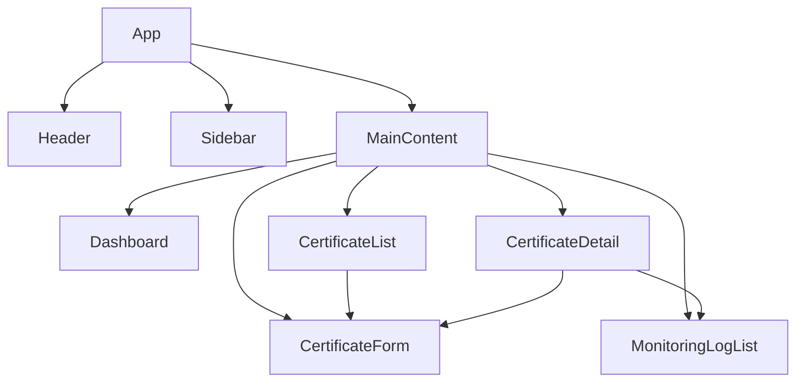
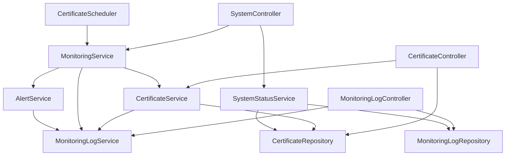

## 组件

定义前端和后端的核心组件，包括它们的职责和交互方式。

### 组件依赖关系和可重用性

#### 前端组件依赖关系图

#### 后端组件依赖关系图

### 前端组件

#### 1. App.vue（根组件）

**职责：** 应用程序的根组件，负责整体布局和路由配置

**关键特性：**
- 应用整体布局结构
- 路由配置和导航
- 全局状态管理
- 全局样式和主题

**子组件：**
- Header
- Sidebar
- MainContent

**依赖关系：**
- 无父组件依赖
- 依赖 Vue Router 进行路由管理
- 依赖 Pinia 进行全局状态管理

**可重用性：**
- 高度可重用，作为整个应用的入口点
- 提供通用的布局结构，可以适应不同的内容需求
- 通过插槽（slots）机制允许灵活的内容插入

#### 2. CertificateList.vue（证书列表组件）

**职责：** 显示证书列表，提供搜索、筛选和排序功能

**关键特性：**
- 证书列表展示
- 分页功能
- 搜索功能（按证书名称和域名）
- 筛选功能（按证书状态）
- 排序功能（按到期日期和状态）
- 批量操作（查看、编辑、删除）

**数据依赖：**
- Certificate[] - 证书列表数据
- 分页信息
- 筛选和排序参数

**API 调用：**
- GET /api/v1/certificates - 获取证书列表
- DELETE /api/v1/certificates/{id} - 删除证书

**依赖关系：**
- 父组件：MainContent
- 子组件：CertificateForm（用于创建新证书）
- 依赖 Element Plus 的表格组件
- 依赖 Pinia 存储中的证书状态

**可重用性：**
- 中等可重用性，专为证书列表设计
- 分页、搜索和筛选逻辑可以抽象为可重用的混入（mixin）或组合式函数
- 表格列配置可以通过 props 动态调整，适应不同的展示需求
- 操作按钮可以通过插槽自定义，增加灵活性

#### 3. CertificateDetail.vue（证书详情组件）

**职责：** 显示单个证书的详细信息，提供编辑和删除功能

**关键特性：**
- 证书详细信息展示
- 证书状态可视化
- 编辑证书信息
- 删除证书
- 相关监控日志查看

**数据依赖：**
- Certificate - 证书详细信息
- MonitoringLog[] - 相关监控日志

**API 调用：**
- GET /api/v1/certificates/{id} - 获取证书详情
- PUT /api/v1/certificates/{id} - 更新证书
- DELETE /api/v1/certificates/{id} - 删除证书
- GET /api/v1/monitoring-logs?certificateId={id} - 获取相关监控日志

**依赖关系：**
- 父组件：MainContent
- 子组件：CertificateForm（用于编辑证书）、MonitoringLogList（用于显示相关日志）
- 依赖 Vue Router 的路由参数获取证书ID
- 依赖 Element Plus 的表单和卡片组件

**可重用性：**
- 中等可重用性，专为证书详情设计
- 详情展示部分可以抽象为通用的详情展示组件
- 状态可视化组件可以独立出来，用于其他需要状态展示的场景
- 通过 props 可以配置显示的字段和操作按钮，增加灵活性

#### 4. CertificateForm.vue（证书表单组件）

**职责：** 提供证书创建和编辑表单

**关键特性：**
- 表单验证
- 日期选择器
- 提交和取消按钮
- 错误提示

**数据依赖：**
- Certificate - 证书数据（编辑时）
- 表单验证规则

**API 调用：**
- POST /api/v1/certificates - 创建证书
- PUT /api/v1/certificates/{id} - 更新证书

**依赖关系：**
- 父组件：CertificateList（创建时）、CertificateDetail（编辑时）
- 依赖 Element Plus 的表单组件和日期选择器
- 依赖 Vuelidate 或类似库进行表单验证

**可重用性：**
- 高度可重用，同时支持创建和编辑模式
- 表单字段和验证规则可以通过 props 动态配置
- 表单提交逻辑可以抽象为可重用的混入（mixin）或组合式函数
- 通过事件发射（emit）与父组件通信，保持组件独立性

#### 5. Dashboard.vue（仪表板组件）

**职责：** 显示系统概览和关键指标

**关键特性：**
- 证书统计信息
- 证书状态分布图表
- 即将过期证书列表
- 最近添加的证书列表
- 系统状态信息

**数据依赖：**
- 证书统计数据
- 即将过期证书列表
- 系统状态信息

**API 调用：**
- GET /api/v1/certificates?status=EXPIRING_SOON - 获取即将过期证书
- GET /api/v1/certificates?sort=createdAt,desc - 获取最近添加的证书
- GET /api/v1/system/status - 获取系统状态

**依赖关系：**
- 父组件：MainContent
- 依赖 Element Plus 的卡片和统计组件
- 依赖图表库（如 ECharts 或 Chart.js）进行数据可视化
- 依赖 Pinia 存储中的系统状态

**可重用性：**
- 中等可重用性，专为系统仪表板设计
- 统计卡片组件可以独立出来，用于其他需要数据统计的场景
- 图表组件可以抽象为通用的图表包装器，支持不同类型的数据展示
- 通过 props 可以配置显示的指标和图表类型，增加灵活性

#### 6. MonitoringLogList.vue（监控日志列表组件）

**职责：** 显示监控日志列表，提供筛选和搜索功能

**关键特性：**
- 监控日志列表展示
- 分页功能
- 筛选功能（按日志类型和证书）
- 搜索功能
- 时间范围选择

**数据依赖：**
- MonitoringLog[] - 监控日志列表数据
- 分页信息
- 筛选参数

**API 调用：**
- GET /api/v1/monitoring-logs - 获取监控日志列表

**依赖关系：**
- 父组件：MainContent、CertificateDetail（作为子组件显示相关日志）
- 依赖 Element Plus 的表格组件和日期选择器
- 依赖 Pinia 存储中的监控日志状态

**可重用性：**
- 高度可重用，可以通过 props 配置为独立组件或嵌入其他组件
- 分页、搜索和筛选逻辑可以抽象为可重用的混入（mixin）或组合式函数
- 表格列配置可以通过 props 动态调整，适应不同的展示需求
- 时间范围选择器可以独立出来，用于其他需要时间筛选的场景

#### 7. Header.vue（页头组件）

**职责：** 显示应用程序页头，包含导航和用户信息

**关键特性：**
- 应用程序标题
- 导航菜单
- 用户信息显示
- 退出登录按钮

**依赖关系：**
- 父组件：App
- 依赖 Vue Router 进行导航
- 依赖 Pinia 存储中的用户状态

**可重用性：**
- 高度可重用，设计为通用的页头组件
- 导航菜单项可以通过 props 动态配置
- 用户信息显示区域可以通过插槽自定义
- 可以适应不同的布局需求，如固定顶部或跟随滚动

#### 8. Sidebar.vue（侧边栏组件）

**职责：** 显示侧边栏导航菜单

**关键特性：**
- 导航菜单项
- 菜单图标
- 当前活动项高亮

**依赖关系：**
- 父组件：App
- 依赖 Vue Router 进行导航和路由匹配
- 依赖 Pinia 存储中的导航状态

**可重用性：**
- 高度可重用，设计为通用的侧边栏导航组件
- 菜单项可以通过 props 动态配置，支持多级菜单
- 菜单图标可以通过插槽或 props 自定义
- 可以适应不同的布局需求，如固定左侧或可折叠
- 支持响应式设计，在移动设备上可以自动隐藏或转换为底部导航

### 后端组件

#### 1. CertificateController（证书控制器）

**职责：** 处理证书相关的 HTTP 请求

**关键方法：**
- getCertificates() - 获取证书列表
- getCertificate(id) - 获取单个证书
- createCertificate(certificate) - 创建证书
- updateCertificate(id, certificate) - 更新证书
- deleteCertificate(id) - 删除证书

**依赖服务：**
- CertificateService

**依赖关系：**
- 被 Spring MVC 框架管理和调用
- 依赖 CertificateService 处理业务逻辑
- 依赖 Spring Security 进行安全控制
- 依赖全局异常处理器处理异常

**可重用性：**
- 高度可重用，遵循标准的 RESTful API 设计模式
- 通过依赖注入可以轻松替换或扩展业务逻辑
- 可以通过 AOP 添加横切关注点，如日志记录、性能监控
- 支持不同的内容类型，如 JSON、XML

#### 2. MonitoringLogController（监控日志控制器）

**职责：** 处理监控日志相关的 HTTP 请求

**关键方法：**
- getMonitoringLogs() - 获取监控日志列表

**依赖服务：**
- MonitoringLogService

**依赖关系：**
- 被 Spring MVC 框架管理和调用
- 依赖 MonitoringLogService 处理业务逻辑
- 依赖 Spring Security 进行安全控制
- 依赖全局异常处理器处理异常

**可重用性：**
- 高度可重用，遵循标准的 RESTful API 设计模式
- 通过依赖注入可以轻松替换或扩展业务逻辑
- 可以通过 AOP 添加横切关注点，如日志记录、性能监控
- 支持不同的内容类型，如 JSON、XML
- 查询参数设计灵活，可以适应不同的筛选和排序需求

#### 3. SystemController（系统控制器）

**职责：** 处理系统管理相关的 HTTP 请求

**关键方法：**
- monitorCertificates() - 手动触发证书监控
- getSystemStatus() - 获取系统状态

**依赖服务：**
- MonitoringService
- SystemStatusService

**依赖关系：**
- 被 Spring MVC 框架管理和调用
- 依赖 MonitoringService 执行监控任务
- 依赖 SystemStatusService 获取系统状态
- 依赖 Spring Security 进行安全控制
- 依赖全局异常处理器处理异常

**可重用性：**
- 高度可重用，遵循标准的 RESTful API 设计模式
- 通过依赖注入可以轻松替换或扩展业务逻辑
- 可以通过 AOP 添加横切关注点，如日志记录、性能监控
- 系统状态信息可以扩展，包含更多的系统指标
- 监控触发机制可以扩展，支持不同的触发条件和参数

#### 4. CertificateService（证书服务）

**职责：** 实现证书相关的业务逻辑

**关键方法：**
- findAll() - 查询所有证书
- findById(id) - 根据ID查询证书
- save(certificate) - 保存证书
- update(id, certificate) - 更新证书
- deleteById(id) - 删除证书
- calculateStatus(certificate) - 计算证书状态
- validateCertificate(certificate) - 验证证书数据

**依赖组件：**
- CertificateRepository
- MonitoringLogService

**依赖关系：**
- 被 Controller 层调用，处理业务逻辑
- 依赖 CertificateRepository 进行数据访问
- 依赖 MonitoringLogService 记录操作日志
- 被 Spring 框架管理，支持事务管理

**可重用性：**
- 高度可重用，业务逻辑与数据访问分离
- 通过接口可以轻松实现不同的业务逻辑变体
- 支持事务管理，确保数据一致性
- 可以通过 AOP 添加横切关注点，如日志记录、性能监控
- 验证逻辑可以独立出来，用于不同的验证场景

#### 5. MonitoringLogService（监控日志服务）

**职责：** 实现监控日志相关的业务逻辑

**关键方法：**
- findAll() - 查询所有监控日志
- save(log) - 保存监控日志
- logMonitoring(certificate, daysUntilExpiry) - 记录监控日志
- logAlert(certificate, daysUntilExpiry, alertType) - 记录预警日志

**依赖组件：**
- MonitoringLogRepository

**依赖关系：**
- 被 Controller 层和其他 Service 层调用，处理日志业务逻辑
- 依赖 MonitoringLogRepository 进行数据访问
- 被 Spring 框架管理，支持事务管理

**可重用性：**
- 高度可重用，日志记录逻辑集中管理
- 通过接口可以轻松实现不同的日志记录策略
- 支持事务管理，确保日志记录的可靠性
- 可以通过 AOP 添加横切关注点，如性能监控
- 日志格式和内容可以灵活配置，适应不同的日志需求

#### 6. MonitoringService（监控服务）

**职责：** 实现证书监控的业务逻辑

**关键方法：**
- monitorAllCertificates() - 监控所有证书
- monitorCertificate(certificate) - 监控单个证书
- checkCertificateStatus(certificate) - 检查证书状态
- triggerAlerts(certificate, daysUntilExpiry) - 触发预警

**依赖组件：**
- CertificateService
- MonitoringLogService
- AlertService

**依赖关系：**
- 被 Controller 层和定时任务调用，执行监控逻辑
- 依赖 CertificateService 获取和更新证书信息
- 依赖 MonitoringLogService 记录监控日志
- 依赖 AlertService 发送预警通知
- 被 Spring 框架管理，支持事务管理

**可重用性：**
- 高度可重用，监控逻辑集中管理
- 通过接口可以轻松实现不同的监控策略
- 支持事务管理，确保监控和预警的一致性
- 可以通过 AOP 添加横切关注点，如性能监控
- 监控规则和预警阈值可以灵活配置，适应不同的业务需求

#### 7. AlertService（预警服务）

**职责：** 实现预警发送的业务逻辑

**关键方法：**
- sendEmailAlert(certificate, daysUntilExpiry) - 发送邮件预警
- sendSmsAlert(certificate, daysUntilExpiry) - 发送短信预警

**依赖组件：**
- MonitoringLogService

**依赖关系：**
- 被 MonitoringService 调用，执行预警发送逻辑
- 依赖 MonitoringLogService 记录预警日志
- 被 Spring 框架管理，支持事务管理

**可重用性：**
- 高度可重用，预警发送逻辑集中管理
- 通过接口可以轻松实现不同的预警发送策略
- 支持事务管理，确保预警发送和日志记录的一致性
- 可以通过 AOP 添加横切关注点，如性能监控、重试机制
- 预警模板和发送渠道可以灵活配置，适应不同的通知需求
- 在 MVP 阶段仅记录日志，后续可以扩展为实际的邮件和短信发送

#### 8. SystemStatusService（系统状态服务）

**职责：** 提供系统状态信息

**关键方法：**
- getSystemStatus() - 获取系统状态
- getCertificateStatistics() - 获取证书统计信息

**依赖组件：**
- CertificateRepository
- MonitoringLogRepository

**依赖关系：**
- 被 Controller 层调用，提供系统状态信息
- 依赖 CertificateRepository 获取证书统计数据
- 依赖 MonitoringLogRepository 获取监控日志统计数据
- 被 Spring 框架管理，支持缓存机制

**可重用性：**
- 高度可重用，系统状态信息集中管理
- 通过接口可以轻松实现不同的状态收集策略
- 支持缓存机制，提高频繁访问的性能
- 可以通过 AOP 添加横切关注点，如性能监控
- 状态指标可以灵活配置，适应不同的监控需求
- 可以扩展为更全面的健康检查服务

#### 9. Certificate（证书实体）

**职责：** 表示证书数据模型

**关键属性：**
- id: Long
- name: String
- domain: String
- issuer: String
- issueDate: Date
- expiryDate: Date
- certificateType: String
- status: CertificateStatus
- createdAt: Date
- updatedAt: Date

**依赖关系：**
- 被 MyBatis Plus 映射到数据库表
- 被 Service 层和 Repository 层使用
- 被 Controller 层序列化为 JSON 响应
- 被前端组件反序列化为 TypeScript 对象

**可重用性：**
- 高度可重用，作为数据模型在系统各层共享
- 通过 JPA 注解可以灵活配置数据库映射
- 通过 JSON 注解可以控制序列化和反序列化行为
- 验证注解可以确保数据完整性
- 可以扩展为更复杂的领域模型，包含业务方法和规则

#### 10. MonitoringLog（监控日志实体）

**职责：** 表示监控日志数据模型

**关键属性：**
- id: Long
- certificateId: Long
- logType: String
- logTime: Date
- message: String
- daysUntilExpiry: Integer
- createdAt: Date

**依赖关系：**
- 被 MyBatis Plus 映射到数据库表
- 被 Service 层和 Repository 层使用
- 被 Controller 层序列化为 JSON 响应
- 被前端组件反序列化为 TypeScript 对象
- 与 Certificate 实体存在多对一关系

**可重用性：**
- 高度可重用，作为数据模型在系统各层共享
- 通过 JPA 注解可以灵活配置数据库映射
- 通过 JSON 注解可以控制序列化和反序列化行为
- 日志类型可以通过枚举确保数据一致性
- 可以扩展为更复杂的领域模型，包含日志分析方法

#### 11. CertificateRepository（证书仓库）

**职责：** 提供证书数据访问层

**关键方法：**
- findAll() - 查询所有证书
- findById(id) - 根据ID查询证书
- save(certificate) - 保存证书
- update(certificate) - 更新证书
- deleteById(id) - 删除证书
- findByStatus(status) - 根据状态查询证书
- findByExpiryDateBefore(date) - 查询到期日期在指定日期之前的证书

**依赖关系：**
- 被 Service 层调用，提供数据访问功能
- 被 MyBatis Plus 实现，提供基本的 CRUD 操作
- 依赖数据库连接池管理数据库连接
- 支持事务管理，确保数据一致性

**可重用性：**
- 高度可重用，数据访问逻辑集中管理
- 通过接口可以轻松实现不同的数据访问策略
- MyBatis Plus 提供的通用方法减少了重复代码
- 自定义查询方法可以灵活适应不同的业务需求
- 支持分页、排序和动态查询，提高数据访问效率

#### 12. MonitoringLogRepository（监控日志仓库）

**职责：** 提供监控日志数据访问层

**关键方法：**
- findAll() - 查询所有监控日志
- save(log) - 保存监控日志
- findByCertificateId(certificateId) - 根据证书ID查询监控日志
- findByLogTypeAndDateRange(logType, startDate, endDate) - 根据日志类型和日期范围查询监控日志

**依赖关系：**
- 被 Service 层调用，提供数据访问功能
- 被 MyBatis Plus 实现，提供基本的 CRUD 操作
- 依赖数据库连接池管理数据库连接
- 支持事务管理，确保数据一致性

**可重用性：**
- 高度可重用，数据访问逻辑集中管理
- 通过接口可以轻松实现不同的数据访问策略
- MyBatis Plus 提供的通用方法减少了重复代码
- 自定义查询方法可以灵活适应不同的业务需求
- 支持分页、排序和动态查询，提高数据访问效率
- 日志查询方法可以优化，支持大量日志数据的高效检索

#### 13. CertificateScheduler（证书调度器）

**职责：** 定时执行证书监控任务

**关键方法：**
- monitorCertificatesTask() - 定时监控证书任务

**依赖组件：**
- MonitoringService

**依赖关系：**
- 被 Spring Scheduler 框架管理和调用
- 依赖 MonitoringService 执行监控逻辑
- 被 Spring 框架管理，支持事务管理
- 依赖系统配置确定调度频率

**可重用性：**
- 高度可重用，定时任务逻辑集中管理
- 通过注解可以灵活配置调度规则
- 支持事务管理，确保定时任务的数据一致性
- 可以通过 AOP 添加横切关注点，如性能监控、异常处理
- 调度参数可以通过外部配置，适应不同的业务需求
- 可以扩展为支持多种调度策略和触发条件

#### 14. SecurityConfig（安全配置）

**职责：** 配置应用程序安全性

**关键配置：**
- JWT 认证配置
- API 端点安全规则
- CORS 配置

**依赖关系：**
- 被 Spring Security 框架管理和调用
- 依赖 JWT 库进行令牌处理
- 依赖用户详情服务进行认证
- 被 Spring 框架管理，作为配置类

**可重用性：**
- 高度可重用，安全配置集中管理
- 通过配置可以灵活调整安全策略
- 支持多种认证方式，如 JWT、OAuth2
- 可以通过注解和方法级安全控制细粒度访问权限
- 安全规则可以动态配置，适应不同的部署环境
- 可以扩展为支持更复杂的安全需求，如多因素认证

#### 15. GlobalExceptionHandler（全局异常处理器）

**职责：** 处理应用程序异常并返回统一错误响应

**关键方法：**
- handleException() - 处理通用异常
- handleValidationException() - 处理验证异常
- handleBusinessException() - 处理业务异常

**依赖关系：**
- 被 Spring MVC 框架自动调用，处理 Controller 层抛出的异常
- 依赖消息源进行错误消息国际化
- 被 Spring 框架管理，作为全局异常处理器

**可重用性：**
- 高度可重用，异常处理逻辑集中管理
- 通过注解可以灵活配置处理的异常类型
- 支持统一的错误响应格式，提高 API 一致性
- 可以扩展为支持更多自定义异常类型和处理逻辑
- 错误消息可以国际化，适应不同语言环境
- 可以集成日志记录，便于问题追踪和分析