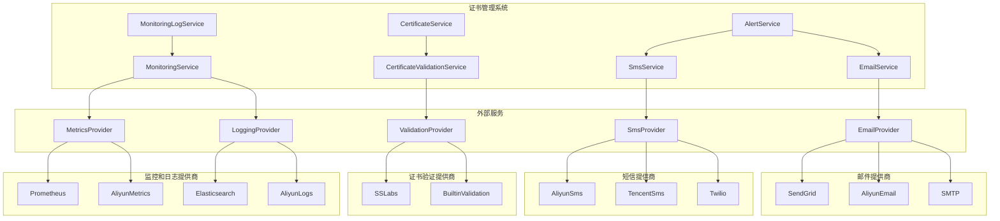

## 外部 API

定义系统与外部服务的接口，虽然 MVP 阶段可能不需要，但需要为未来扩展做准备。

### 外部 API 设计原则

- **接口稳定性**：外部 API 应保持稳定的接口版本，避免频繁变更
- **错误处理**：完善的错误处理机制，包括重试策略和降级方案
- **安全性**：所有外部 API 调用都应使用安全通信和认证机制
- **可配置性**：外部 API 的端点、超时和重试参数应可配置
- **监控和日志**：所有外部 API 调用都应有适当的监控和日志记录

### 邮件服务 API

**目的：** 发送证书过期预警邮件

**提供商选择：**
- **MVP 阶段**：仅记录日志，不实际发送邮件
- **未来扩展**：可集成 SendGrid、阿里云邮件服务或企业内部邮件服务器

**API 接口设计：**
```java
public interface EmailService {
    /**
     * 发送证书过期预警邮件
     * @param certificate 证书信息
     * @param daysUntilExpiry 距离到期的天数
     * @param recipientEmail 收件人邮箱
     * @return 发送结果
     */
    EmailResult sendExpiryAlertEmail(Certificate certificate, int daysUntilExpiry, String recipientEmail);
}

public class EmailResult {
    private boolean success;
    private String messageId;
    private String error;
    // getters and setters
}
```

**配置参数：**
```yaml
email:
  provider: log # 可选值：log, sendgrid, aliyun, smtp
  sendgrid:
    api-key: ${SENDGRID_API_KEY}
    from-email: noreply@example.com
  aliyun:
    access-key-id: ${ALIYUN_ACCESS_KEY_ID}
    access-key-secret: ${ALIYUN_ACCESS_KEY_SECRET}
    region: cn-hangzhou
  smtp:
    host: smtp.example.com
    port: 587
    username: ${SMTP_USERNAME}
    password: ${SMTP_PASSWORD}
    from-email: noreply@example.com
  timeout: 5000 # 超时时间（毫秒）
  retry:
    max-attempts: 3 # 最大重试次数
    interval: 1000 # 重试间隔（毫秒）
```

**错误处理策略：**
- 网络超时：自动重试，最多3次
- 认证失败：记录错误并通知管理员
- 邮件发送失败：记录错误并降级为日志记录
- 服务不可用：记录错误并启用备用邮件服务（如果配置）

### 短信服务 API

**目的：** 发送证书过期预警短信

**提供商选择：**
- **MVP 阶段**：仅记录日志，不实际发送短信
- **未来扩展**：可集成阿里云短信服务、腾讯云短信服务或 Twilio

**API 接口设计：**
```java
public interface SmsService {
    /**
     * 发送证书过期预警短信
     * @param certificate 证书信息
     * @param daysUntilExpiry 距离到期的天数
     * @param recipientPhone 收件人手机号
     * @return 发送结果
     */
    SmsResult sendExpiryAlertSms(Certificate certificate, int daysUntilExpiry, String recipientPhone);
}

public class SmsResult {
    private boolean success;
    private String messageId;
    private String error;
    // getters and setters
}
```

**配置参数：**
```yaml
sms:
  provider: log # 可选值：log, aliyun, tencent, twilio
  aliyun:
    access-key-id: ${ALIYUN_ACCESS_KEY_ID}
    access-key-secret: ${ALIYUN_ACCESS_KEY_SECRET}
    region: cn-hangzhou
    sign-name: 证书管理系统
    template-code: SMS_CERT_EXPIRY_ALERT
  tencent:
    secret-id: ${TENCENT_SECRET_ID}
    secret-key: ${TENCENT_SECRET_KEY}
    region: ap-beijing
    sign-name: 证书管理系统
    template-id: 123456
  twilio:
    account-sid: ${TWILIO_ACCOUNT_SID}
    auth-token: ${TWILIO_AUTH_TOKEN}
    from-number: +1234567890
  timeout: 5000 # 超时时间（毫秒）
  retry:
    max-attempts: 3 # 最大重试次数
    interval: 1000 # 重试间隔（毫秒）
```

**错误处理策略：**
- 网络超时：自动重试，最多3次
- 认证失败：记录错误并通知管理员
- 短信发送失败：记录错误并降级为日志记录
- 服务不可用：记录错误并启用备用短信服务（如果配置）

### 证书验证 API

**目的：** 验证证书的有效性和状态

**提供商选择：**
- **MVP 阶段**：使用 Java 内置证书验证功能
- **未来扩展**：可集成第三方证书验证服务，如 SSL Labs API

**API 接口设计：**
```java
public interface CertificateValidationService {
    /**
     * 验证证书的有效性和状态
     * @param certificate 证书信息
     * @return 验证结果
     */
    ValidationResult validateCertificate(Certificate certificate);
}

public class ValidationResult {
    private boolean valid;
    private String status;
    private int daysUntilExpiry;
    private List<String> issues;
    // getters and setters
}
```

**配置参数：**
```yaml
certificate-validation:
  provider: builtin # 可选值：builtin, ssl-labs
  ssl-labs:
    api-key: ${SSL_LABS_API_KEY}
    endpoint: https://api.ssllabs.com/api/v3/
    timeout: 30000 # 超时时间（毫秒）
    cache:
      ttl: 3600 # 缓存时间（秒）
      max-size: 1000 # 最大缓存条目数
```

**错误处理策略：**
- 网络超时：自动重试，最多2次
- API 限制：记录错误并使用内置验证作为降级方案
- 验证失败：记录错误并标记证书为无效
- 服务不可用：记录错误并使用内置验证作为降级方案

### 监控和日志服务 API

**目的：** 将系统监控和日志数据发送到外部服务

**提供商选择：**
- **MVP 阶段**：使用 Spring Boot Actuator 和 Logback 本地记录
- **未来扩展**：可集成 Prometheus、Grafana、ELK Stack 或阿里云日志服务

**API 接口设计：**
```java
public interface MonitoringService {
    /**
     * 发送监控指标
     * @param metrics 监控指标
     */
    void sendMetrics(Map<String, Object> metrics);
    
    /**
     * 发送日志
     * @param logs 日志数据
     */
    void sendLogs(List<LogEntry> logs);
}

public class LogEntry {
    private String timestamp;
    private String level;
    private String logger;
    private String message;
    private Map<String, Object> context;
    // getters and setters
}
```

**配置参数：**
```yaml
monitoring:
  metrics:
    enabled: true
    provider: prometheus # 可选值：prometheus, aliyun
    prometheus:
      endpoint: http://prometheus:9091/api/v1/write
      interval: 10000 # 发送间隔（毫秒）
    aliyun:
      endpoint: https://metrics.cn-hangzhou.aliyuncs.com
      access-key-id: ${ALIYUN_ACCESS_KEY_ID}
      access-key-secret: ${ALIYUN_ACCESS_KEY_SECRET}
      project: certificate-management
      interval: 10000 # 发送间隔（毫秒）
  logging:
    enabled: true
    provider: elasticsearch # 可选值：elasticsearch, aliyun
    elasticsearch:
      hosts: http://elasticsearch:9200
      index: certificate-management-logs
      batch-size: 100
      batch-interval: 5000 # 批量发送间隔（毫秒）
    aliyun:
      endpoint: https://elasticsearch.cn-hangzhou.aliyuncs.com
      access-key-id: ${ALIYUN_ACCESS_KEY_ID}
      access-key-secret: ${ALIYUN_ACCESS_KEY_SECRET}
      project: certificate-management
      logstore: application-logs
      batch-size: 100
      batch-interval: 5000 # 批量发送间隔（毫秒）
```

**错误处理策略：**
- 网络超时：自动重试，最多3次
- 认证失败：记录错误并通知管理员
- 数据发送失败：记录错误并降级为本地存储
- 服务不可用：记录错误并降级为本地存储，待服务恢复后重试

### 外部 API 集成架构



### 外部 API 调用模式

#### 1. 同步调用模式

**适用场景：** 需要立即获取结果的场景，如证书验证

**实现方式：**
```java
public class CertificateServiceImpl implements CertificateService {
    private final CertificateValidationService validationService;
    
    @Override
    public Certificate validateCertificate(Certificate certificate) {
        ValidationResult result = validationService.validateCertificate(certificate);
        // 处理验证结果
        return updateCertificateStatus(certificate, result);
    }
}
```

**优缺点：**
- 优点：实现简单，逻辑清晰
- 缺点：外部服务延迟会影响系统响应时间

#### 2. 异步调用模式

**适用场景：** 不需要立即获取结果的场景，如发送预警邮件和短信

**实现方式：**
```java
public class AlertServiceImpl implements AlertService {
    private final EmailService emailService;
    private final SmsService smsService;
    private final TaskExecutor taskExecutor;
    
    @Override
    public void sendExpiryAlert(Certificate certificate, int daysUntilExpiry) {
        // 异步发送邮件
        taskExecutor.execute(() -> {
            EmailResult emailResult = emailService.sendExpiryAlertEmail(
                certificate, daysUntilExpiry, certificate.getContactEmail());
            logEmailResult(emailResult);
        });
        
        // 异步发送短信
        taskExecutor.execute(() -> {
            SmsResult smsResult = smsService.sendExpiryAlertSms(
                certificate, daysUntilExpiry, certificate.getContactPhone());
            logSmsResult(smsResult);
        });
    }
}
```

**优缺点：**
- 优点：不会阻塞主线程，提高系统响应速度
- 缺点：实现复杂，需要处理异步任务失败的情况

#### 3. 批量调用模式

**适用场景：** 需要处理大量数据的场景，如批量发送监控指标和日志

**实现方式：**
```java
public class MonitoringServiceImpl implements MonitoringService {
    private final MetricsService metricsService;
    private final LoggingService loggingService;
    private final ScheduledExecutorService scheduler;
    private final Queue<Map<String, Object>> metricsQueue = new ConcurrentLinkedQueue<>();
    private final Queue<LogEntry> logsQueue = new ConcurrentLinkedQueue<>();
    
    @PostConstruct
    public void init() {
        // 定时批量发送监控指标
        scheduler.scheduleAtFixedRate(this::sendMetricsBatch, 10, 10, TimeUnit.SECONDS);
        
        // 定时批量发送日志
        scheduler.scheduleAtFixedRate(this::sendLogsBatch, 5, 5, TimeUnit.SECONDS);
    }
    
    private void sendMetricsBatch() {
        if (!metricsQueue.isEmpty()) {
            List<Map<String, Object>> batch = new ArrayList<>();
            while (!metricsQueue.isEmpty() && batch.size() < 100) {
                batch.add(metricsQueue.poll());
            }
            if (!batch.isEmpty()) {
                metricsService.sendMetrics(batch);
            }
        }
    }
    
    private void sendLogsBatch() {
        if (!logsQueue.isEmpty()) {
            List<LogEntry> batch = new ArrayList<>();
            while (!logsQueue.isEmpty() && batch.size() < 100) {
                batch.add(logsQueue.poll());
            }
            if (!batch.isEmpty()) {
                loggingService.sendLogs(batch);
            }
        }
    }
}
```

**优缺点：**
- 优点：减少网络调用次数，提高处理效率
- 缺点：数据会有一定延迟，需要处理队列满的情况

### 外部 API 安全考虑

#### 1. 认证和授权

- **API 密钥**：所有外部 API 调用都应使用 API 密钥进行认证
- **IP 白名单**：限制只有系统服务器的 IP 可以访问外部 API
- **最小权限原则**：API 密钥应只具有必要的权限

#### 2. 数据安全

- **HTTPS**：所有外部 API 调用都应使用 HTTPS 加密
- **敏感数据**：不在日志中记录敏感信息，如 API 密钥、个人身份信息
- **数据脱敏**：在发送到外部服务前，对敏感数据进行脱敏处理

#### 3. 错误处理

- **错误信息**：不在错误响应中暴露敏感信息
- **重试机制**：实现安全的重试机制，避免重试风暴
- **降级策略**：在外部服务不可用时，有安全的降级策略

### 外部 API 监控和日志

#### 1. 监控指标

- **调用次数**：记录每个外部 API 的调用次数
- **响应时间**：记录每个外部 API 的响应时间
- **错误率**：记录每个外部 API 的错误率
- **可用性**：记录每个外部 API 的可用性

#### 2. 日志记录

- **请求日志**：记录外部 API 的请求内容（脱敏后）
- **响应日志**：记录外部 API 的响应内容（脱敏后）
- **错误日志**：记录外部 API 调用的错误信息
- **性能日志**：记录外部 API 调用的性能数据

#### 3. 告警规则

- **高错误率**：当外部 API 的错误率超过阈值时发送告警
- **高响应时间**：当外部 API 的响应时间超过阈值时发送告警
- **服务不可用**：当外部 API 连续多次调用失败时发送告警
- **配额耗尽**：当外部 API 的配额即将耗尽时发送告警