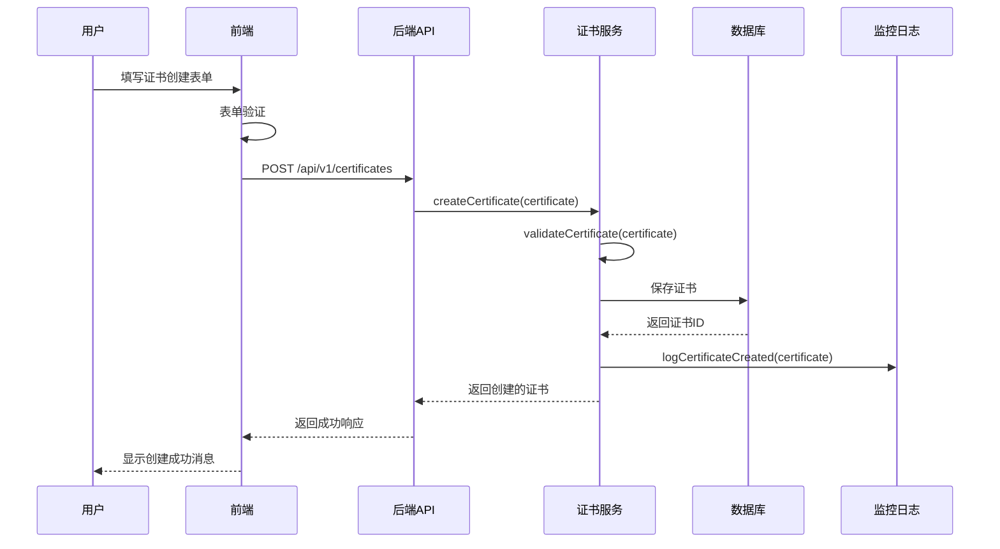
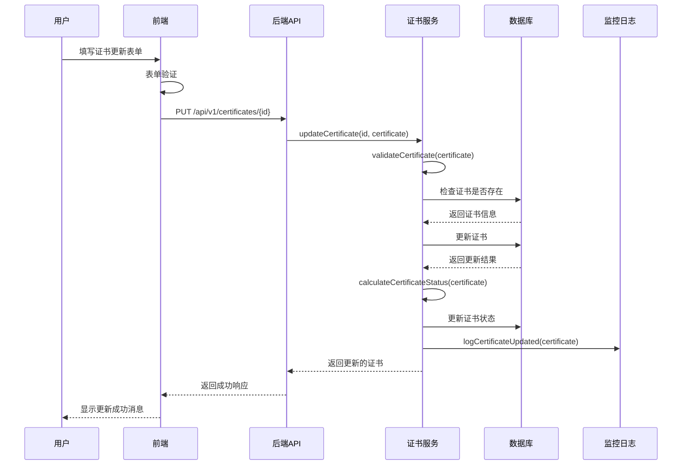
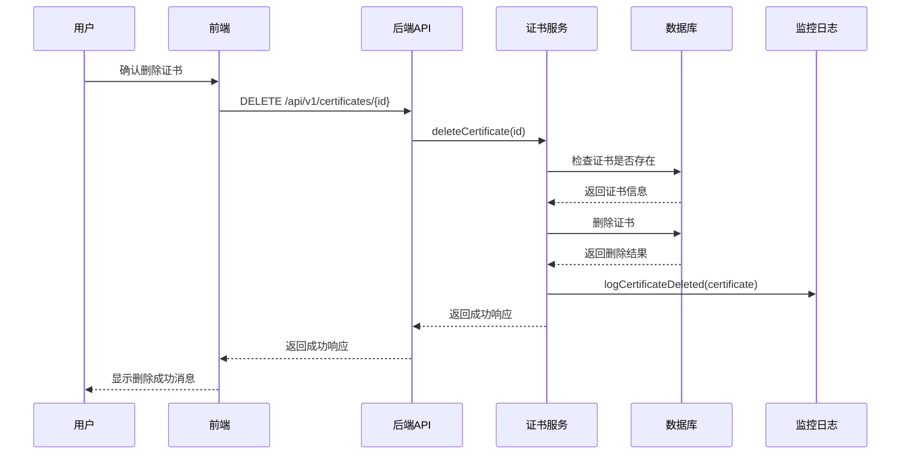
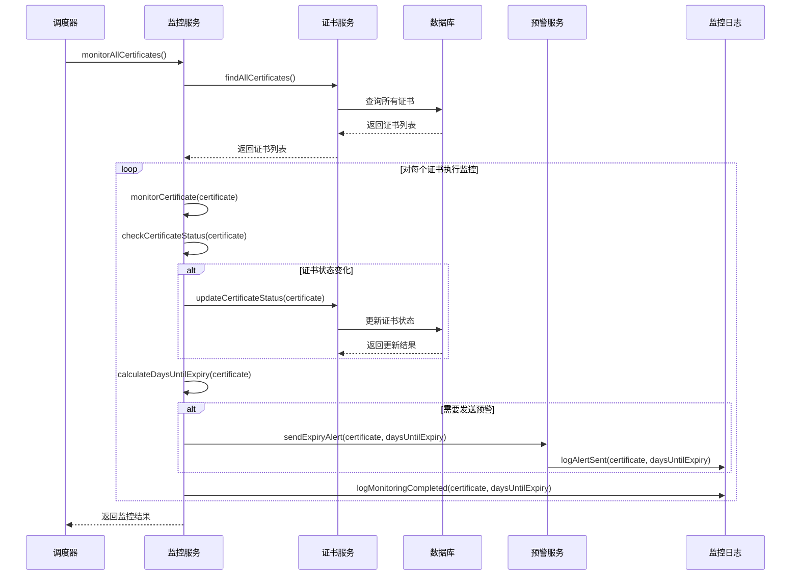
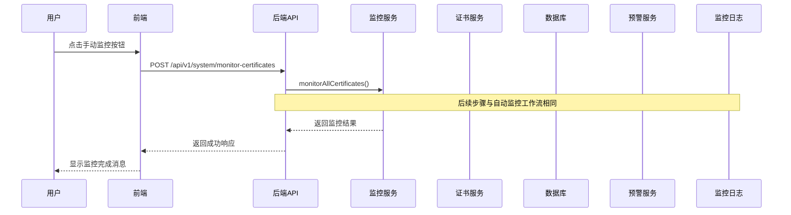
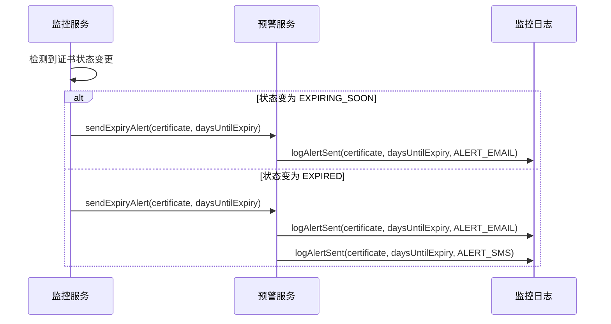
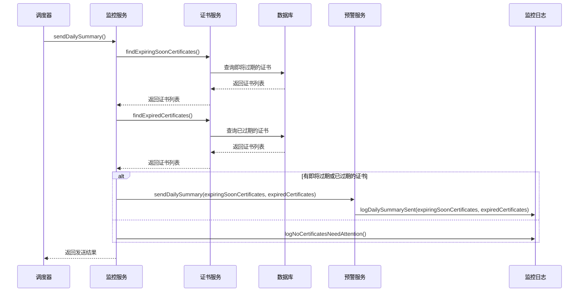
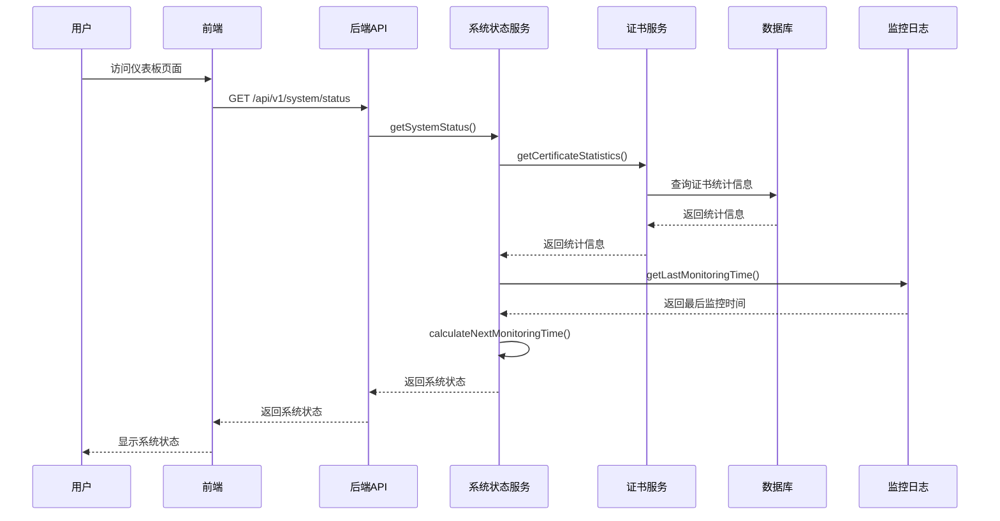
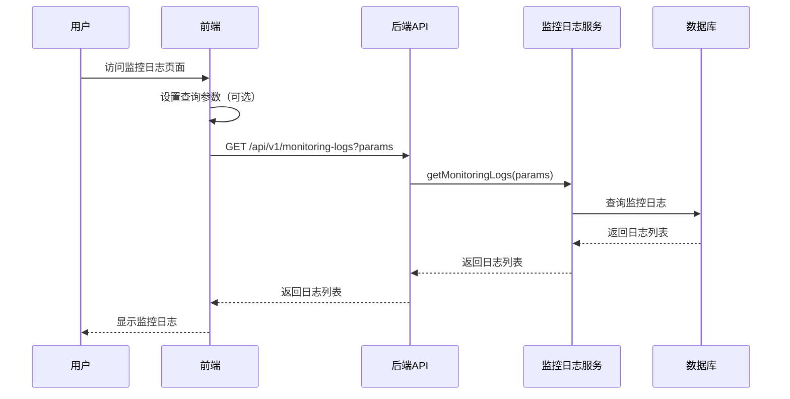

## 核心工作流

定义系统的核心业务流程，包括证书管理、监控和预警等流程。

### 工作流设计原则

- **用户中心**：所有工作流都应以用户需求和体验为中心
- **端到端**：工作流应覆盖完整的业务流程，从开始到结束
- **异常处理**：每个工作流都应有完善的异常处理机制
- **可追踪**：工作流中的每个步骤都应有适当的日志记录
- **可配置**：工作流中的关键参数应可配置，以适应不同的业务需求

### 证书管理工作流

#### 1. 创建证书工作流

**目的：** 创建新的证书记录

**触发条件：** 用户通过前端界面提交创建证书表单

**工作流步骤：**


**关键业务规则：**
- 证书名称和域名不能为空
- 证书颁发日期不能晚于到期日期
- 证书类型必须是预定义的类型之一
- 证书创建后状态自动设置为 NORMAL

**异常处理：**
- 表单验证失败：显示具体的错误信息
- 证书名称或域名已存在：显示冲突错误
- 数据库保存失败：记录错误并显示服务器错误
- 系统异常：记录错误并显示服务器错误

#### 2. 更新证书工作流

**目的：** 更新现有证书的信息

**触发条件：** 用户通过前端界面提交更新证书表单

**工作流步骤：**


**关键业务规则：**
- 证书名称和域名不能为空
- 证书颁发日期不能晚于到期日期
- 证书类型必须是预定义的类型之一
- 证书状态根据到期日期自动计算

**异常处理：**
- 表单验证失败：显示具体的错误信息
- 证书不存在：显示未找到错误
- 证书名称或域名与其他证书冲突：显示冲突错误
- 数据库更新失败：记录错误并显示服务器错误
- 系统异常：记录错误并显示服务器错误

#### 3. 删除证书工作流

**目的：** 删除现有证书及其相关数据

**触发条件：** 用户通过前端界面确认删除证书

**工作流步骤：**


**关键业务规则：**
- 只有存在的证书才能被删除
- 证书删除后，相关的监控日志应保留
- 证书删除操作不可逆

**异常处理：**
- 证书不存在：显示未找到错误
- 数据库删除失败：记录错误并显示服务器错误
- 系统异常：记录错误并显示服务器错误

### 证书监控工作流

#### 1. 自动监控工作流

**目的：** 定期检查所有证书的状态和到期时间

**触发条件：** 定时任务（默认每小时执行一次）

**工作流步骤：**


**关键业务规则：**
- 证书状态根据到期日期自动计算：
  - NORMAL：距离到期超过30天
  - EXPIRING_SOON：距离到期30天以内（含30天）
  - EXPIRED：已过期
- 当证书状态变为 EXPIRING_SOON 或 EXPIRED 时，发送预警
- 预警仅记录日志，不实际发送邮件或短信（MVP阶段）

**异常处理：**
- 证书查询失败：记录错误并跳过该证书
- 证书状态更新失败：记录错误并继续处理其他证书
- 预警发送失败：记录错误并继续处理其他证书
- 系统异常：记录错误并终止监控流程

#### 2. 手动监控工作流

**目的：** 手动触发证书监控检查

**触发条件：** 用户通过前端界面点击手动监控按钮

**工作流步骤：**


**关键业务规则：**
- 与自动监控工作流使用相同的业务逻辑
- 手动监控会检查所有证书，不受定时调度限制
- 手动监控的结果会记录到监控日志中

**异常处理：**
- 与自动监控工作流的异常处理相同
- 监控启动失败：记录错误并显示服务器错误
- 系统异常：记录错误并显示服务器错误

### 证书预警工作流

#### 1. 证书状态变更预警工作流

**目的：** 当证书状态发生变化时发送预警

**触发条件：** 证书状态从 NORMAL 变为 EXPIRING_SOON 或 EXPIRED

**工作流步骤：**


**关键业务规则：**
- 当证书状态变为 EXPIRING_SOON 时，发送邮件预警
- 当证书状态变为 EXPIRED 时，发送邮件预警和短信预警
- 预警仅记录日志，不实际发送邮件或短信（MVP阶段）
- 同一证书的同一状态变更只发送一次预警

**异常处理：**
- 预警发送失败：记录错误并继续处理
- 系统异常：记录错误并终止预警流程

#### 2. 定期预警工作流

**目的：** 定期发送证书状态摘要，提醒用户关注即将过期或已过期的证书

**触发条件：** 定时任务（默认每天上午9点执行）

**工作流步骤：**


**关键业务规则：**
- 每天发送一次证书状态摘要
- 摘要包含即将过期和已过期的证书列表
- 如果没有需要关注的证书，记录日志但不发送摘要
- 预警仅记录日志，不实际发送邮件或短信（MVP阶段）

**异常处理：**
- 证书查询失败：记录错误并跳过该查询
- 摘要发送失败：记录错误并继续处理
- 系统异常：记录错误并终止摘要发送流程

### 系统管理工作流

#### 1. 系统状态查询工作流

**目的：** 查询系统的运行状态和统计信息

**触发条件：** 用户访问仪表板页面或手动刷新系统状态

**工作流步骤：**


**关键业务规则：**
- 系统状态包括：
  - 系统运行状态（RUNNING、MAINTENANCE、ERROR）
  - 系统运行时间
  - 证书总数
  - 各状态证书数量
  - 最后监控时间
  - 下次监控时间
- 系统状态信息应实时更新

**异常处理：**
- 统计信息查询失败：记录错误并使用默认值
- 系统异常：记录错误并返回错误状态

#### 2. 监控日志查询工作流

**目的：** 查询系统的监控日志记录

**触发条件：** 用户访问监控日志页面或执行日志搜索

**工作流步骤：**


**关键业务规则：**
- 监控日志可以按以下条件筛选：
  - 日志类型（MONITORING、ALERT_EMAIL、ALERT_SMS）
  - 证书ID
  - 时间范围
- 监控日志支持分页和排序
- 监控日志查询结果应包含总记录数

**异常处理：**
- 日志查询失败：记录错误并返回空列表
- 系统异常：记录错误并返回错误状态

### 工作流配置

#### 1. 监控配置

```yaml
monitoring:
  # 自动监控调度配置
  scheduler:
    enabled: true
    cron: 0 0 * * * # 每天午夜执行
    timezone: Asia/Shanghai
    # 手动触发是否需要管理员权限
    manual-trigger-requires-admin: false
  
  # 证书状态计算规则
  status-rules:
    expiring-soon-threshold: 30 # 距离到期30天以内为即将过期
    expired-threshold: 0 # 距离到期0天以内为已过期
  
  # 预警配置
  alerts:
    # 状态变更预警
    status-change:
      enabled: true
      expiring-soon:
        channels:
          - email
      expired:
        channels:
          - email
          - sms
    # 定期预警
    daily-summary:
      enabled: true
      time: 09:00:00 # 每天上午9点
      timezone: Asia/Shanghai
      channels:
        - email
```

#### 2. 工作流重试配置

```yaml
workflow:
  # 重试配置
  retry:
    max-attempts: 3
    backoff-multiplier: 2
    initial-interval: 1000 # 初始间隔1秒
    max-interval: 10000 # 最大间隔10秒
  
  # 超时配置
  timeout:
    certificate-monitoring: 300000 # 证书监控超时5分钟
    alert-sending: 30000 # 预警发送超时30秒
    status-query: 10000 # 状态查询超时10秒
  
  # 降级配置
  fallback:
    alert-sending: log # 预警发送失败时降级为记录日志
    certificate-validation: builtin # 证书验证失败时降级为内置验证
```

### 工作流监控和日志

#### 1. 工作流监控指标

- **执行次数**：记录每个工作流的执行次数
- **执行时间**：记录每个工作流的执行时间
- **成功率**：记录每个工作流的成功率
- **错误率**：记录每个工作流的错误率
- **预警发送次数**：记录预警发送的次数和成功率

#### 2. 工作流日志记录

- **开始日志**：记录工作流开始执行的时间和参数
- **步骤日志**：记录工作流中每个关键步骤的执行情况
- **错误日志**：记录工作流执行过程中的错误信息
- **完成日志**：记录工作流完成执行的时间和结果

#### 3. 工作流告警规则

- **工作流失败**：当关键工作流连续多次失败时发送告警
- **执行超时**：当工作流执行时间超过阈值时发送告警
- **预警发送失败**：当预警发送连续多次失败时发送告警
- **证书状态异常**：当大量证书状态异常时发送告警