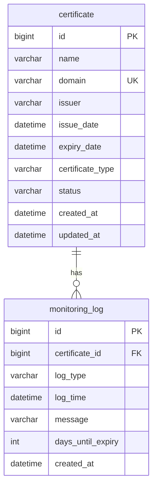

## 数据库架构

定义系统的数据库结构，包括表设计、字段定义、索引和关系等。

### 数据库设计原则

- **规范化**：遵循数据库规范化原则，避免数据冗余
- **性能优化**：合理设计索引，优化查询性能
- **可扩展性**：设计支持未来业务扩展的表结构
- **数据完整性**：使用外键约束和触发器确保数据完整性
- **安全性**：敏感数据加密存储，限制数据访问权限

### 数据库选型

- **数据库类型**：MySQL 8.0
- **字符集**：utf8mb4
- **排序规则**：utf8mb4_general_ci
- **存储引擎**：InnoDB
- **事务隔离级别**：READ COMMITTED

### 表结构设计

#### 1. 证书表 (certificate)

**用途**：存储证书的基本信息和状态

```sql
CREATE TABLE `certificate` (
  `id` bigint NOT NULL AUTO_INCREMENT COMMENT '证书唯一标识符',
  `name` varchar(100) NOT NULL COMMENT '证书名称',
  `domain` varchar(255) NOT NULL COMMENT '证书关联的域名',
  `issuer` varchar(100) NOT NULL COMMENT '证书颁发机构',
  `issue_date` datetime NOT NULL COMMENT '证书颁发日期',
  `expiry_date` datetime NOT NULL COMMENT '证书到期日期',
  `certificate_type` varchar(50) NOT NULL COMMENT '证书类型',
  `status` varchar(20) NOT NULL DEFAULT 'NORMAL' COMMENT '证书状态（NORMAL、EXPIRING_SOON、EXPIRED）',
  `created_at` datetime NOT NULL DEFAULT CURRENT_TIMESTAMP COMMENT '记录创建时间',
  `updated_at` datetime NOT NULL DEFAULT CURRENT_TIMESTAMP ON UPDATE CURRENT_TIMESTAMP COMMENT '记录更新时间',
  PRIMARY KEY (`id`),
  UNIQUE KEY `uk_domain` (`domain`),
  KEY `idx_status` (`status`),
  KEY `idx_expiry_date` (`expiry_date`),
  KEY `idx_created_at` (`created_at`)
) ENGINE=InnoDB DEFAULT CHARSET=utf8mb4 COLLATE=utf8mb4_general_ci COMMENT='证书信息表';
```

**字段说明**：
- `id`：主键，自增长
- `name`：证书名称，必填
- `domain`：证书关联的域名，必填，唯一
- `issuer`：证书颁发机构，必填
- `issue_date`：证书颁发日期，必填
- `expiry_date`：证书到期日期，必填
- `certificate_type`：证书类型，必填
- `status`：证书状态，默认为 NORMAL
- `created_at`：记录创建时间，默认为当前时间
- `updated_at`：记录更新时间，默认为当前时间，更新时自动更新

**索引说明**：
- `PRIMARY KEY (`id`)`：主键索引
- `UNIQUE KEY `uk_domain` (`domain`)`：域名唯一索引
- `KEY `idx_status` (`status`)`：状态索引，用于按状态查询
- `KEY `idx_expiry_date` (`expiry_date`)`：到期日期索引，用于按到期日期查询
- `KEY `idx_created_at` (`created_at`)`：创建时间索引，用于按创建时间查询

#### 2. 监控日志表 (monitoring_log)

**用途**：记录证书监控和预警活动的日志

```sql
CREATE TABLE `monitoring_log` (
  `id` bigint NOT NULL AUTO_INCREMENT COMMENT '日志唯一标识符',
  `certificate_id` bigint NOT NULL COMMENT '关联的证书ID',
  `log_type` varchar(20) NOT NULL COMMENT '日志类型（MONITORING、ALERT_EMAIL、ALERT_SMS）',
  `log_time` datetime NOT NULL DEFAULT CURRENT_TIMESTAMP COMMENT '日志记录时间',
  `message` varchar(500) NOT NULL COMMENT '日志消息内容',
  `days_until_expiry` int DEFAULT NULL COMMENT '距离到期的天数',
  `created_at` datetime NOT NULL DEFAULT CURRENT_TIMESTAMP COMMENT '记录创建时间',
  PRIMARY KEY (`id`),
  KEY `idx_certificate_id` (`certificate_id`),
  KEY `idx_log_type` (`log_type`),
  KEY `idx_log_time` (`log_time`),
  KEY `idx_created_at` (`created_at`),
  CONSTRAINT `fk_monitoring_log_certificate` FOREIGN KEY (`certificate_id`) REFERENCES `certificate` (`id`) ON DELETE CASCADE
) ENGINE=InnoDB DEFAULT CHARSET=utf8mb4 COLLATE=utf8mb4_general_ci COMMENT='监控日志表';
```

**字段说明**：
- `id`：主键，自增长
- `certificate_id`：关联的证书ID，必填，外键
- `log_type`：日志类型，必填
- `log_time`：日志记录时间，必填，默认为当前时间
- `message`：日志消息内容，必填
- `days_until_expiry`：距离到期的天数，可选
- `created_at`：记录创建时间，默认为当前时间

**索引说明**：
- `PRIMARY KEY (`id`)`：主键索引
- `KEY `idx_certificate_id` (`certificate_id`)`：证书ID索引，用于按证书查询日志
- `KEY `idx_log_type` (`log_type`)`：日志类型索引，用于按日志类型查询
- `KEY `idx_log_time` (`log_time`)`：日志时间索引，用于按日志时间查询
- `KEY `idx_created_at` (`created_at`)`：创建时间索引，用于按创建时间查询

**外键约束**：
- `CONSTRAINT `fk_monitoring_log_certificate` FOREIGN KEY (`certificate_id`) REFERENCES `certificate` (`id`) ON DELETE CASCADE`：证书ID外键，级联删除

### 数据库关系图



### 数据库初始化脚本

```sql
-- 创建数据库
CREATE DATABASE IF NOT EXISTS `certificate_management` DEFAULT CHARACTER SET utf8mb4 COLLATE utf8mb4_general_ci;

-- 使用数据库
USE `certificate_management`;

-- 创建证书表
CREATE TABLE IF NOT EXISTS `certificate` (
  `id` bigint NOT NULL AUTO_INCREMENT COMMENT '证书唯一标识符',
  `name` varchar(100) NOT NULL COMMENT '证书名称',
  `domain` varchar(255) NOT NULL COMMENT '证书关联的域名',
  `issuer` varchar(100) NOT NULL COMMENT '证书颁发机构',
  `issue_date` datetime NOT NULL COMMENT '证书颁发日期',
  `expiry_date` datetime NOT NULL COMMENT '证书到期日期',
  `certificate_type` varchar(50) NOT NULL COMMENT '证书类型',
  `status` varchar(20) NOT NULL DEFAULT 'NORMAL' COMMENT '证书状态（NORMAL、EXPIRING_SOON、EXPIRED）',
  `created_at` datetime NOT NULL DEFAULT CURRENT_TIMESTAMP COMMENT '记录创建时间',
  `updated_at` datetime NOT NULL DEFAULT CURRENT_TIMESTAMP ON UPDATE CURRENT_TIMESTAMP COMMENT '记录更新时间',
  PRIMARY KEY (`id`),
  UNIQUE KEY `uk_domain` (`domain`),
  KEY `idx_status` (`status`),
  KEY `idx_expiry_date` (`expiry_date`),
  KEY `idx_created_at` (`created_at`)
) ENGINE=InnoDB DEFAULT CHARSET=utf8mb4 COLLATE=utf8mb4_general_ci COMMENT='证书信息表';

-- 创建监控日志表
CREATE TABLE IF NOT EXISTS `monitoring_log` (
  `id` bigint NOT NULL AUTO_INCREMENT COMMENT '日志唯一标识符',
  `certificate_id` bigint NOT NULL COMMENT '关联的证书ID',
  `log_type` varchar(20) NOT NULL COMMENT '日志类型（MONITORING、ALERT_EMAIL、ALERT_SMS）',
  `log_time` datetime NOT NULL DEFAULT CURRENT_TIMESTAMP COMMENT '日志记录时间',
  `message` varchar(500) NOT NULL COMMENT '日志消息内容',
  `days_until_expiry` int DEFAULT NULL COMMENT '距离到期的天数',
  `created_at` datetime NOT NULL DEFAULT CURRENT_TIMESTAMP COMMENT '记录创建时间',
  PRIMARY KEY (`id`),
  KEY `idx_certificate_id` (`certificate_id`),
  KEY `idx_log_type` (`log_type`),
  KEY `idx_log_time` (`log_time`),
  KEY `idx_created_at` (`created_at`),
  CONSTRAINT `fk_monitoring_log_certificate` FOREIGN KEY (`certificate_id`) REFERENCES `certificate` (`id`) ON DELETE CASCADE
) ENGINE=InnoDB DEFAULT CHARSET=utf8mb4 COLLATE=utf8mb4_general_ci COMMENT='监控日志表';

-- 插入示例数据
INSERT INTO `certificate` (`name`, `domain`, `issuer`, `issue_date`, `expiry_date`, `certificate_type`, `status`) VALUES
('网站SSL证书', 'example.com', 'Let''s Encrypt', '2023-01-15 00:00:00', '2024-01-15 00:00:00', 'SSL/TLS', 'NORMAL'),
('API网关证书', 'api.example.com', 'DigiCert', '2023-03-01 00:00:00', '2024-03-01 00:00:00', 'SSL/TLS', 'NORMAL'),
('内部服务证书', 'service.internal', 'Self-Signed', '2023-02-01 00:00:00', '2023-08-01 00:00:00', 'SSL/TLS', 'EXPIRING_SOON'),
('测试环境证书', 'test.example.com', 'Let''s Encrypt', '2023-01-01 00:00:00', '2023-04-01 00:00:00', 'SSL/TLS', 'EXPIRED');

INSERT INTO `monitoring_log` (`certificate_id`, `log_type`, `log_time`, `message`, `days_until_expiry`) VALUES
(1, 'MONITORING', '2023-06-15 10:00:00', '证书监控检查完成', 214),
(2, 'MONITORING', '2023-06-15 10:00:00', '证书监控检查完成', 259),
(3, 'MONITORING', '2023-06-15 10:00:00', '证书监控检查完成', 47),
(4, 'MONITORING', '2023-06-15 10:00:00', '证书监控检查完成', -75),
(3, 'ALERT_EMAIL', '2023-06-15 10:00:00', '发送证书过期预警邮件', 47),
(4, 'ALERT_EMAIL', '2023-06-15 10:00:00', '发送证书过期预警邮件', -75),
(4, 'ALERT_SMS', '2023-06-15 10:00:00', '发送证书过期预警短信', -75);
```

### 数据库性能优化

#### 1. 查询优化

**常用查询及优化建议**：

1. **查询所有证书**
   ```sql
   SELECT * FROM certificate ORDER BY created_at DESC;
   ```
   - 优化：使用 `idx_created_at` 索引

2. **按状态查询证书**
   ```sql
   SELECT * FROM certificate WHERE status = 'EXPIRING_SOON';
   ```
   - 优化：使用 `idx_status` 索引

3. **查询即将过期的证书**
   ```sql
   SELECT * FROM certificate WHERE expiry_date BETWEEN NOW() AND DATE_ADD(NOW(), INTERVAL 30 DAY);
   ```
   - 优化：使用 `idx_expiry_date` 索引

4. **查询证书的监控日志**
   ```sql
   SELECT * FROM monitoring_log WHERE certificate_id = 1 ORDER BY log_time DESC;
   ```
   - 优化：使用 `idx_certificate_id` 和 `idx_log_time` 索引

5. **按日志类型查询监控日志**
   ```sql
   SELECT * FROM monitoring_log WHERE log_type = 'ALERT_EMAIL';
   ```
   - 优化：使用 `idx_log_type` 索引

#### 2. 分页查询优化

**证书列表分页查询**：
```sql
-- 使用 LIMIT 和 OFFSET 进行分页
SELECT * FROM certificate ORDER BY created_at DESC LIMIT 20 OFFSET 0;

-- 对于大数据量，使用游标分页更高效
SELECT * FROM certificate WHERE created_at < '2023-06-15 10:00:00' ORDER BY created_at DESC LIMIT 20;
```

**监控日志分页查询**：
```sql
-- 使用 LIMIT 和 OFFSET 进行分页
SELECT * FROM monitoring_log WHERE certificate_id = 1 ORDER BY log_time DESC LIMIT 20 OFFSET 0;

-- 对于大数据量，使用游标分页更高效
SELECT * FROM monitoring_log WHERE certificate_id = 1 AND log_time < '2023-06-15 10:00:00' ORDER BY log_time DESC LIMIT 20;
```

#### 3. 索引优化建议

1. **复合索引**：对于经常一起查询的字段，考虑创建复合索引
   ```sql
   -- 证书状态和到期日期复合索引
   CREATE INDEX `idx_status_expiry_date` ON `certificate` (`status`, `expiry_date`);
   
   -- 监控日志证书ID和日志类型复合索引
   CREATE INDEX `idx_certificate_id_log_type` ON `monitoring_log` (`certificate_id`, `log_type`);
   ```

2. **覆盖索引**：对于只查询索引字段的场景，使用覆盖索引
   ```sql
   -- 证书ID和名称覆盖索引
   CREATE INDEX `idx_id_name` ON `certificate` (`id`, `name`);
   
   -- 监控日志ID和消息覆盖索引
   CREATE INDEX `idx_id_message` ON `monitoring_log` (`id`, `message`);
   ```

### 数据库备份和恢复策略

#### 1. 备份策略

- **全量备份**：每天凌晨2点执行一次全量备份
- **增量备份**：每小时执行一次增量备份
- **备份保留期**：保留30天的备份

**备份脚本示例**：
```bash
#!/bin/bash

# 数据库配置
DB_HOST="localhost"
DB_PORT="3306"
DB_USER="root"
DB_PASS="password"
DB_NAME="certificate_management"

# 备份目录
BACKUP_DIR="/var/backups/mysql"
DATE=$(date +%Y%m%d_%H%M%S)

# 创建备份目录
mkdir -p $BACKUP_DIR

# 全量备份
mysqldump -h$DB_HOST -P$DB_PORT -u$DB_USER -p$DB_PASS --single-transaction --routines --triggers --events $DB_NAME | gzip > $BACKUP_DIR/${DB_NAME}_full_${DATE}.sql.gz

# 删除30天前的备份
find $BACKUP_DIR -name "${DB_NAME}_full_*.sql.gz" -type f -mtime +30 -delete

# 记录备份日志
echo "[$(date '+%Y-%m-%d %H:%M:%S')] Full backup completed: ${DB_NAME}_full_${DATE}.sql.gz" >> $BACKUP_DIR/backup.log
```

#### 2. 恢复策略

- **全量恢复**：从最新的全量备份恢复
- **时间点恢复**：从全量备份和增量备份恢复到指定时间点

**恢复脚本示例**：
```bash
#!/bin/bash

# 数据库配置
DB_HOST="localhost"
DB_PORT="3306"
DB_USER="root"
DB_PASS="password"
DB_NAME="certificate_management"

# 备份目录
BACKUP_DIR="/var/backups/mysql"
BACKUP_FILE=$1

# 检查备份文件是否存在
if [ ! -f "$BACKUP_FILE" ]; then
    echo "Backup file not found: $BACKUP_FILE"
    exit 1
fi

# 创建数据库（如果不存在）
mysql -h$DB_HOST -P$DB_PORT -u$DB_USER -p$DB_PASS -e "CREATE DATABASE IF NOT EXISTS $DB_NAME"

# 恢复数据
gunzip < $BACKUP_FILE | mysql -h$DB_HOST -P$DB_PORT -u$DB_USER -p$DB_PASS $DB_NAME

# 记录恢复日志
echo "[$(date '+%Y-%m-%d %H:%M:%S')] Recovery completed: $BACKUP_FILE" >> $BACKUP_DIR/recovery.log
```

### 数据库安全策略

#### 1. 访问控制

- **最小权限原则**：为应用程序用户分配最小必要的权限
- **用户角色分离**：区分管理员、开发人员和应用程序用户
- **IP白名单**：限制数据库访问的IP地址

**用户权限配置示例**：
```sql
-- 创建应用程序用户
CREATE USER 'cert_app'@'%' IDENTIFIED BY 'secure_password';

-- 授予应用程序用户最小必要权限
GRANT SELECT, INSERT, UPDATE, DELETE ON `certificate_management`.* TO 'cert_app'@'%';

-- 创建只读用户
CREATE USER 'cert_readonly'@'%' IDENTIFIED BY 'readonly_password';

-- 授予只读用户只读权限
GRANT SELECT ON `certificate_management`.* TO 'cert_readonly'@'%';

-- 刷新权限
FLUSH PRIVILEGES;
```

#### 2. 数据加密

- **传输加密**：使用 SSL/TLS 加密数据库连接
- **存储加密**：对敏感字段进行加密存储

**SSL配置示例**：
```sql
-- 检查SSL是否启用
SHOW VARIABLES LIKE '%ssl%';

-- 强制使用SSL连接
ALTER USER 'cert_app'@'%' REQUIRE SSL;
ALTER USER 'cert_readonly'@'%' REQUIRE SSL;

-- 刷新权限
FLUSH PRIVILEGES;
```

#### 3. 审计日志

- **操作审计**：记录所有数据库操作
- **登录审计**：记录所有数据库登录尝试

**审计插件配置示例**：
```sql
-- 安装审计插件
INSTALL PLUGIN audit_log SONAME 'audit_log.so';

-- 启用审计日志
SET GLOBAL audit_log_format = 'JSON';
SET GLOBAL audit_log_policy = 'ALL';

-- 配置审计日志文件路径
SET GLOBAL audit_log_file = '/var/log/mysql/audit.log';
```

### 数据库监控和告警

#### 1. 监控指标

- **性能指标**：查询响应时间、慢查询数、连接数
- **资源指标**：CPU使用率、内存使用率、磁盘空间
- **业务指标**：证书数量、监控日志数量、预警数量

#### 2. 告警规则

- **高CPU使用率**：当CPU使用率超过80%时告警
- **高内存使用率**：当内存使用率超过90%时告警
- **磁盘空间不足**：当磁盘空间使用率超过85%时告警
- **慢查询**：当慢查询数量超过阈值时告警
- **连接数过多**：当连接数超过最大连接数的80%时告警

#### 3. 监控工具

- **MySQL Enterprise Monitor**：官方监控工具
- **Percona Monitoring and Management (PMM)**：开源监控工具
- **Prometheus + Grafana**：开源监控和可视化解决方案