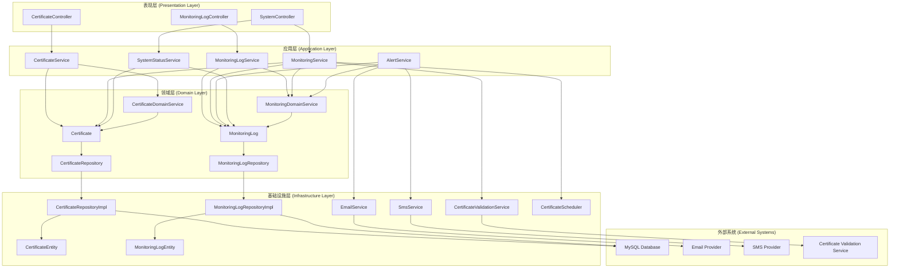

# 分层架构

## 1. 分层架构图

## 2. 分层职责

- **表现层 (Presentation Layer)**：
  - 负责处理HTTP请求和响应
  - 验证输入参数
  - 调用应用层服务处理业务逻辑
  - 返回统一的API响应格式

- **应用层 (Application Layer)**：
  - 实现应用业务用例
  - 协调领域对象和基础设施服务
  - 处理事务边界
  - 提供DTO和VO之间的转换

- **领域层 (Domain Layer)**：
  - 包含核心业务逻辑和领域模型
  - 定义领域实体、值对象和领域服务
  - 定义仓库接口，不关心具体实现
  - 发布领域事件

- **基础设施层 (Infrastructure Layer)**：
  - 实现仓库接口，提供数据持久化
  - 集成外部系统和服务
  - 提供技术基础设施支持
  - 实现横切关注点（如日志、缓存）
