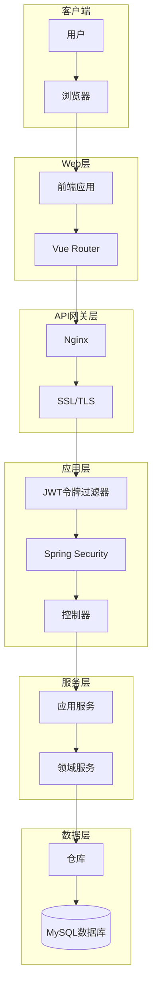

# 安全架构

## 1. 安全架构图



## 2. 认证机制

- **JWT认证**：使用JSON Web Token进行无状态认证
- **令牌结构**：
  ```json
  {
    "sub": "1234567890",
    "name": "John Doe",
    "roles": ["USER", "ADMIN"],
    "iat": 1516239022,
    "exp": 1516242622
  }
  ```
- **认证流程**：
  1. 用户提交用户名和密码
  2. 服务器验证凭据
  3. 服务器生成JWT令牌
  4. 服务器返回JWT令牌给客户端
  5. 客户端在后续请求中携带JWT令牌
  6. 服务器验证JWT令牌
  7. 服务器处理请求并返回响应

## 3. 授权机制

- **基于角色的访问控制**：使用Spring Security的基于角色的访问控制
- **角色定义**：
  - `ROLE_USER`：普通用户，可以查看和管理证书
  - `ROLE_ADMIN`：管理员，具有所有权限
- **权限配置**：
  ```java
  @Configuration
  @EnableWebSecurity
  @EnableGlobalMethodSecurity(prePostEnabled = true)
  public class SecurityConfig extends WebSecurityConfigurerAdapter {
      
      @Override
      protected void configure(HttpSecurity http) throws Exception {
          http
              .csrf().disable()
              .exceptionHandling().authenticationEntryPoint(unauthorizedHandler).and()
              .sessionManagement().sessionCreationPolicy(SessionCreationPolicy.STATELESS).and()
              .authorizeRequests()
              .antMatchers("/api/auth/**").permitAll()
              .antMatchers(HttpMethod.GET, "/api/certificates/**").hasAnyRole("USER", "ADMIN")
              .antMatchers(HttpMethod.POST, "/api/certificates/**").hasRole("ADMIN")
              .antMatchers(HttpMethod.PUT, "/api/certificates/**").hasRole("ADMIN")
              .antMatchers(HttpMethod.DELETE, "/api/certificates/**").hasRole("ADMIN")
              .antMatchers("/api/monitoring-logs/**").hasAnyRole("USER", "ADMIN")
              .antMatchers("/api/system/**").hasRole("ADMIN")
              .anyRequest().authenticated();
          
          http.addFilterBefore(jwtTokenFilter(), UsernamePasswordAuthenticationFilter.class);
      }
      
      // 其他配置...
  }
  ```

## 4. 数据安全

- **密码加密**：使用BCryptPasswordEncoder加密存储用户密码
- **敏感数据加密**：对数据库中的敏感数据进行加密存储
- **HTTPS通信**：使用SSL/TLS加密客户端和服务器之间的通信
- **SQL注入防护**：使用参数化查询防止SQL注入攻击
- **XSS防护**：对用户输入进行转义，防止跨站脚本攻击
