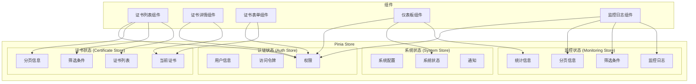

# 状态管理

## 1. 状态管理架构

## 2. 状态管理设计原则

- **单一数据源**：每个状态在应用中只有一个来源
- **状态只读**：组件不能直接修改状态，必须通过actions修改
- **纯函数修改**：使用纯函数修改状态，确保可预测性
- **模块化**：将状态按功能模块划分，便于管理

## 3. 状态持久化

- **本地存储**：使用localStorage存储用户认证信息和系统配置
- **会话存储**：使用sessionStorage存储临时数据
- **Cookie**：使用Cookie存储认证令牌（可选）
