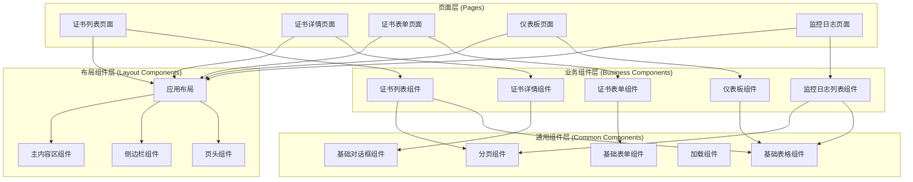

# 组件设计

## 1. 组件分层架构

## 2. 组件通信方式

- **Props / Emits**：父子组件之间的通信
- **Provide / Inject**：跨层级组件之间的通信
- **Pinia**：全局状态管理，任意组件之间的通信
- **Event Bus**：组件之间的事件通信（仅在必要时使用）

## 3. 组件设计模式

- **容器组件与展示组件分离**：将数据获取逻辑与UI展示分离
- **组合式API**：使用Vue 3的组合式API组织组件逻辑
- **插槽（Slots）**：使用插槽提高组件的灵活性
- **混入（Mixins）**：使用混入复用组件逻辑
