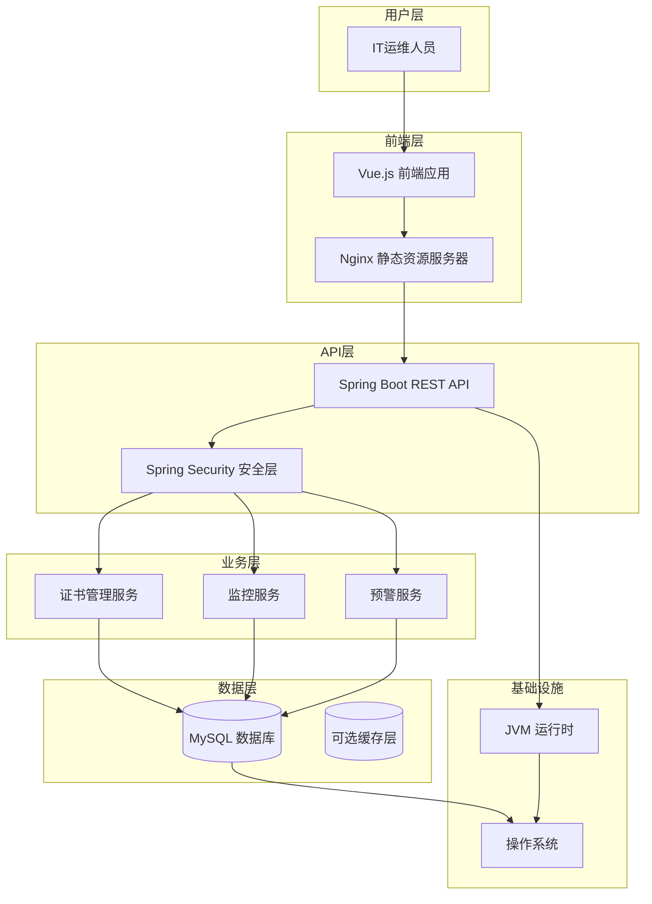

## 高层架构

### 技术摘要

证书生命周期管理系统采用基于 Spring Boot + Vue 的全栈架构，结合了企业级后端框架和现代化前端技术。系统使用领域驱动设计（DDD）原则组织后端代码，通过 REST API 实现前后端分离，采用 MySQL 作为主数据库，并实现了自动化的证书监控和预警功能。这种架构设计确保了系统的可扩展性、可维护性和安全性，同时满足了 MVP 阶段的快速开发需求和未来的业务增长。

### 平台和基础设施选择

**推荐平台：** 传统服务器架构（Spring Boot + Vue + MySQL）

**理由：**
- **技术成熟度**：Spring Boot 和 Vue.js 都是成熟的企业级技术，拥有丰富的生态系统和社区支持
- **团队熟悉度**：作为标准企业技术栈，大多数开发团队都具备相关经验，降低学习成本
- **MVP 适配性**：这种架构非常适合 MVP 阶段的快速开发和部署
- **成本效益**：相比云原生解决方案，初期投入更低，运维成本可控
- **数据安全**：自托管数据库提供了更好的数据控制权和安全性

**核心服务：**
- **应用服务器**：Spring Boot 内嵌 Tomcat
- **数据库**：MySQL 8.0
- **前端服务器**：Nginx（静态资源服务）
- **监控服务**：Spring Boot Actuator
- **日志服务**：Logback

**部署主机和区域：**
- **开发环境**：本地开发服务器
- **测试环境**：内部测试服务器
- **生产环境**：企业内部服务器或云主机（根据企业政策决定）

### 仓库结构

**结构：** Monorepo（单一代码仓库）

**Monorepo 工具：** Maven（后端）+ npm（前端）

**包组织策略：**
```
certificate-management-system/
├── backend/                 # Spring Boot 后端应用
│   ├── src/main/java/      # Java 源代码
│   ├── src/main/resources/ # 配置文件
│   └── src/test/java/      # 测试代码
├── frontend/               # Vue.js 前端应用
│   ├── src/               # Vue 源代码
│   ├── public/            # 静态资源
│   └── tests/             # 测试代码
├── shared/                # 共享代码和类型定义
│   ├── types/             # TypeScript 类型定义
│   └── utils/             # 共享工具函数
├── docs/                  # 项目文档
├── docker/                # Docker 配置
└── scripts/               # 构建和部署脚本
```

### 高层架构图



### 架构模式

- **领域驱动设计（DDD）**：采用 DDD 原则组织后端代码，将业务逻辑集中在领域层 - _理由_：确保业务逻辑的清晰性和可维护性，便于未来业务扩展

- **分层架构**：将系统分为表现层、应用层、领域层和基础设施层 - _理由_：实现关注点分离，提高代码的可测试性和可维护性

- **RESTful API**：使用 REST 风格设计 API 接口 - _理由_：标准化前后端通信，提高系统的互操作性

- **组件化前端**：使用 Vue 组件化开发前端界面 - _理由_：提高前端代码的复用性和可维护性

- **单仓库管理（Monorepo）**：前后端代码放在同一个仓库中管理 - _理由_：简化版本控制和依赖管理，便于团队协作

- **定时任务架构**：使用 Spring Scheduler 实现证书监控定时任务 - _理由_：轻量级实现，无需额外引入消息队列

- **安全优先设计**：在架构各层都考虑安全性 - _理由_：证书管理涉及敏感信息，安全性至关重要